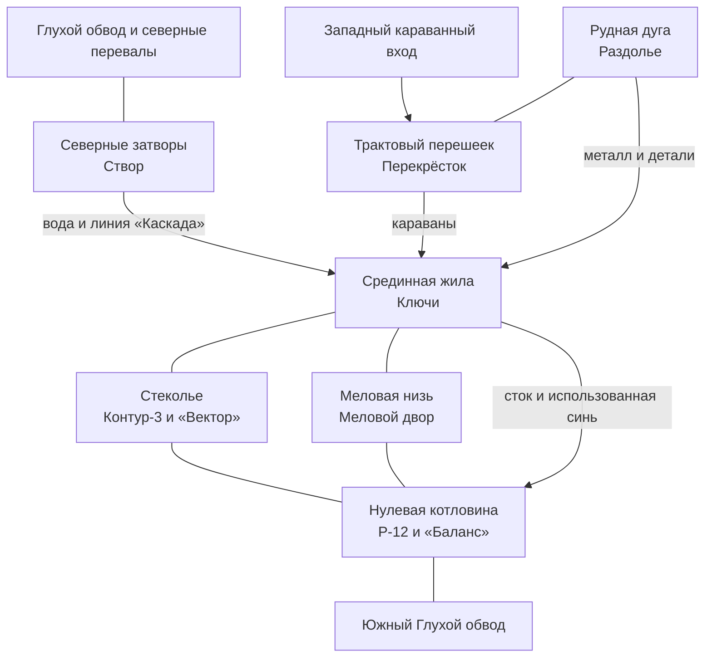

# «Кромка» — библия мира и план интеграции

> Статус: канонический дизайн и план внедрения. Фактическое состояние каждого
> патча, результаты проверок и оставшиеся Unity-аудиты фиксируются в
> `KROMKA_IMPLEMENTATION_STATUS.md`.

## 1. Назначение документа

Документ фиксирует единый канон новой версии игры и переводит его в конкретный
план разработки для существующего Unity-клиента и авторитетного multiplayer-
сервера.

Главные решения:

- рабочее название игры — **«Кромка»**;
- жанр — постъядерная MMORPG с открытой песочницей и линейной сюжетной кампанией;
- основная камера остаётся перспективной камерой сверху;
- игрок — независимый наёмник свободного происхождения;
- постоянного NPC-отряда у игрока нет;
- NPC можно приглашать только на личную базу;
- личная база приватна и отсутствует на публичной глобальной карте;
- клановые базы являются фиксированными публичными локациями;
- захват клановой базы возможен только в известное заранее окно осады;
- магии как открытой системы нет, но в основе Искажений присутствует скрытая
  необъяснимая тайна;
- старые Fallout-подобные пользовательские названия и образы должны быть
  заменены собственной терминологией и художественной идентичностью.

## 2. Видение игры

### 2.1. Короткое описание

Через 103 года после глобальной ядерной войны люди продолжают жить в Кромке —
изолированном регионе разрушенного континента. Города и кланы сражаются за
синь, довоенный сорбент, без которого невозможно очищать воду и поддерживать
старую энергетику. Под землёй всё ещё работает повреждённая инфраструктура
«Каскада», а связанные с ней экспериментальные установки вызывают Сдвиги,
создают аномалии и меняют материю.

Игрок прибывает с караваном как обычный наёмник. Он не является избранным и не
обладает уникальным происхождением. Его значение определяется контрактами,
отношениями с людьми, созданной базой, найденными артефактами и участием в
борьбе за будущее региона.

### 2.2. Основные игровые опоры

1. **Опасная вылазка.** Игрок выходит из безопасного места за ресурсами,
   контрактом или артефактом и должен вернуться с добычей.
2. **Понятный риск.** Аномалии визуально читаемы, опасные зоны обозначены, а
   проигрыш должен следовать из решения игрока, а не из невидимой ловушки.
3. **Дом.** Личная база отражает развитие персонажа и выбор полезных жителей.
4. **Живой рынок.** Ресурсы распределены по региону, поэтому торговля и
   караваны необходимы.
5. **Свобода против порядка.** Каждая крупная фракция предлагает разумный
   способ выживания и скрывает неприятную цену своего решения.
6. **Большая война без уничтожения личного прогресса.** Кланы сражаются за
   публичные базы и инфраструктуру, но не могут отнять личное убежище игрока.
7. **Скрытая тайна.** Научное объяснение Искажений работает почти всегда, но
   отдельные факты ему противоречат.

### 2.3. Тон

Основной тон — взрослая постапокалиптическая драма без самоцельной жестокости.
Чёрный юмор появляется в быту, бюрократии, пропаганде и человеческой привычке
приспосабливаться ко всему. Трагические сцены не превращаются в шутку.

Рабочий слоган:

> Земля кончилась. Учёт продолжается.

## 3. Канон мира

### 3.1. Обмен

Глобальная ядерная война длилась 51 минуту. Довоенная пропаганда называла
взаимные удары «равноценным обменом», поэтому выжившие сократили название
катастрофы до **Обмена**.

Кромка до войны была удалённым промышленным регионом Континентального
Содружества. Здесь находились шахты, химические комбинаты, оборонные заводы,
исследовательские центры и сеть убежищ. Регион избежал полного уничтожения
благодаря подземной системе «Каскад».

### 3.2. «Каскад»

Официально «Каскад» строили для защиты промышленности от катастроф. На деле
сеть объединяла:

- водозаборы и очистные станции;
- электростанции и накопители энергии;
- склады гражданской обороны;
- подземные транспортные линии;
- командные бункеры;
- автоматизированные заводы;
- военную связь;
- секретный исследовательский комплекс «Вектор».

В день Обмена «Каскад» распределил места в убежищах по государственной шкале
полезности. Инженеры, военные и руководство получили приоритет, а тысячи
людей погибли перед закрытыми воротами. Алгоритм отбора сохранился в системе и
остаётся центральным моральным конфликтом сюжета.

### 3.3. Синь

Главный стратегический ресурс Кромки — **синь**, синие гранулы довоенного
сорбента ИМ-12.

Синь связывает радиоактивные частицы, тяжёлые металлы и промышленные токсины.
Она применяется для очистки воды и воздуха, восстановления почвы, работы
старых топливных элементов, производства лекарств и сложного химического
синтеза.

Использованную синь можно восстановить только на регенераторах «Каскада».
Оборудование изнашивается, поэтому синь означает одновременно чистую воду,
энергию, промышленность и политическую власть.

Артефакты редки и ценны, но не заменяют синь: артефакт усиливает отдельного
человека, а синь сохраняет жизнь целому поселению.

### 3.4. «Вектор», Искажения и Сдвиги

«Вектор» исследовал сверхмощные электромагнитные поля, изменение структуры
материалов и передачу энергии через земную кору. Во время Обмена установки
были повреждены, но часть из них продолжила работать через сеть «Каскада».

Локальные нарушения называют **Искажениями**, отдельную аномалию — **узлом**,
а область с высокой плотностью узлов — **пятном**.

Периодический энергетический сброс повреждённых установок называется
**Сдвигом**. Перед ним пропадает нормальная радиосвязь, металл начинает
вибрировать, животные уходят из низин, появляется медный привкус и слышен
подземный гул. После Сдвига часть аномалий меняет положение, открываются новые
маршруты и появляются свежие артефакты.

### 3.5. Скрытая тайна

Официально считается, что Искажения созданы аварией «Вектора». Засекреченные
архивы показывают обратное: похожие явления фиксировали в шахтах Кромки за
десятилетия до строительства комплекса. «Вектор» мог быть построен не для
создания явления, а для его изучения и удержания.

Необъяснимые признаки:

- артефакт «Память» иногда сохраняет сообщения, которые будут переданы позже;
- незнакомые люди видят во сне одну и ту же лестницу, ведущую вниз;
- терминалы во время сильного Сдвига обращаются к человеку по имени, которого
  нет в их базе;
- датчики фиксируют дополнительный сигнал только в присутствии наблюдателя;
- на отдельных довоенных фотографиях видны ещё не сформировавшиеся артефакты.

Исследователи называют источник противоречий **Свидетелем**. Игра долго не
подтверждает, является ли он природным процессом, отражением будущего,
коллективным сознанием или чужим разумом.

## 4. География и художественный язык

### 4.1. Принцип построения карты

Каноническая карта Кромки создаётся заново и не наследует форму, биомы,
береговую линию, дороги или расположение точек существующей глобальной карты.
Старый мир не перекрашивается в новые названия. Сначала задаётся логика
«Каскада», воды, промышленности, поселений и войны за синь, а уже из неё
строятся рельеф и маршруты.

Обитаемая Кромка занимает примерно 380 × 300 километров условного масштаба.
Это пониженная межгорная область вокруг реки **Тесьмы**. До войны её выбрали
для тяжёлой промышленности, потому что здесь одновременно находились вода,
руда, химическое сырьё и естественная защита горных складок.

После Обмена окружающие военные и промышленные районы превратились в
**Глухой обвод** — широкий пояс пожаров под землёй, радиоактивной пыли,
разрушенных перевалов и зон постоянной автоматической обороны. Из Кромки
существуют три известные дороги, но две проходимы лишь несколько недель в
году. Караван «Двенадцатый» входит через третий, западный коридор. Поэтому
регион изолирован, но не считается последним населённым местом во всём мире.

«Каскад» следует естественному уклону Тесьмы с севера на юг. Север принимает
и удерживает воду, центральная долина распределяет её между поселениями и
заводами, а южная котловина собирает загрязнённый сток. Внизу расположен
регенератор Р-12, способный восстанавливать использованную синь. Такая
география делает политический конфликт физическим: перекрытый шлюз наверху
или остановленный регенератор внизу отражается на всём регионе.

### 4.2. Макрорегионы

| Макрорегион | Положение и функция | Внешний вид | Основные силы и места |
|---|---|---|---|
| **Северные затворы** | Высокие верховья Тесьмы; плотины, резервуары и главный вход чистой воды в «Каскад» | Тёмная вода между бетонными откосами, затопленные крыши, мокрый камень, водосбросы, туман и линии высоковольтных опор | Створ, Управа, Патронный двор «Створ-2», ГЭС-2 |
| **Срединная жила** | Самая населённая речная долина; поля, каналы, железная дорога и пересечение ветвей «Каскада» | Длинные дамбы, редкие лесополосы, панельные посёлки, водонапорные башни, мосты и огороды на очищенной земле | Ключи, Застава 17, ферма «Дальний ряд», фильтровальная Т-6 |
| **Рудная дуга** | Западная полоса шахт, карьеров, металлургии и старых складов сорбента | Терриконы, красно-чёрная порода, канатные дороги, открытые цеха, пар из градирен и ржавые рельсы | Раздолье, Вольные артели, шахта «Три смены», Литейная Раздолья |
| **Трактовый перешеек** | Полоса устойчивого грунта между двумя заражёнными низинами; единственный круглогодичный тяжёлый путь | Приподнятое шоссе, железнодорожная насыпь, бетонные водопропуски, дорожные кафе-крепости, склады и кладбища машин | Перекрёсток, Лига Тракта, Арсенал №6, Депо Обводное |
| **Меловая низь** | Юго-восточная область известняка, провалов и подземных источников; часть воды проходит в обход официальных каналов | Белые обрывы, меловая пыль, голубоватые карстовые окна, утопленные дворы, фильтрующая ткань и тоннели в мягком камне | Меловой двор, Вторые, Овраг Слухачей, Меловой шлюз |
| **Стеколье** | Восточная зона прямых ударов по научному и военному кластеру; главный район Искажений | Спёкшийся грунт, блестящие пластины, наклонённые опоры, целые фасады без внутренних стен, сухие грозы и неверные тени | Контур-3, Контур, Солнечное поле №4, объект «Вектор», ретранслятор В-9 |
| **Нулевая котловина** | Южная конечная точка водной и промышленной системы; отстойники, регенерация сини и скрытые командные объекты | Чёрная вода в чашах, толстые трубы, химический туман, насосные башни, многоуровневые дамбы и редкие полосы аварийного света | Регенератор Р-12, Бункер «Баланс», Комитет, Форт 14 |
| **Глухой обвод** | Непроходимая внешняя граница и зона отдельных высокоуровневых экспедиций | Горизонт, скрытый пылью, оплавленные леса опор, кратеры, работающие без людей турели и свет далёких пожаров | сезонные входы, закрытые объекты и места будущих дополнений |

Макрорегионы не обязаны иметь равную площадь. Срединная жила вытянута вдоль
реки, Рудная дуга огибает её с запада, а Трактовый перешеек является длинным
маршрутом, а не прямоугольным биомом. Их границы переходные: например, поля
вокруг Ключей постепенно сменяются отвальными холмами, а не обрываются по
линии на карте.

Схема показывает соседство и основные направления движения, но не масштаб:

### 4.3. Пространственная логика конфликта

Положение каждой силы определяется тем, какую часть общего цикла она может
удерживать:

- Управа контролирует северные шлюзы и способна нормировать объём воды;
- Вольные артели добывают металл, керамику и детали для ремонта «Каскада»;
- Контур умеет оценивать загрязнение, стабилизировать синь и обслуживать
  сложную автоматику;
- Лига Тракта перевозит чистую и использованную синь между удалёнными узлами;
- Вторые знают карстовые обходы и неучтённые подземные источники;
- Комитет имеет доступ к Р-12 и командным протоколам, но не может открыто
  удерживать весь путь от воды до регенератора.

Ни одна фракция не самодостаточна. Захват северной плотины без деталей из
Рудной дуги только откладывает аварию. Владение Р-12 бесполезно без караванов,
которые привезут отработанную синь. Эта зависимость объясняет торговлю,
контракты, диверсии, временные союзы и борьбу кланов за промежуточные узлы.

Восемь клановых баз размещаются на ответвлениях системы, а не в случайных
точках:

| ID | Стратегический объект | Регион | Экономическое преимущество |
|---|---|---|---|
| `clanHydroNode2` | ГЭС-2 | Северные затворы | энергия и детали турбин |
| `clanFilterT6` | Фильтровальная Т-6 | Срединная жила | очистка воды и экономия фильтров |
| `clanOreExchange` | Рудный перевал | Рудная дуга | руда и ускоренная переработка |
| `clanFactoryCycle` | Цех обратного цикла | Рудная дуга | восстановление промышленных реагентов |
| `clanDepotBypass` | Депо Обводное | Трактовый перешеек | вместимость склада и скорость караванов |
| `clanChalkSluice` | Меловой шлюз | Меловая низь | вода и производство лекарственного сырья |
| `clanRelayEast` | Ретранслятор В-9 | Стеколье | прогноз Сдвигов и обнаружение событий |
| `clanFortZero` | Форт 14 | Нулевая котловина | доступ к закрытым складам без прямого бонуса к урону |

Столицы фракций, Ключи, «Вектор», Р-12 и «Баланс» не являются клановыми
базами и не могут быть захвачены.

### 4.4. Маршруты и рост опасности

Основные дороги образуют не равномерную сетку, а несколько понятных артерий:

- **Синяя линия** идёт вдоль служебных каналов от Створа к Р-12;
- **Железная ветвь** связывает Рудную дугу, Ключи и Стеколье;
- **Большой тракт** проходит через Перекрёсток и соединяет западный вход,
  центральную долину и Меловую низь;
- **Нижний обход** ведёт к Нулевой котловине, но после Сдвигов часто меняет
  безопасные участки;
- подземные линии «Каскада» используются как сюжетные подземелья и редкие
  короткие пути, а не как свободное быстрое перемещение.

Первый игровой цикл сосредоточен вокруг Ключей, ближнего участка Тракта и
края Рудной дуги. Затем игрок выходит к Северным затворам и Меловой низи.
Стеколье требует защиты от Искажений, а Нулевая котловина является
высокоопасным пространством поздней кампании. Границы не запираются
невидимой стеной: угрозы, состояние маршрутов и требования к экипировке
предупреждают игрока о риске.

### 4.5. Общий визуальный стиль

Кромка не использует американскую ретрофутуристическую эстетику 1950-х.
Основой служит вымышленная позднеиндустриальная культура с постсоветским
настроением:

- панельный бетон, силикатный кирпич и тяжёлые промышленные конструкции;
- навесы из профлиста, сварные ворота, трубы внешнего отопления;
- выцветшие надписи, номера цехов и служебные пиктограммы;
- старая техника утилитарна и почти не украшена;
- новые поселения используют дерево, ткань, автомобильные детали и цветовые
  метки фракций;
- реклама встречается редко, а основная довоенная графика — инструкции,
  предупреждения и государственные лозунги;
- каждый крупный объект должен иметь один читаемый сверху ориентир: башню,
  трубу, кран, купол, резервуар, антенну или разрушенный мост.

Базовая палитра — пепельно-серая, ржавая и пыльно-бежевая. Цвет фракции
добавляется локально на флаги, двери, повязки и ремонтные заплаты, а не
перекрашивает всю локацию.

### 4.6. Визуальные языки фракций

| Фракция | Цветовой код | Архитектура и детали |
|---|---|---|
| Управа | тёмно-синий, белый, чёрный | одинаковые баррикады, номера секторов, прожекторы, прямые проходы, аккуратно залатанный бетон |
| Вольные артели | охра, красный, необработанный металл | пристройки разных мастеров, расписанные ворота, открытые мастерские, множество личных знаков |
| Контур | серо-зелёный, холодный белый, янтарные лампы | герметичные двери, кабельные эстакады, чистые рабочие зоны, старые приборы без декоративной фантастики |
| Лига Тракта | песочный, бордовый, латунь | навесы, склады, знаки маршрутов, весы, доски цен, ухоженные караванные дворы |
| Вторые | меловой белый, графит, выцветший голубой | закрытые дворы, фильтрующая ткань, отметки безопасных путей, повторно используемые медицинские детали |
| Комитет преемственности | чёрный, тусклый красный, холодный свет | нетронутые служебные коридоры, одинаковая нумерация, автоматические двери, отсутствие бытовых следов |

## 5. Типы локаций и их внешний вид

### 5.1. Учебный караванный двор

**Назначение:** приватное обучение нового персонажа перед отправкой каравана.

**Вид:** огороженный грузовой двор у разрушенной железнодорожной ветки.
Сборные бараки, навес снабжения, стрельбище, ремонтная яма, учебная аномалия,
грузовики и вагоны каравана. За ограждением видна безопасная, но пустая
равнина. Всё подготовлено к отъезду, поэтому ящики подписаны, NPC заняты
погрузкой, а маршрут отмечен на большой настенной карте.

**Свет:** холодное раннее утро, тёплые лампы под навесами, лёгкий туман.

**Ориентир:** водонапорная башня с номером «12».

### 5.2. Безопасное поселение

**Назначение:** торговля, лечение, квесты, социальные встречи и выход в мир.

**Вид:** плотная застройка вокруг источника воды или работающего узла
«Каскада». Внешнее кольцо состоит из транспорта, бетонных блоков и сварных
ворот. Внутри находятся рынок, общественная кухня, мастерские, медицинский
пункт и доска контрактов. Поселение должно выглядеть жилым: бельё, огороды,
ёмкости для воды, детские рисунки, очереди и рабочие места.

**Свет:** тёплые окна и костры противопоставлены холодной пустоши.

**Опасности:** прямого PvP нет; конфликт выражается диалогами, экономикой и
репутацией.

### 5.3. Столица фракции

**Назначение:** крупный сюжетный и политический центр.

**Вид:** более сложная версия безопасного поселения с тремя визуальными
слоями: гражданская жизнь, производственный слой и закрытая зона власти.
Столица обязана сразу показывать преимущества и цену идеологии фракции.

- Управа демонстрирует чистоту, порядок, очереди и пропускные пункты.
- Артели демонстрируют разнообразие, производство, свободу и хаотичность.
- Контур демонстрирует работающую технологию, стерильность и закрытые двери.
- Лига демонстрирует достаток, движение товаров и имущественное неравенство.
- Вторые демонстрируют взаимопомощь, нехватку пространства и следы болезней.

### 5.4. Караванный узел

**Назначение:** торговые маршруты, доставка, найм на работы и мировые события.

**Вид:** большая открытая площадка, разделённая на стоянку, склады, ремонт,
ночлег и рынок. Сверху читаются пути движения транспорта. На въездах стоят
столбы с маршрутными метками, а не обычные дорожные указатели.

**Палитра:** пыльный песочный цвет, бордовые тенты, тёплые лампы.

### 5.5. Дорога и случайная встреча

**Назначение:** короткая боевая или сюжетная сцена во время путешествия.

**Вид:** небольшой фрагмент трассы, железной дороги, моста или просёлка с одним
сильным ориентиром и несколькими подходами. Встречи не должны выглядеть как
одинаковая арена: меняются высота, укрытия, видимость и возможный путь обхода.

**Погодные варианты:** боковой дождь, пыль, сумерки, след Сдвига, туман из
низины.

### 5.6. Ресурсная точка

**Назначение:** добыча, PvP за сырьё, защита рабочих и контракты снабжения.

**Вид:** ресурс должен быть виден в конструкции места. У рудника есть штольня,
вагонетки и дробильная площадка; у водозабора — резервуар, трубы и фильтры; у
нефтяной точки — насос, лужи и ёмкости; у поля лома — пресс, сортировочные
кучи и кран.

**Правило:** каждая точка имеет основной ресурс, вторичный редкий ресурс и
одну причину риска: PvP, мутанты, химическое заражение или аномальное пятно.

### 5.7. Промышленная руина

**Назначение:** исследование, вертикальные маршруты, сложный лут и засады.

**Вид:** цех, котельная, элеватор, депо или химический корпус. Пространство
строится вокруг крупных машин, мостков, труб и провалившихся перекрытий.
Интерьер читается сверху благодаря проёмам и системе прозрачности крыш.

**Палитра:** тёмный металл, ржавчина, выцветшая зелёная или голубая краска,
локальные аварийные лампы.

### 5.8. Узел «Каскада»

**Назначение:** территориальный контроль, сюжет, синь, энергия и инфраструктура.

**Вид:** бетонный служебный объект, частично ушедший под землю. На поверхности
видны резервуары, вентиляционные шахты, толстые кабели и техническая башня.
Подземная часть строже и чище обычных руин, но повреждена корнями, водой и
последствиями Сдвигов.

**Ориентир:** крупный номер узла и вертикальная аварийная лампа.

### 5.9. Бункер или лаборатория

**Назначение:** сюжетная тайна, редкая технология, рейд или моральный выбор.

**Вид:** тесные служебные помещения, шлюзы, архивы, медицинские отсеки и
машинные залы. Чем глубже уровень, тем меньше следов обычной жизни и больше
нетронутой автоматики. Бункеры не должны превращаться в одинаковые серые
коридоры: каждому назначается довоенная функция и собственный аварийный
сценарий.

### 5.10. Аномальное пятно

**Назначение:** поиск артефактов и пространственная головоломка.

**Вид:** открытая или полуразрушенная территория, где каждая аномалия заметна
без детектора. Границы показываются движением пыли, искрами, паром, деформацией
воздуха, вращением мусора или изменением растительности.

Пятно не должно быть сплошной стеной эффектов. Игрок сверху видит безопасные
карманы, возможный маршрут и точки для броска болта.

### 5.11. Логово мутантов

**Назначение:** охота, трофеи, зачистка и мировые контракты.

**Вид:** пространство рассказывает о повадках конкретного вида. У Рыхляков
перекопан грунт, у Пыльников разрушена изоляция, у Плакальщиков собраны
блестящие предметы, у Складней находятся остатки медицинских контейнеров.

Логово имеет внешний след, основное гнездо и опасную внутреннюю область с
маткой, старшей особью или иным редким противником.

### 5.12. Рейдовый комплекс

**Назначение:** групповое PvE высокого уровня.

**Вид:** несколько последовательно открываемых зон с разными задачами:
наружный периметр, производственный уровень, техническое ядро и зона
основного противника. Визуальная эскалация должна показывать приближение к
источнику угрозы.

### 5.13. Личная база

**Назначение:** приватный дом, жители, хранение и производство.

**Вид:** скрытый технический двор или малое убежище, которое игрок постепенно
превращает в жилую базу. Свободное строительство разрешено внутри ограниченной
площадки. Окружение за её границами постоянно и не может быть разобрано.

Личная база не отображается другим игрокам на глобальной карте и не может
быть захвачена.

### 5.14. Клановая база

**Назначение:** публичный стратегический объект и место запланированной осады.

**Вид:** крупный узел «Каскада» с авторской планировкой, несколькими линиями
подхода, внешними ретрансляторами, воротами и командным центром. Свободное
строительство не применяется. Клан выбирает модули только в фиксированных
оборонительных позициях, чтобы не создавать непроходимые крепости.

## 6. Каноническое размещение и миграция локаций

Координаты, соседство, рельеф и дорожная сеть старой карты не считаются
ограничением. Для Кромки создаётся новая ревизия мира. Существующие стабильные
ID сохраняются только ради серверных ссылок, сохранений и миграции; они не
обязывают сохранять прежнюю географию или художественное содержание.

Старые определения не удаляются: они остаются в версии мира `legacy` как
источник миграции. Новая авторская запись каждого места получает
`worldRevision: kromka-1`, новые координаты, окружение, связи и точку безопасного
переноса старых персонажей.

| Стабильный ID | Каноническое место | Размещение и функция в новой географии |
|---|---|---|
| `settlement` | **Ключи** | Срединная жила; первое безопасное поселение у пересечения Тесьмы, канала и железной ветви |
| `caravanCamp` | **Перекрёсток** | Трактовый перешеек; главный двор Лиги в месте схождения трёх дорог |
| `scrapTown` | **Раздолье** | Рудная дуга; столица Вольных артелей вокруг ремонтируемого металлургического комбината |
| `relayStation` | **Контур-3** | безопасный край Стеколья; научный центр в здании довоенной диспетчерской |
| `roadOutpost` | **Застава 17** | Срединная жила; пост Управы на единственном тяжёлом мосту через Тесьму |
| `klimAmmoWorks` | **Патронный двор «Створ-2»** | Северные затворы; военное производство рядом со складами охраны плотины |
| `scrapOutpost` | **Сторожевая артель** | восточный выход из Рудной дуги; защита грузовой ветви до Ключей |
| `scrapFoundry` | **Литейная Раздолья** | Рудная дуга; крупная мастерская и источник промышленных деталей |
| `relayOutpost` | **Периметр К-3** | Стеколье; герметичный пропускной пункт перед зоной Искажений |
| `relayWorkshop` | **Опытная мастерская К-3** | Стеколье; сложный крафт, стабилизация приборов и спорные опыты Контура |
| `solarArray` | **Солнечное поле №4** | открытая возвышенность Стеколья; энергия, сухие грозы и электрические узлы |
| `oldDepot` | **Арсенал №6** | северная часть Трактового перешейка; рейдовый склад у заброшенной военной ветки |
| `resourceDryWaterPump` | **Водозабор «Сухой»** | Срединная жила; повреждённая резервная ветвь «Каскада» |
| `resourceChemSpring` | **Сток 4-Б** | край Нулевой котловины; реагенты, токсичные испарения и загрязнённый дренаж |
| `resourceIronMine` | **Шахта «Три смены»** | Рудная дуга; железная руда, старые подъёмники и долговые рабочие договоры |
| `resourceKlimQuarry` | **Карьер Девятый** | Северные затворы; камень и заполнитель для постоянного ремонта плотин |
| `resourceOilPump` | **Топливная рампа** | Нижний обход; остатки топлива, химикаты и высокий риск PvP |
| `resourceOldKlimFarm` | **Ферма «Дальний ряд»** | Срединная жила; продовольствие на восстановленной полосе почвы |
| `resourceScrapFields` | **Сортировочные поля** | ближняя Рудная дуга; безопасная начальная добыча лома |
| `resourceSiliconRidge` | **Керамический уступ** | граница Меловой низи и Стеколья; сырьё для электроники, фильтров и детекторов |
| `resourceTireDepot` | **Полимерный склад** | Трактовый перешеек; резина, ткань и материалы для караванного ремонта |
| `antHive` | **Колония Пыльников** | заброшенные кабельные тоннели Рудной дуги |
| `geckoCanyon` | **Овраг Слухачей** | карстовый разрез Меловой низи, где хищники охотятся по вибрации |
| `radscorpionNest` | **Гнездовье Рыхляков** | осыпающиеся отстойники Нулевой котловины |
| `mutantCrater` | **Воронка Складней** | Стеколье; логово довоенной биофауны в разрушенном медицинском блоке |
| `randomAshGrove` | **Полоса №8** | шаблон лесополосы и заброшенных дач Срединной жилы |
| `randomDryBasin` | **Меловая чаша** | шаблон карстовой впадины, стоянки или аномального пятна Меловой низи |
| `randomRuinedRoad` | **Разбитый тракт** | шаблон дорожной встречи на Большом тракте и Нижнем обходе |
| `randomEncounter` | **Событие пути** | универсальная сцена, получающая окружение текущего макрорегиона |
| `wasteland` | **Глухой обвод** | шаблон опасной приграничной экспедиции, а не базовый фон всей карты |

Новые обязательные локации:

| Новый ID | Название | Каноническое размещение и назначение |
|---|---|---|
| `tutorialCaravanYard` | Сборный двор №12 | за западным коридором вне общей карты; приватное обучение перед входом в Кромку |
| `sluiceCity` | Створ | Северные затворы; столица Управы вокруг командной плотины |
| `secondHaven` | Меловой двор | Меловая низь; столица Вторых в карьере с подземным источником |
| `balanceBunker` | Бункер «Баланс» | под административным ярусом Нулевой котловины; архив алгоритма отбора |
| `cascadeRegenerator` | Регенератор Р-12 | нижняя точка Нулевой котловины; финальный комплекс первой кампании |
| `vectorLab` | Объект «Вектор» | глубина Стеколья; источник знаний об Искажениях и Свидетеле |
| `personalBase` | Личное убежище | приватный экземпляр без единственной точки на глобальной карте |

Личная база открывается через безопасные точки входа в ПУТНИКЕ и не занимает
землю между публичными локациями. Случайные встречи выбирают визуальный
профиль макрорегиона, поэтому Меловая чаша не может появиться у северной
плотины, а затопленная дамба — посреди Стеколья.

## 7. Фракции

### 7.1. Управа

Управа предлагает безопасность, пайки, медицину и охраняемые дороги. Взамен
требует регистрации, налогов, службы и подчинения единым законам.

**Лидер:** комиссар Марина Вельская.

**Тайна:** руководство создаёт управляемый дефицит сини в зависимых
поселениях. Основатели Управы также запечатали эвакуационный тоннель с
тысячами беженцев.

### 7.2. Вольные артели

Союз независимых поселений, мастерских и фермерских общин. Артели защищают
право владеть землёй, оружием и результатом собственного труда.

**Лидер:** Ника Резник.

**Тайна:** богатые артели покупают голоса бедных, используют долговую
зависимость и тайно нанимают налётчиков для ослабления Управы.

### 7.3. Контур

Объединение инженеров, врачей и учёных. Контур поддерживает фильтры, лечит
лучевую болезнь и исследует «Каскад».

**Лидер:** профессор Тимур Арсеньев.

**Тайна:** Контур скрывает прогноз падения производства сини и проводит
опасные испытания на зависимых людях.

### 7.4. Лига Тракта

Союз караванных домов, перевозчиков и владельцев рынков. Лига поддерживает
дороги, почту и общую торговую валюту — **марки Тракта**, обычно просто марки.

**Лидер:** Софья Сыч.

**Тайна:** Лига вооружает все стороны, сливает маршруты независимых торговцев
и поддерживает выгодный ей уровень нестабильности.

### 7.5. Вторые

Потомки людей, которым не хватило места в убежищах. Они требуют равного
доступа к воде и признания жителей заражённых территорий.

**Лидер:** врач Яра Коваль.

**Тайна:** руководство скрывает смертность разведчиков и поддерживает миф о
врождённой устойчивости Вторых к заражению.

### 7.6. Комитет преемственности

Скрытая организация потомков персонала центрального бункера. Комитет считает
себя последним законным правительством и хочет централизовать «Каскад».

**Лидер:** администратор Николай Северов.

**Тайна:** Комитет управляет частью автоматической обороны и готов сократить
число потребителей воды, чтобы сохранить систему.

### 7.7. Положение игрока

Игрок остаётся независимым наёмником на протяжении основной кампании. Вместо
вечного вступления во фракцию он получает репутацию и временные контракты.
Высокая репутация открывает товары, задания и доступ, а помощь противнику
может закрыть отдельные возможности.

Клан может заключить ограниченный договор с одной фракцией, но фракция не
становится владельцем клана.

## 8. Основные NPC

| Персонаж | Роль | Личная проблема и тайна |
|---|---|---|
| Ирена «Верста» Белова | картограф каравана и первый проводник игрока | продала сведения о грузе, не зная, что это приведёт к нападению |
| Марина Вельская | комиссар Управы | верит, что контролируемая жестокость предотвращает большую катастрофу |
| Ника Резник | представитель Артелей | защищает свободу, одновременно позволяя богатым артелям управлять голосованием |
| Тимур Арсеньев | глава Контура | скрывает реальный срок до кризиса сини |
| Софья Сыч | глава Лиги | ценит торговый мир, но зарабатывает на продолжении войны |
| Яра Коваль | лидер Вторых | защищает отвергнутых, жертвуя собственными разведчиками |
| Николай Северов | главный противник первой кампании | способен логично обосновать каждую жертву числом спасённых |
| Аркадий Актов | регистратор земли и баз | его абсурдные документы признают все стороны; часть прав он выдумал сам |
| доктор Рада Меньшова | врач и голос радио «Фон» | участвовала в ранних опытах Контура |
| майор Лев Карцев | полевой командир Управы | должен выбрать между приказом и защитой мирных жителей |

## 9. Обучение и начало игры

### 9.1. Общий принцип

Обучение является частью истории. Новый персонаж проходит подготовку как
наёмник перед отправкой каравана «Двенадцатый» в Кромку. Учебная локация —
приватный экземпляр Сборного двора №12.

Повторно прошедший обучение аккаунт может пропустить его. В этом случае
стартовые предметы, обязательные флаги и краткое резюме выдаются сервером
автоматически. Первое прохождение пропускать нельзя.

### 9.2. Последовательность обучения

| Этап | Сюжетное действие | Осваиваемая механика |
|---|---|---|
| 1. Контракт | игрок подписывает договор и выбирает происхождение | создание персонажа, характеристики, диалог |
| 2. Осмотр | Верста отправляет на склад и к инструктору | движение, камера, взаимодействие |
| 3. Снаряжение | кладовщик выдаёт одежду, оружие и ПУТНИК | инвентарь, экипировка, быстрый доступ |
| 4. Стрельбище | игрок поражает неподвижную и движущуюся мишени | прицеливание, ОД, режим огня, перезарядка |
| 5. Укрытие | учебная очередь заставляет сменить позицию | препятствия, линия огня, приседание |
| 6. Первая помощь | игрок помогает раненому грузчику | лечение, травмы, медицинские предметы |
| 7. Ремонт | из лома собирается деталь для каравана | добыча, станок, простой крафт |
| 8. Аномалия | инструктор проводит через слабый учебный «Звон» | визуальное чтение аномалии и бросок обычного болта |
| 9. Отправка | игрок сдаёт готовность и входит в колонну | ПУТНИК, журнал задач, начало путешествия |

Стартовый комплект:

- обычный болт как постоянный инструмент;
- простое оружие по выбранному боевому профилю;
- базовая одежда;
- одна аптечка;
- вода и сухой паёк;
- переносной терминал **ПУТНИК** — «Переносной универсальный терминал
  навигации, инвентаризации и коммуникации».

Детектор артефактов в обучении не выдаётся.

### 9.3. Первая миссия: «Двенадцатый не пришёл»

После завершения обучения начинается настоящая игра. Караван входит в Кромку
и попадает в организованную засаду у старой железнодорожной станции.

Задачи миссии:

1. прийти в себя и найти часть снаряжения;
2. проверить выживших и получить первый моральный выбор без изменения
   основного маршрута;
3. пройти через активировавшееся после нападения аномальное пятно, используя
   болт;
4. запустить аварийный передатчик;
5. отбить часть груза или проследить за похитителями;
6. добраться до поселения Ключи.

Миссия заканчивается открытием глобальной карты, доски контрактов, торговли и
первой линии основного сюжета. Игрок не получает спутника и не формирует NPC-
отряд.

### 9.4. Ранние побочные задания

**«Тихий писк».** После первой миссии доктор Рада просит вернуть измерительный
блок из повреждённого поста. Награда — детектор артефактов первого уровня.

**«Железный довод».** Механик просит добыть сердечник из магнитной аномалии.
Награда — постоянная замена обычного болта на улучшенный магнитный.

Оба задания побочные, но явно отмечаются как открывающие новую механику.

### 9.5. Правила побочных заданий

Побочные задания должны раскрывать устройство Кромки через поступки, а не
через справочные диалоги. В каждом авторском задании используются минимум два
разных действия: разведка, бой, переговоры, поиск улик, работа с аномалией,
ремонт, доставка под угрозой или защита точки.

Общие правила:

- игрок по-прежнему является независимым наёмником и не вступает во фракцию
  навсегда;
- фракционная цепочка состоит из знакомства, внутреннего противоречия и
  задания, раскрывающего неприятную тайну;
- выбор не делится на очевидно добрый и злой: каждая сторона что-то спасает и
  кем-то расплачивается;
- важное решение создаёт `questOutcomeTag`, меняет репутацию, услуги, цены,
  доступные реплики и помощь в финале;
- персональная версия события может меняться в сюжетном экземпляре, но один
  игрок не способен навсегда перестроить общий MMO-мир;
- уникальная награда является новой возможностью или равноценной альтернативой,
  а не обязательным лучшим предметом;
- именные NPC могут открыть услугу на базе или работать с ней удалённо, но не
  становятся управляемыми спутниками;
- чёрный юмор строится на бюрократии, хозяйственной изобретательности и
  несовпадении официального отчёта с реальностью, а не на бессмысленной
  жестокости.

Фракционная цепочка открывается поэтапно: первое задание доступно при
нейтральном отношении, второе — после знакомства, третье — при доверии либо
через компрометирующую улику. Поэтому игрок не обязан притворяться сторонником
фракции, чтобы узнать её тайну.

### 9.6. Цепочка Управы

#### «Пайковая единица» — `uprava_ration_unit`

Комендатура просит найти причину пропажи фильтров из поставок в Ключи. Игрок
сверяет пломбы, опрашивает кладовщика и перехватывает тележку с якобы
испорченными кассетами. Фильтры исправны: дефицит создан намеренно, чтобы
поселение согласилось на постоянный гарнизон.

Варианты завершения:

- передать накладные Марине Вельской: Управа наказывает исполнителя,
  сохраняет схему и открывает игроку снабженческий склад;
- отдать фильтры Ключам: растёт репутация поселений и Вторых, но дорожные
  сборы Управы для игрока увеличиваются;
- подменить отчёт и заставить коменданта поставлять норму скрытно: меньше
  репутации, зато в Ключах появляется стабильный запас воды.

Награда — марки, пропуск на Заставу 17 или скидка на воду в зависимости от
решения. Официальный акт в любом случае сообщает, что «недостача обнаружена в
полном объёме».

#### «Тоннель закрыт на ремонт» — `uprava_tunnel_closed`

Майор Карцев выдаёт задачу обследовать старый эвакуационный тоннель под
Створом. Нужно восстановить питание ворот, пройти затопленный участок и
отбиться от Пыльников. Внутри обнаруживаются тела беженцев и запись приказа,
по которому основатели Управы заперли тоннель ради спасения главного
водозабора.

Игрок может отдать единственный носитель архиву, сделать копию для Карцева
или передать запись независимому радио. Публикация ухудшает отношения с
Управой, но открывает новые реплики и помощь семей погибших. Сдача оригинала
даёт чертёж армированного фильтра. Скрытая копия становится аргументом в
следующем задании.

#### «Цена тишины» — `uprava_price_of_silence`

Вельская поручает остановить нелегальный передатчик до выступления, способного
вызвать голодный бунт. На станции выясняется, что ведущий располагает
доказательствами и тоннеля, и управляемого дефицита. Станцию атакует отряд,
которого нет ни в одном приказе.

Финальный выбор цепочки:

- подавить эфир и получить высший гражданский допуск Управы;
- передать доказательства в прямой эфир, потеряв доступ к части государственных
  складов, но открыв сеть независимых информаторов;
- убедить Вельскую признать дефицит, но отложить историю тоннеля: начинается
  ограниченная реформа, обе стороны считают игрока наполовину предателем.

Постоянная помощь в финале — организованный коридор эвакуации либо народные
проводники, в зависимости от исхода.

Повторяемые контракты Управы: сопровождение пайков, проверка дорожных постов,
поиск дезертиров с возможностью принять их сдачу и защита ремонтных бригад.

### 9.7. Цепочка Вольных артелей

#### «Один человек — один голос» — `artels_one_person_one_vote`

Игрок доставляет переносную урну трём малым артелям перед общим собранием.
Одну общину купили авансом, вторую держат долгом за генератор, а третья
принципиально голосует дважды, потому что их мастер «человек крупный».

Можно принять формально правильные бюллетени, аннулировать зависимые голоса
или собрать публичные свидетельства о подкупе. Награда — доступ к артельным
заказам; разоблачение дополнительно снижает цену простых верстачных модулей,
но закрывает магазин одного богатого подрядчика.

#### «Труд свободен от оплаты» — `artels_free_labor`

Ника Резник просит вернуть рабочих, якобы похищенных Управой с шахты «Три
смены». Рабочие не похищены: они сбежали от долговых договоров, по которым
еда, инструмент и койка стоят больше заработка.

Игрок исследует штольню, находит двойную бухгалтерию и выбирает: вернуть
людей после списания долга, провести их через блокпост или передать книги
собранию. Возможна сделка с владельцем, но тогда на личной базе становятся
дешевле рудные поставки ценой ухудшения отношений со свободными рабочими.

#### «Налёт по предварительной записи» — `artels_scheduled_raid`

Перед праздником независимости Артели нанимают игрока защитить Раздолье от
известной банды. У захваченных налётчиков находятся оружие артельного
производства и договор без подписи: богатые мастерские сами заказали прежние
атаки на соседние склады, чтобы ослабить Управу и поднять цены.

Игрок может уничтожить договор, вынести его на собрание или заставить
заказчиков оплатить восстановление пострадавших поселений. Итог открывает
один из трёх вариантов: закрытую оружейную линию, честные кооперативные заказы
или дешёвые строительные поставки. В финале Артели предоставят либо
вооружённых добровольцев, либо ремонтные команды.

Повторяемые контракты Артелей: производственные заказы, оборона мастерских,
возврат инструмента, разведка месторождений и доставка деталей между
общинами.

### 9.8. Цепочка Контура

#### «Доброволец №0» — `contour_volunteer_zero`

Контур заказывает образцы из слабого аномального пятна и просит найти
пропавшего техника. Техник обнаруживается живым, но с экспериментальным
стабилизатором в теле. Его подпись о добровольном участии поставлена уже после
операции.

Игрок может доставить техника врачу Контура, вывести к Раде или снять
прототип ради данных. Последний вариант даёт быстрый технический выигрыш, но
навсегда ухудшает отношения с независимыми медиками. Спасение открывает
улучшенный рецепт противоаномального препарата.

#### «До следующего квартала» — `contour_until_next_quarter`

Арсеньев просит восстановить вычислитель расхода сини на Солнечном поле №4.
Для запуска нужны три калибровочных блока из зон с разными угрозами. Расчёт
показывает: при нынешнем потреблении стабильного запаса хватит значительно
меньше, чем Контур сообщает поселениям.

Игрок выбирает точность прогноза: честный расчёт вызывает рост цен, мягкая
версия даёт время подготовить производство, а подмена скрывает кризис и
повышает репутацию Контура. Награда — настройка детектора или медицинского
сканера; выбрать можно только одну.

#### «Правда по технике безопасности» — `contour_safety_truth`

На опытной мастерской происходит авария. Официально виноват погибший лаборант,
но журналы показывают серию испытаний на зависимых пациентах и приказ
продолжать работу. Игроку приходится отключать нестабильные установки,
эвакуировать людей и решать судьбу архива.

Архив можно опубликовать полностью, передать независимой врачебной комиссии
или оставить Арсеньеву в обмен на немедленный план спасения производства
сини. Итог открывает общественную лабораторию, независимую клинику либо
закрытый исследовательский терминал. В финале Контур помогает данными,
медициной или мощностью комплекса.

Повторяемые контракты Контура: сбор образцов, калибровка датчиков, доставка
лекарств, сопровождение полевого техника и отключение аварийных установок.

### 9.9. Цепочка Лиги Тракта

#### «Груз не пахнет» — `league_cargo_has_no_smell`

Софья Сыч нанимает игрока сопроводить три опломбированных ящика через разные
блокпосты. По звуку и весу понятно, что накладные лгут: внутри оружие для двух
противоборствующих сторон и медикаменты, списанные как подшипники.

Можно не вскрывать груз, перенаправить лекарства в Ключи или показать ящики
обоим покупателям. Первый вариант повышает репутацию Лиги, второй открывает
скидку у врачей, третий временно снижает боевые поставки на маршруте, но
делает часть торговцев враждебными.

#### «Маршрут известен ограниченному кругу» — `league_limited_route`

Несколько независимых караванов ограблены на новом безопасном пути. Игрок
ставит ложные маршрутные метки, наблюдает за курьерами и выходит на диспетчера
Лиги, продающего расписание налётчикам. Диспетчер утверждает, что делится
прибылью с семьями погибших возчиков — и это оказывается правдой лишь
наполовину.

Его можно сдать, завербовать как двойного информатора или передать самим
возчикам. Награда — постоянная отметка одного безопасного маршрута, повышение
дохода от караванных заказов либо сеть предупреждений о засадах.

#### «Страховой случай» — `league_insured_event`

Лига организует мирную встречу Управы и Артелей на Перекрёстке. Перед
переговорами Сыч просит незаметно усилить охрану. Игрок обнаруживает
подготовленную инсценировку налёта: она должна сорвать договор и поднять
страховые сборы, не оставив настоящих жертв — по плану Лиги.

Можно позволить постановке пройти, сорвать её публично или превратить ложное
нападение в повод заключить реальное соглашение. Наградой становится
расширенный торговый терминал, снижение караванной комиссии либо бесплатная
доставка тяжёлых грузов на личную базу. В финале Лига предоставляет транспорт
или нейтральный канал переговоров.

Повторяемые контракты Лиги: срочная доставка, охрана каравана, восстановление
дорожных маяков, поиск пропавшего груза и расчистка временного маршрута.

### 9.10. Цепочка Вторых

#### «Устойчивость подтверждена» — `seconds_resilience_confirmed`

Яра Коваль просит доставить лекарства группе Вторых после Сдвига. Несколько
людей тяжело больны, хотя официально община утверждает, что Вторые устойчивы
к заражению. Нужно найти чистую воду, запустить полевой фильтр и отбить
мутантов, привлечённых его шумом.

Игрок может сохранить легенду ради безопасности общины, потребовать признать
болезнь или подделать диагноз как обычное отравление. Исход меняет цены на
защитные препараты и доверие разведчиков. Признание открывает более сильную
медицину, но вызывает нападения фанатичных соседей в персональных событиях.

#### «Разведчик вернётся после отчёта» — `seconds_scout_after_report`

По документам три разведчика ещё находятся на задании. В действительности их
оставили в заражённой зоне после приказа продолжать наблюдение. Игрок идёт по
их меткам, проходит аномальное пятно и находит одного выжившего вместе с
журналом смертности, который руководство скрывало годами.

Можно вывести разведчика открыто, тайно вернуть только данные или передать
журнал семьям. Награда — прогноз двух безопасных маршрутов после Сдвига,
чертёж лёгкого защитного костюма либо доверие семей Вторых.

#### «Общая вода» — `seconds_common_water`

Вторые занимают заброшенный водозабор, но его запуск снизит давление в
системе двух соседних поселений. Управа готовит штурм, а насос невозможно
удерживать без деталей Контура. Игрок добывает детали и собирает представителей
сторон либо помогает одному лагерю закрепиться.

Возможны совместный график, исключительный контроль Вторых или передача узла
Управе с обязательной квотой. Игрок получает модуль экономии воды для базы,
доступ к полевым медикам или гарантированный пайковый контракт. В финале
Вторые открывают убежища либо выводят людей через опасную территорию.

Повторяемые контракты Вторых: поиск пропавших, доставка фильтров, разведка
пятен после Сдвига, лечение удалённых общин и сопровождение переселенцев.

### 9.11. Цепочка Комитета преемственности

Цепочка Комитета открывается во второй половине кампании. Задания приходят
через одноразовые сообщения и не отображают имя заказчика, пока игрок не
получит допуск.

#### «Допуск временно вечный» — `committee_temporary_clearance`

Неизвестный куратор поручает извлечь карту доступа из запечатанного архива.
Внутри работает довоенная система кадров, которая требует справку об
отсутствии справки. Игрок может восстановить терминал, обойти три охранных
контура или найти мумифицированного сотрудника, всё ещё числящегося на смене.

Карту можно передать заказчику, скопировать для Контура или оставить себе.
Награда — доступ в служебные зоны бункеров, но копирование повышает сложность
последующих автоматических проверок.

#### «Лишние по списку» — `committee_surplus_population`

Комитет просит обновить датчики населения в трёх поселениях под видом
технической переписи. Собранные данные используются алгоритмом для выбора
районов, которым отключат воду при следующем кризисе.

Игрок может передать точные данные, занизить население самых уязвимых общин
или внедрить ложных потребителей, заставив систему признать расчёт
недостоверным. Точный отчёт даёт доступ к складу Комитета; саботаж открывает
тайные резервуары, но превращает автоматические патрули в противников.

#### «Последняя перепись» — `committee_final_census`

Северов раскрывает заказчика и предлагает увидеть модель будущего: при
свободном потреблении «Каскад» рухнет, при централизованном отборе часть
населения погибнет намеренно. Для проверки модели игрок входит в Бункер
«Баланс», восстанавливает вычислительные секции и отбивает систему у
независимой группы, желающей просто стереть её.

Игрок может сохранить алгоритм, ограничить его консультативным режимом или
разделить данные между фракциями. Награда — командный протокол, предупреждение
о закрытых объектах либо распределённый доступ союзников. Выбор меняет
аргументы Северова и доступную помощь в финале, но не завершает основную
кампанию вместо игрока.

Повторяемые контракты Комитета: извлечение архивов, проверка ретрансляторов,
скрытая доставка модулей, отключение потерянной автоматики и удаление опасных
записей с возможностью сохранить копию.

### 9.12. Личные задания именных NPC

Личное задание появляется после сюжетной встречи и достаточного доверия либо
после нахождения улики, затрагивающей персонажа. Оно раскрывает человека
отдельно от должности. Лидеру фракции можно помочь лично, одновременно
сорвав его политический план.

| NPC и задание | Содержание и решение | Постоянный результат |
|---|---|---|
| **Ирена «Верста» Белова — «Цена маршрута»** (`personal_versta_route_price`) | Игрок прослеживает цепочку покупателей карты каравана «Двенадцатый» и узнаёт, что исходную схему продала Верста. Она рассчитывала на обычную кражу груза. Можно выдать её семьям погибших, помочь раскрыть настоящего организатора или потребовать искупать вину работой. | Публичное признание даёт поддержку выживших; расследование открывает маршруты засад; искупление позволяет установить на базе картографический стол, отмечающий одно событие пути в день. |
| **Марина Вельская — «Подпись под дверью»** (`personal_velskaya_signature`) | В архиве тоннеля находится приказ с подписью матери Вельской. Марина просит доказать подделку, но экспертиза подтверждает документ. Игрок предлагает ей признать прошлое, уничтожить лист или опубликовать его без имени. | Открывается реформаторская, жёсткая или кризисная версия её помощи; награда — гражданский допуск, сеть осведомителей или поддержка семей тоннеля. |
| **Ника Резник — «Свободные выборы с доставкой»** (`personal_reznik_election`) | Конкурент Ники действительно честнее, но его мастерская не переживёт разрыв с богатыми артелями. Игрок добывает договоры, организует открытые дебаты и решает, поддержать Нику, конкурента или коалицию малых общин. | Меняется состав артельных торговцев и тип финальной помощи; игрок получает один из равноценных чертежей производственного модуля. |
| **Тимур Арсеньев — «Три месяца до оптимизма»** (`personal_arsenyev_optimism`) | Личная модель Арсеньева предсказывает кризис раньше официальной. Для проверки нужно снять данные внутри сильного пятна и выбрать, кому первому показать расчёт. Арсеньев признаётся, что скрывал срок, чтобы избежать паники и выиграть время. | Доступ к точному прогнозу Сдвигов, медицинскому резерву или открытому научному архиву; меняются его реплики в финале. |
| **Софья Сыч — «Честная цена войны»** (`personal_sych_war_price`) | Игрок собирает четыре части личной бухгалтерии Сыч и видит, что мир лишит Лигу большей части прибыли. Можно заставить её профинансировать перемирие, передать книги конкуренту или оставить систему работать за долю для пострадавших. | Снижение торговой комиссии, бесплатная доставка одного тяжёлого груза в неделю либо фонд восстановления караванов. |
| **Яра Коваль — «Имена на меле»** (`personal_koval_chalk_names`) | Яра каждую ночь дописывает на стене имена пропавших разведчиков, хотя публично называет их действующей сменой. Игрок ищет жетоны последней группы и решает, провести открытое поминовение или сохранить легенду до окончания кризиса. | Семьи открывают тайные убежища либо разведсеть сохраняет мораль; возможен найм разведчика-жителя на личную базу, но он не сопровождает игрока. |
| **Николай Северов — «Собеседование в будущее»** (`personal_severov_future_interview`) | Северов приглашает игрока пройти симуляцию распределения воды. Любое решение жертвует поселением, пока игрок не обнаружит намеренно исключённый вариант ремонта. Можно доказать ошибку, принять расчёт или внедрить неопределённость в модель. | Дополнительный вариант диалога в финале, код остановки одной системы обороны либо сведения о скрытом ремонтном узле; Северов спутником или жителем не становится. |
| **Аркадий Актов — «Право на воздух»** (`personal_aktov_air_rights`) | Для регистрации личной базы Актов требует документ на воздух над участком. Нужный архив сгорел, поэтому игрок разыскивает три несовместимые копии закона и выясняет, что первые земельные права Актов сочинил сам. Можно узаконить фикцию общим соглашением, разоблачить его или подделать четвёртую, наконец согласованную копию. | Открывается личная база; выбор даёт дешёвое расширение, уважение независимых поселенцев или декоративную табличку «Воздух оплачен до конца света» и дополнительный слот гостевого доступа. |
| **Доктор Рада Меньшова — «Голос без помех»** (`personal_menshova_clear_voice`) | Старые записи доказывают участие Рады в опытах Контура. Неизвестный шантажист требует прекратить радиоэфиры. Игрок ищет передатчик, спасает бывшего пациента и выбирает полное признание, частичную правду или уничтожение архива. | Радио предупреждает о Сдвигах раньше, независимая клиника получает новые методы либо Рада сохраняет доверие слушателей ценой будущего шантажа. |
| **Майор Лев Карцев — «Приказ, которого нет»** (`personal_kartsev_missing_order`) | Карцев получает устный приказ оставить посёлок ради обороны склада сини. Игрок помогает эвакуации, удерживает склад или добывает запись приказа, вынуждая командование признать ответственность. | В финале Карцев приводит мирных добровольцев, регулярный отряд или отказывается выполнять преступный приказ; игрок получает полевой ремонт брони либо усиленный дорожный пропуск. |

### 9.13. Связь заданий с MMO-песочницей

Постоянные последствия хранятся на персонаже и проявляются через фазирование,
реплики, ассортимент, доступ к комнатам и состав помощи в сюжетных экземплярах.
Общие поселения не исчезают и не переходят навсегда под власть фракции из-за
решения одного игрока.

Повторяемые задания используют авторские шаблоны целей, но сервер меняет
локацию, противника и требуемый груз. Они дают марки, репутацию и обычные
ресурсы, не повторяют уникальные награды и не раскрывают одну и ту же тайну
заново. Дневной лимит наград не запрещает играть дальше, а постепенно снижает
только выплату за одинаковый тип контракта.

Персональные исходы добавляют до шести видов помощи в финале кампании:

- эвакуационный маршрут;
- транспорт и снабжение;
- ремонтная команда;
- медицинская поддержка;
- научный протокол;
- отключение части автоматической обороны.

Игрок не может собрать NPC в отряд: помощь срабатывает до миссии, по радио или
на фиксированном этапе сюжетной локации.

## 10. Аномалии и болт

### 10.1. Требования к читаемости

- каждая обычная аномалия заметна без детектора;
- тип можно различить по постоянному визуальному и звуковому признаку;
- безопасный край не должен зависеть от случайного невидимого радиуса;
- эффект сохраняется на низких настройках графики и в мобильном landscape;
- детектор ищет артефакты, а не аномалии.

### 10.2. Бросок болта

Болт — постоянный инструмент без учёта количества в инвентаре. Игрок указывает
курсором точку на земле и бросает его на расстояние до 10 метров. Задержка
между бросками — 0,75 секунды.

Попадание болта активирует обычную аномалию и полностью разряжает её на
короткое время. Состояние общее для всех игроков в комнате.

| Аномалия | Постоянный признак | Окно после болта |
|---|---|---:|
| Тяга | мусор медленно ползёт к центру, воздух сжимается | 4 с |
| Шов | тонкая дрожащая линия, искры на пересечениях | 3 с |
| Карусель | пыль и металл вращаются по кругу | 5 с |
| Стекло | марево и спёкшаяся блестящая земля | 4 с |
| Роса | цветной туман и коррозия на предметах | 5 с |
| Провал | поверхность пульсирует и проседает | 4 с |
| Звон | голубые дуги между металлическими обломками | 6 с |
| Молчун | частицы движутся без звука, внешний звук глохнет | 5 с |

Исключения — огромные сюжетные поля и активные излучатели. Они не маскируются
под обычные аномалии и отключаются через генератор, терминал или сюжетную цель.

Улучшенный магнитный болт после побочного задания:

- летит на 13 метров;
- активирует узел при попадании в пределах 1,5 метра от его границы;
- увеличивает окно разрядки на 2 секунды;
- полностью заменяет обычный болт и не создаёт отдельного режима метания.

## 11. Детектор и артефакты

### 11.1. Экипировка

У персонажа появляются два новых независимых слота:

- `detector` — активный детектор артефактов;
- `artifactBelt` — пояс-контейнер с 2, 3 или 4 ячейками артефактов.

Детектор не занимает оружейную руку и не заменяет броню. Без детектора игрок
может проходить аномалии, но не видит скрытый артефакт и не может его подобрать.

Детектор первого уровня:

- начинает подавать сигнал в 12 метрах от артефакта;
- учащает сигнал по мере приближения;
- показывает артефакт на расстоянии 3 метров;
- не определяет название и свойства до поднятия.

### 11.2. Правила бонусов

- одинаковые артефакты не складываются;
- второй похожий эффект даёт 50% числового бонуса;
- скорость ограничена суммарным бонусом +18%;
- сопротивление одному типу урона ограничено 60%;
- бонус грузоподъёмности ограничен +30 кг;
- постоянная регенерация ограничена 1 HP/с;
- все эффекты рассчитывает сервер;
- текущая базовая грузоподъёмность `30 + Мощь × 8`, рюкзак добавляет 20 кг;
- бонус скорости должен входить в серверный предел допустимого перемещения,
  иначе легальное ускорение будет отклоняться как ошибка позиции.

Дополнение 2026-09: каждая находка — экземпляр вида с тиром 1–5 (цвета шкалы
экипировки) и скрытыми до стабилизации свойствами; значения таблицы ниже —
база тира вида, тир и seed масштабируют пользу вверх и цену вниз. Подбор в
обычный инвентарь без контейнера, стабилизация платная у исследователя, в
столице или на личной базе, разбор даёт компоненты семьи и катализаторы;
рождение артефактов идёт из аномалий по типу поля с пиком после выброса.

### 11.3. Базовый набор артефактов

| Артефакт | Польза | Цена |
|---|---|---|
| Пружина | скорость +8%, восстановление ОД +10% | электрический урон +20% |
| Жила | грузоподъёмность +15 кг, ближний урон +12% | скорость −6% |
| Узел | максимум здоровья +25 | лечение аптечками −20% |
| Капля | после 6 секунд без урона восстанавливает 0,6 HP/с | расход воды +30% |
| Кровник | ниже 30% здоровья восстанавливает 20 HP за 10 секунд; перезарядка 90 секунд | после срабатывания +15 радиации |
| Панцирь | баллистическое сопротивление +12%, взрывное +8% | скорость −8% |
| Тепляк | сопротивление огню +35% | максимум ОД −15% |
| Сито | сопротивление радиации +40% | максимум здоровья −10 |
| Громник | сопротивление электричеству +45% | во влажной среде электрический удар дополнительно оглушает |
| Молчун | шум движения −35%, сопротивление взрыву +20% | радиус слышимости −30% |
| Якорь | сопротивление притяжению и отбрасыванию +60%, груз +8 кг | скорость −10% |
| Роса | сопротивление токсинам +35%, стимуляторы действуют на 20% дольше | обычная еда не лечит |
| Память | след артефакта виден детектору на 40% дольше | создаёт редкие ложные сигналы |

Артефакт сразу после появления находится в горячем состоянии. Для переноса
нужен защитный контейнер, а для экипировки — стабилизация на базе или у
специалиста. Горячий артефакт виден чужим детекторам и создаёт риск PvP.

## 12. Мутанты

Мутации объясняются сочетанием радиации, химического загрязнения, довоенной
генной инженерии и воздействия Сдвигов. Они не являются магическими.

| Вид | Облик | Боевая роль | Локационные следы |
|---|---|---|---|
| Гари | худые псовые с чёрными кератиновыми пластинами | быстрые стаи и окружение | обугленные следы, кости, низкие лазы |
| Рыхляки | массивные свиноподобные животные с костными наростами | таран и атака из рыхлого грунта | перекопанная земля, грязевые ямы |
| Слухачи | слепые хищники с развитыми ушными полостями | реагируют на движение и выстрелы | тихие логова, звуковые ловушки |
| Плакальщики | крупные врановые, имитирующие речь | заманивание, атака стаей | блестящие предметы и ложные крики |
| Складни | потомки организмов для выращивания донорских тканей | медленные живучие противники | медицинские контейнеры, органические массы |
| Фонарники | травоядные с биолюминесцентным симбионтом | мирная фауна, привлекающая хищников | светящиеся тропы и пастбища |
| Пыльники | крупные колониальные насекомые | разрушают броню, фильтры и механизмы | съеденная изоляция, рыхлые соты |
| Выжженные | люди с необратимыми поражениями после Сдвига | непредсказуемое поведение; не все враждебны | личные вещи и следы попыток сохранить быт |

Старшая особь каждого вида используется как редкий мировой или рейдовый
противник, но не заменяет обычную экологию постоянным потоком боссов.

## 13. Основная сюжетная кампания

### Пролог: «Двенадцатый не пришёл»

После обучения караван попадает в засаду. Игрок добирается до Ключей и узнаёт,
что нападавшие искали служебный модуль «Каскада».

### Глава I: «Вода никому не должна»

Игрок восстанавливает местный фильтр, запускает первый узел и получает право
обустроить личное убежище. Он выбирает первых жителей базы, но не формирует
боевой отряд.

### Глава II: «Право на руины»

Для доступа к центральной линии нужны три технических ключа. Игрок знакомится
с фракциями, участвует в территориальных конфликтах и выясняет, что нападение
на караван было заказным.

### Глава III: «Инвентаризация живых»

В бункере «Баланс» раскрывается система отбора граждан. Контур признаёт, что
основной регенератор сини разрушается и через восемнадцать месяцев треть
поселений может остаться без воды.

### Глава IV: «Кому положено будущее»

Комитет захватывает узлы «Каскада». Игрок формирует временный политический
союз через репутацию и контракты. Союзники участвуют в сюжетных сценах, но не
становятся управляемыми спутниками.

### Финал: «Никто не владеет дождём»

Северов пытается вызвать искусственный Сдвиг и перезапустить производство
сини ценой нескольких поселений. Игрок останавливает запуск. Центральное
управление распадается на автономные узлы, поэтому ни одна фракция не получает
всю систему. Это сохраняет постоянный глобальный конфликт после окончания
линейной кампании.

## 14. Симуляция жизни в пустоши

> **Экономика v3, решение 17.09.2026.** Мир переходит на модель «один кран»
> по образцу Albion Online: снаряжение делают только игроки, поселения — хабы
> без потребления, производства, населения и беженцев, караваны и видимые
> отряды NPC уходят с карты, а опасные клетки карты становятся общими
> локациями. Разделы 14.3, 14.4, 14.6, 14.10, 14.11 и 14.13 описывают прежнюю
> живую пустошь и действуют только для частей, которые ещё включены флагами
> `worldModel` в `data/kromka/economy.json`. Действующие правила экономики —
> раздел 14.5, потерь — 16.5, торговли — 17.4, перемещения — 18.1, план — KRM-22.

### 14.1. Назначение и границы

Живая пустошь — авторитетная серверная симуляция, которая связывает географию,
экономику и конфликты Кромки. Поселения расходуют запасы, ресурсные точки
производят сырьё, караваны физически перевозят груз, патрули отвечают на угрозы,
а рейдеры и мутанты выбирают уязвимые цели. Мир продолжает этот цикл без
присутствия игроков в конкретной 3D-локации.

Симуляция нужна не для создания шума на карте, а для возникновения понятных
игровых причин: контракт на воду появляется из-за дефицита воды, цена лекарства
растёт после потери медицинского каравана, а безопасная дорога действительно
снижает риск следующей поставки. Любое заметное состояние должно иметь
доступную игроку причину и хотя бы один способ вмешательства.

Система следует пяти правилам:

1. **Причинность.** Результат следует из запасов, маршрута, сил сторон и
   зафиксированного события, а не из произвольного броска режиссёра.
2. **Читаемость.** Карта и карточка точки показывают состояние, главную причину,
   ближайший прогноз и возможное действие игрока.
3. **Обратимость.** Фоновая неудача создаёт кризис и контент, но не удаляет
   навсегда столицу, сюжетного NPC или базовую услугу.
4. **Значимость без избранности.** Один наёмник способен спасти караван или
   изменить ближайшие сутки, но не переписывает общий мир одной миссией.
5. **Агрегация.** На глобальном уровне считаются группы и показатели; каждый
   мирный житель не существует как постоянно активный физический NPC.

### 14.2. Время и частота решений

Один игровой день Кромки длится **60 реальных минут**. Один игровой час равен
2 минутам 30 секундам. Базовый server tick выполняется раз в 5 секунд, однако
не каждая подсистема обязана принимать решение на каждом tick.

| Слой | Частота | Что изменяется |
|---|---:|---|
| Движение | каждый server tick | положение отрядов, участки маршрута и прибытие |
| Контакт | при пересечении | засада, преследование, помощь, вход в локальную комнату |
| Хозяйство | раз в игровой час | производство, потребление, ремонт и загрузка караванов |
| Намерение отряда | раз в 1–2 игровых часа | выбор доставки, патруля, отхода, охоты или налёта |
| Стратегия фракции | раз в 6 игровых часов | приоритеты снабжения, защиты, разведки и давления |
| Суточный итог | раз в 24 игровых часа | миграция, восстановление, отчёт и долгосрочные тренды |

После перезапуска сервер догоняет прошедшее время ограниченными
детерминированными шагами. Догоняющая симуляция может переместить караван,
изменить запас или завершить фоновый конфликт, но не выдаёт игроку личную
награду без подтверждённого участия. Порядок повторного расчёта с одним seed и
одним входным состоянием должен давать одинаковый результат.

### 14.3. Сущности живого мира

| Сущность | Постоянное состояние | Самостоятельное поведение |
|---|---|---|
| Поселение | население, запасы, здоровье, безопасность, исправность, напряжение | потребляет припасы, формирует спрос, запрашивает помощь |
| Ресурсная точка | богатство, рабочая сила, опасность, склад и владелец | добывает сырьё, останавливается при угрозе или поломке |
| Производственный узел | рецепты, входные материалы, исправность и очередь | перерабатывает груз и создаёт партии продукции |
| Караван | дом, груз, вместимость, охрана, маршрут и цель | загружается, ищет спрос, обходит угрозу или просит сопровождение |
| Патруль | фракция, численность, состояние и район ответственности | охраняет дорогу, защищает точку, преследует или отступает |
| Враждебный отряд | логово, сила, добыча, голод и известные цели | охотится, устраивает засаду, грабит или возвращается в логово |
| Группа беженцев | происхождение, численность, припасы и место назначения | ищет безопасное поселение и создаёт гуманитарный контракт |
| Инфраструктура | состояние, пропускная способность и контролирующая сторона | изменяет скорость, стоимость и безопасность связанных маршрутов |
| Сдвиг | область, фаза, длительность и последствия | меняет проходимость, аномалии, мутантов и шанс артефактов |

Личная база игрока не участвует в глобальном захвате территорий. Клановая база
видна симуляции как экономический и логистический узел, но её владелец меняется
только через предусмотренное окно осады.

### 14.4. Состояние поселения

У поселения есть физические запасы воды, пищи, медицины, топлива, материалов и
сини. Боеприпасы и готовые товары учитываются отдельно и не заменяют припасы
для населения. Интерфейс переводит абсолютные значения в понятный прогноз
**«дней резерва»** с учётом текущего населения и работающих производств.

Кроме запасов поселение хранит пять показателей от 0 до 100:

- **здоровье** — болезни, травмы и способность пережить дефицит;
- **безопасность** — гарнизон, стены, разведка и давление ближайших угроз;
- **исправность** — состояние насосов, мастерских, жилья и связи;
- **достаток** — доступность работы, услуг и оборот местного рынка;
- **напряжение** — страх, конфликты, недоверие и готовность жителей уехать.

Состояние определяется не средним числом, а худшим существенным ограничением:

| Состояние | Условие | Игровое проявление |
|---|---|---|
| Стабильно | критических ограничений нет, основных запасов больше трёх суток | полный набор услуг, обычные цены и плановые контракты |
| Нехватка | один основной запас меньше трёх суток или показатель ниже 45 | рост локального спроса, закупочный или ремонтный контракт |
| Кризис | два запаса меньше суток, безопасность ниже 25 или исправность ниже 20 | аварийные цены, беженцы, нападения и видимые изменения локации |
| Восстановление | причина кризиса устранена, но показатели ещё не вернулись к норме | ускоренный ремонт, временные льготы и благодарность без мгновенного сброса последствий |

Отсутствие одной поставки не убивает население мгновенно. Сначала расходуется
резерв, затем падают здоровье и достаток, растёт напряжение. Только два полных
игровых дня устойчивого кризиса запускают отъезд. За сутки может уехать не
более 5% обычного населения; столицы и сюжетные центры имеют защищённый минимум
жителей и никогда не превращаются в пустые декорации.

### 14.5. Экономика мира (v3)

Три правила: **снаряжение делают только игроки**, **поселение ничего не
производит и не потребляет**, **всё сделанное изнашивается и уходит из мира**.
Спрос на крафт создают не нужды поселений, а смерть, износ и Чёрный рынок.

#### Краны и стоки

| Что | Откуда приходит | Куда уходит |
|---|---|---|
| Сырьё и детали | узлы в зонах (выход растёт с цветом), останки оружия с NPC, аномалии | крафт, ремонт, разбор |
| Снаряжение | крафт игроков; базовый ассортимент торговцев-людей в столицах фракций и на базах Сердцевины | износ, смерть в чёрной зоне (лом), разбор, «продажный» Чёрный рынок |
| Расходники | крафт игроков, личный запас NPC | использование, смерть |
| Артефакты | аномалии и Сдвиги | пояс, разбор, смерть по правилам зоны |
| Марки | карманы NPC, награды заданий | налог и сбор аукциона, аренда участков, ремонтник |
| Синь | покупка за деньги | премиум, услуги за синь, обменник |

Поселение не добывает сырьё и не делает продукцию: NPC появляются уже
вооружёнными, а их снаряжение с трупа не падает. С NPC выпадают марки,
расходники из личного запаса, **останки оружия** (детали и лом по таблице
разбора) и предметы Чёрного рынка.

#### Чёрный рынок

Единственный скупщик снаряжения — Чёрный рынок в безопасном хабе Сердцевины;
входы в хаб стоят в чёрных сценах Ядра, поэтому довезти товар — уже риск.
Рынок **только покупает** и скупает без потолка по количеству.

1. Каждое убийство NPC получает бюджет добычи: база NPC × множитель цвета
   зоны (16.5). Бюджет делится на полосы ценности.
2. Если на складе рынка есть предмет нужной полосы, он падает с NPC (первым
   пришёл — первым выпал) с тем состоянием, с каким его продал игрок.
3. Если склад полосы пуст, растёт цена скупки этой полосы, пока игроки не
   продадут.
4. Скупку оплачивает казна рынка, а её пополняет доля марок, которые иначе
   выпали бы с NPC (стартовое значение — 20%). Новых марок рынок не создаёт.
5. Часть дешёвого остатка склада рынок уничтожает («продажный скупщик»),
   иначе низ рынка забьётся.
6. Чем сильнее фармят одну зону, тем меньше бюджет за убийство в ней.

Хаб называется **Рынок Ядра**: мирная сцена под «Объектом Ноль», вход — спуск
напротив служебного лифта в центре чёрной сцены, пускают всех, кто подписал
контракт Сердцевины. Скупщик берёт целое оружие и броню (от 10% состояния).
Числа — блок `blackMarket` в `data/kromka/economy.json`: полосы ценности
до 20 / 60 / 150 / 400 марок и выше, цена скупки — 45% базовой цены × множитель
полосы × состояние; каждая продажа снижает множитель полосы на 1%, каждый пустой
запрос поднимает на 4% (пределы 0,6–2,5), за час множитель возвращается к 1 на
0,02. Пока в столицах торгуют NPC-торговцы, скупщик платит за целый предмет
не больше 38% базы — меньше их самой низкой цены продажи.
Шанс, что NPC уронит предмет рынка, — 30%; бюджет — опыт NPC × 2, не
меньше 15, × множитель зоны; бюджет выбирает полосу, и из неё выпадает самый
старый предмет, даже если он дороже бюджета. Бюджет падает на 2% за каждое убийство сверх 30 в
одной комнате за 20 минут, но не ниже 40%. Стартовая казна — 3000 марок, на
складе не больше 60 штук одного предмета, за сутки рынок уничтожает 10%
дешёвой полосы.

#### Столицы: аукционы и участки

В каждой столице свой аукцион; списки столиц не связаны, товар едет ногами.
Ордера на покупку и продажу живут до 30 дней. Сбор за выставление и правку —
2,5%, налог с продажи — 8%, с премиумом — 4%; оба сгорают. Ставка налога
фиксируется в ордере при выставлении, житель-Торговец снижает её на свой бонус
торговли (8% × 0,8 = 6,4% при бонусе 20%). Прежняя общая книга переехала один
раз: её ордера сняты, товар и марки ждут владельца на полке у первого
аукционера, к которому он подойдёт.

**Торговцы и автоматы (решение 17.09.2026).** Торговых автоматов в игре нет.
Торгуют только торговцы-люди (роль `merchant` или `trader`) в столицах фракций
и на базах Сердцевины и скупщик Чёрного рынка; остальные мирные NPC — охрана,
аукционисты, медики, жители — товаров не показывают.

NPC-станков нет. Станки стоят на **участках**, которыми владеет поселение.
Право аренды участка разыгрывается на аукционе на срок; арендная плата
сгорает. Арендатор назначает плату за пользование станком — она уходит ему, это
оборот, а не сток. Незанятый участок работает от поселения с высокой платой.
Возврат материалов станка: `1 − 1/(1 + бонус/100)`; бонус участка 18, профильный
регион +15 для своих рецептов, фокус премиума +59.

Участок — любой станок поселения, кроме личной и клановых баз и обучения
(блок `plots` в `data/kromka/economy.json`). Торги открыты, пока участок
свободен, и за сутки до конца аренды; первая ставка — от 100 марок, каждая
следующая выше на 5%, торги длятся сутки, ставка в последние 5 минут их
продлевает. Победитель арендует участок на 7 дней, ставка сгорает, перебитые
ставки возвращаются (ушедшему из игры — при следующем входе). Плата за заказ —
доля стоимости изделия по базовой цене, не меньше комиссии рецепта:
арендатор назначает 0–30% (по умолчанию 5%) и работает сам бесплатно,
свободный участок берёт 15%, и эти марки сгорают. Профильные регионы:
Ключи — оружие и ремонт, Раздолье — инструменты и оружие, Контур-3 —
энергия и химия, Перекрёсток — патроны и химия.

Ремонтник, банк и возрождение остаются в столицах. Ремонт тратит крафтовые
детали и марки; ниже 10% состояния предмет не работает.

#### Синь и премиум

Синь — валюта аккаунта, аналог золота Albion: покупается за деньги, не лежит в
рюкзаке и не выпадает. На обменнике синь и марки торгуются между игроками по
ордерам со сбором 10 марок за ордер; курс служит датчиком инфляции. За синь
покупается премиум.

Премиум даёт то же, что в Albion: налог аукциона 4% вместо 8%, +50% опыта,
+50% марок с NPC, +50% выхода при сборе, фокус 10 000 в сутки (запас
до 30 000) для возврата материалов на станках и ускоренный рост на личной базе.
Снаряжение с NPC премиум не умножает: оно приходит со склада Чёрного рынка.
Боевых бонусов премиум не даёт.

**Итерация 1 (реализовано, блок `accountSin` в `economy.json`).** Счёт сини
хранится на аккаунте (`saves.json` → `accounts`) с журналом последних
операций. Кассеты сини, попавшие в рюкзак (старые сохранения, склад клана,
возврат залога осады), при входе, при сверке состояния и при сохранении
переходят на счёт; цены в сини — залог осады — списываются со счёта. Премиум
стоит 300 сини за 30 дней и продлевается от конца срока. Фокус копится только
под премиумом и тратится на заказ у станка участка — 10 единиц на марку
стоимости изделия, не меньше 50; заказ с фокусом получает бонус возврата
материалов, а фокус не списывается, если возврат не поместился в рюкзак.
Бонус марок не действует на кассу торговцев: это марки игроков. Обменник — книга ордеров у аукционера любой столицы: сбор 10
марок за ордер, налога нет, синь списывается со счёта при выставлении и
зачисляется на счёт при покупке, марки ждут на полке. На аукционе синь не
выставляется. В клиенте всё это — раздел «СИНЬ» у аукционера. Покупка сини
за деньги — отдельная работа; до неё синь выдаёт только закрытый маршрут
разработчика `POST /api/dev/accounts/sin`.

**Итерация 2 (реализовано, флаг `worldModel.accountMarks`).** Марки тоже
лежат на счёте аккаунта (`accounts[…].marks`), общие для всех его
персонажей. В игре одновременно один персонаж аккаунта; пока он в игре, его
строка марок — живое значение счёта, и торговля, аукцион, станки и ремонт
работают с ней, а сохранение переносит её на счёт и в сохранении персонажа
марок не оставляет. Марки, лежавшие в сохранениях персонажей, при входе
прибавляются к счёту. Марки не выпадают, не выбрасываются и не кладутся на
склад базы или в хранилище фракции; предел счёта — 1 000 000 000, поэтому
выручка аукциона и обменника больше не упирается в прежние 200 000 и не
уходит на полку. Клиент берёт марки из `account.marks` и не показывает их в
сетке рюкзака. Фокус виден везде, где он тратится: переключатель «тратить
фокус» (общий для окна станка и страницы крафта Пип-Боя, запоминается),
остаток фокуса, цена заказа в фокусе и списанный фокус в итоге заказа;
страница персонажа показывает фокус и его предел.

#### Личная база

Жители остаются аналогом работников Albion. Бонус Торговца после отключения
NPC-торговцев действует на налог аукциона.

#### Параметры

Все числа живут в `data/kromka/economy.json`: флаги `worldModel`, множители
зон, шанс лома, износ при смерти, порог неработоспособности, доля марок
Чёрного рынка, полосы ценности, доля уничтожения, налог и сбор аукциона,
срок и шаг аренды, премиум.

### 14.6. Караваны, патрули и враждебные группы

В экономике v3 караванов нет: поселения не производят и не возят груз, а
перевозка — дело игроков (транспорт появится отдельным патчем). Флаг
`worldModel.worldCaravans` выключает постоянные, экспортные и торговые
караваны вместе с заданиями сопровождения.

Патрули, рейдеры и мутанты остаются угрозой, но перестают быть видимыми
отрядами на карте: после этапа 5 KRM-22 они появляются внутри сцен опасных
клеток по цвету зоны, а решает это сервер. До этого действует прежнее
поведение отрядов из истории ниже.

Прежние правила отрядов (до v3)

Каждый глобальный отряд принимает решение по ограниченному набору известных ему
данных. Он знает собственный маршрут, дружественные точки, полученные сигналы и
угрозы в радиусе разведки, но не всю карту.

- патруль защищает атакуемую точку, усиливает слабый участок или перехватывает
  обнаруженную угрозу;
- рейдеры предпочитают слабые склады, но избегают явно более сильного
  противника;
- мутанты охотятся и кормятся вокруг логова, реагируют на шум, Сдвиги и
  уменьшение доступной добычи.

### 14.7. Локальная жизнь NPC

Глобальная симуляция хранит агрегированные рабочие места и смены. При загрузке
локации сервер превращает их в конкретных NPC: часть населения работает,
отдыхает, торгует, ремонтирует, охраняет вход или стоит в очереди за водой.
Ночью сокращается рынок, меняется караул и увеличивается число людей в жилой
части. Смена состояния поселения меняет состав сцены: при нехватке появляются
очереди, при угрозе — баррикады и ополчение, при восстановлении — ремонтные
бригады.

NPC не спят: личных коек, спальных корпусов и сна по расписанию нет.
Стационарные торговцы и служебные NPC столиц (аукционист, ремонтник, медик,
регистратор, скупщик) просто стоят на своём месте и торгуют: у них нет
расписания, они не проверяют шум и стрельбу, не бегут и не закрывают торговлю
во время боя. В разговоре такой NPC только поворачивается к игроку. Нападение
на него делает фракцию враждебной, и тогда он живёт по общим правилам.

Именные NPC сохраняют личность, отношения, квестовое состояние и допустимое
место работы. Фоновая симуляция может изменить их расписание, реплики или
временно перевести в безопасное помещение, но не убивает и не удаляет их без
авторского задания. Обычные NPC могут погибать и заменяться агрегированным
населением после периода восстановления.

Разгруженная локация не выполняет полный локальный AI. Расписание и хозяйство
продолжаются числами, а при следующем входе игрок видит результат. Это сохраняет
ощущение жизни без сотен постоянно работающих комнат. Ни один NPC из этой
системы не становится постоянным спутником игрока.

### 14.8. Контроль территории и война фракций

Цвет на карте является следствием снабжения и присутствия, а не самостоятельным
ресурсом. Для каждой точки считается давление контроля:

- до −7 — контроль укрепляется;
- от −6,99 до 6,99 — стабильное состояние;
- от 7 до 11,99 — спорная зона;
- от 12 — точка на грани потери.

Давление создают враждебные отряды, диверсии, нехватка снабжения и разрушенная
инфраструктура. Его уменьшают гарнизон, патрули, доставка и успешные контракты.
Обычная точка меняет владельца только после завершённого конфликта и появления
способного удерживать её гарнизона. Столицы, ключевые сюжетные объекты и
«Каскад» не переходят к другой стороне через фоновый расчёт.

Расширение имеет цену: каждая удалённая точка без непрерывного дружественного
маршрута увеличивает логистические расходы и замедляет отправку подкреплений.
Фракция, занявшая много разорванных владений, становится уязвимой, а не получает
неограниченный прирост силы. Клановые базы никогда не меняют владельца из-за
фонового давления — только по правилам раздела 23.3.

Дополнение 2026-09 (Сердцевина): помимо фонового давления существует
центральная территория одной сценой с базами фракций, платформами метро и
тремя аванпостами. Членство в фракции Сердцевины — отдельное от репутации и
контрактов поле персонажа; сменить фракцию можно не чаще одного раза в 72 ч.
Аванпост меняет владельца только во время события «Захват аванпоста», которое
открывается ровно через 20 минут после последней смены и остаётся открытым до
новой; захват — присутствием, оспаривание — присутствием другой фракции; на
каждую смену владельца выходит один NPC-гарнизон с платформы. С экономикой v3
Сердцевина — чёрная зона (16.5): выпадает всё, часть выпавшего становится
ломом; платформы фракций и хаб Чёрного рынка остаются безопасными. См.
`docs/WORLD_ZONES_ARTIFACTS_2026-09.md`.

### 14.9. Сдвиги, аномалии и мутанты

Сдвиг временно меняет проходимость дорог, активность аномальных пятен, поведение
мутантов и вероятность появления артефактов. Предупреждение проходит через
ретрансляторы заранее; фракции успевают изменить маршруты, а игроки — решить,
эвакуироваться или рискнуть. После Сдвига часть полей меняет форму, но обычные
аномалии остаются визуально или звуково различимыми и подчиняются правилам
болта из раздела 10.

Логово создаёт давление мутантов в окружающем районе. Уничтоженный отряд не
возрождается на том же месте мгновенно: логово тратит накопленную численность и
формирует новую группу через 12–48 игровых часов в зависимости от вида.
Зачистка логова надолго снижает давление, но не уничтожает вид во всём мире.
Сдвиг может ускорить восстановление популяции или заставить её покинуть район.

Артефакты появляются как следствие активного аномального события, а не по
таймеру рядом с ожидающим игроком. Детектор ищет только артефакт; сами аномалии
игрок распознаёт без него. Не найденный артефакт может исчезнуть или стать
нестабильным при следующем Сдвиге, поэтому рынок не накапливает бесконечный
запас.

### 14.10. Действия игроков и мировые контракты

Симуляция превращает реальные проблемы в ограниченный набор авторских
контрактов:

| Причина | Контракт | Немедленный результат | Последствие на 12–48 игровых часов |
|---|---|---|---|
| дефицит воды или пищи | доставка либо сопровождение | груз прибывает на склад | цены и напряжение снижаются |
| потерянный караван | поиск, спасение или возврат груза | сохраняются люди или часть припасов | маршрут получает новую оценку риска |
| низкая безопасность | разведка, патруль или защита | обнаружена либо отбита угроза | добыча и движение становятся безопаснее |
| повреждённый узел | добыча деталей и ремонт | восстановлена часть исправности | производство и пропускная способность растут |
| давление мутантов | выслеживание отряда или зачистка логова | исчезает конкретная группа | реже возникают нападения поблизости |
| активный Сдвиг | замер, эвакуация или поиск артефакта | получены данные либо спасены люди | уточняется прогноз и открываются безопасные окна |
| спорная точка | снабжение, диверсия или оборона | меняется давление контроля | фракция удерживает или теряет инициативу |

Одна выполненная задача заметна, но имеет ограниченную длительность. Несколько
игроков могут совместно вывести район из кризиса; повторение одним персонажем
одинакового контракта постепенно уменьшает денежную выплату, не отменяя
полезный мировой результат. Личная сюжетная развилка по-прежнему хранится на
персонаже и не подменяет общее состояние сервера.

### 14.11. Восстановление и защита от снежного кома

Мир должен создавать кризисы, но оставаться пригодным для игры после ночи без
защитников или месяца доминирования одной организации.

- столицы и сюжетные узлы не уничтожаются и не меняют владельца в фоне;
- жизненно важная услуга переходит в аварийный режим, а не исчезает полностью;
- при критическом дефиците фракции формируют дорогую аварийную поставку и
  публичный контракт, поэтому выход существует даже без сильного клана;
- слабая сторона получает более дешёвую логистику и быстрее формирует оборону,
  но не получает скрытого бонуса к урону;
- слишком большая территория увеличивает расходы, время реакции и число
  уязвимых маршрутов;
- уничтоженные обычные отряды восстанавливаются из дома с задержкой и потерей
  темпа, а не исчезают навсегда и не возникают мгновенно;
- личные базы и их склады не грабятся фоновой симуляцией;
- клановое имущество меняет состояние только по явным правилам содержания и
  осады;
- производство ограничено входными ресурсами, вместимостью и спросом, поэтому
  офлайн-время не создаёт бесконечные товары или марки.

Система восстановления всегда оставляет след: спасённое после кризиса
поселение несколько часов ремонтируется, благодарит участников, меняет цены и
показывает последствия. Мир не сбрасывается молча к исходным значениям.

### 14.12. Отображение для игрока

Все пространственные слои глобальной карты — поселения, точки, инфраструктура,
караваны, патрули и угрозы — остаются видимыми при любой дистанции камеры.
Масштаб может сокращать число подписей и частиц, но не скрывать сами объекты.

Карточка точки показывает четыре обязательные строки:

1. **Состояние:** стабильно, нехватка, кризис или восстановление.
2. **Причина:** например, «не прибыл водный караван».
3. **Прогноз:** например, «запаса воды на 18 игровых часов».
4. **Помощь:** доступный контракт или требуемый груз.

Игрок видит три последних существенных изменения района и может открыть
подробный журнал без технических чисел simulation tick. Уведомления сообщают
событие, место и последствие, а не только системный ID. Чёрный юмор разрешён в
бюрократической формулировке — «авария признана плановой после третьей аварии» —
но не высмеивает погибших или страдание жителей.

### 14.13. Пример одного игрового дня

1. В 05:00 Створ сообщает о падении давления; запас воды Ключей сокращается до
   двух суток.
2. В 07:00 Управа отправляет водный караван, а рынок Ключей поднимает закупочную
   цену воды на 12%.
3. В 09:00 рейдерская группа замечает груз и выходит к Большому тракту. На карте
   появляется прогноз угрозы и контракт сопровождения.
4. В 11:00 игроки вступают в бой, сохраняют половину охраны и 80% груза.
5. В 13:00 груз поступает в Ключи ровно один раз; запас увеличивается, цена
   начинает снижаться, но раненые требуют медикаментов.
6. В 18:00 патруль обследует место засады и находит путь к лагерю налётчиков.
7. В 22:00 Сдвиг закрывает короткий обход. Следующий караван выбирает длинный
   маршрут, а Контур публикует контракт на новый замер.

Такой день создаётся одной связанной цепочкой состояния. Если игроки не примут
сопровождение, симуляция разрешит засаду сама и породит другой, но также
объяснимый набор последствий.

## 15. Персонаж и развитие

### 15.1. Роль и создание персонажа

Игрок всегда начинает как независимый наёмник, прибывший с караваном
«Двенадцатый». Он не является избранным, штатным бойцом фракции или командиром
сюжетного отряда. Имя, внешность, биография и специализация свободны: они дают
варианты реплик и стартового снаряжения, но не закрывают фракции и финалы.

На семь характеристик даётся 40 очков, значение каждой — от 1 до 10. В
пользовательском интерфейсе используются только названия «Кромки»:

| ID | Название | Основное влияние |
|---|---|---|
| `str` | Мощь | вес, ближний урон, требования оружия |
| `per` | Наблюдательность | обзор, дальняя точность, обнаружение |
| `end` | Стойкость | ОЗ, защита и сопротивление травмам |
| `cha` | Влияние | речь, награды и цены продажи |
| `int` | Интеллект | лечение, терминалы и технология |
| `agi` | Реакция | скорость, ОД, взлом и темп действий |
| `luck` | Чутьё | критические удары, редкий лут и риск травм |

Быстрый старт распределяет их как 5/7/6/5/5/7/5, отмечает «Лёгкое оружие» и
«Странника», выбирает черты «Меткий глаз» и «Падальщик» и сохраняет тот же
суммарный бюджет, что ручная настройка.

### 15.2. Навыки и черты

Персонаж отмечает 1–2 профильных навыка и выбирает 1–2 стартовые черты. Профиль
ускоряет раннее развитие, но не повышает предел навыка. Шестнадцать навыков:

| Боевые | Мирные и полевые |
|---|---|
| Лёгкое, тяжёлое, энергетическое оружие | Доктор, Первая помощь |
| Метательное оружие | Скрытность, Взлом, Ловушки |
| Ближний бой, Без оружия | Наука, Ремонт |
|  | Красноречие, Бартер, Странник |

«Странник» отвечает за полевую добычу, встречи и скорость глобального
путешествия. «Наука» читает довоенные системы, «Ремонт» возвращает в строй
физические механизмы. «Доктор» лечит устойчивые травмы, «Первая помощь» быстро
восстанавливает ОЗ.

### 15.3. Уровни и перки

- уровень даёт 5 очков навыков; одно вложение повышает навык на 5 процентных
  пунктов, максимум — 100;
- каждые три уровня выдаётся одно очко перка;
- 41 перк распределён по группам: бой, обзор и выживание, медицина, техника и
  торговля, защита и удача, характеристики;
- перк имеет минимальный уровень, требования, предел ранга и точное описание
  числового эффекта;
- сервер восстанавливает допустимый бюджет из уровня и сделанных вложений,
  поэтому повторный запрос не создаёт лишние очки.

Повышение уровня не лечит персонажа посреди боя, не перезаряжает оружие и не
снимает травмы. Клиент показывает прогноз, сервер рассчитывает результат.

### 15.4. Производные параметры и цель развития

Характеристики, навыки, перки, травмы, снаряжение и артефакты совместно задают
ОЗ, ОД, их восстановление, скорость, обзор, шум, точность, критический шанс,
лечение, крафт, ремонт, взлом, речь, торговлю и переносимый вес. Базовая
вместимость равна `30 + Мощь × 8` кг; обычный рюкзак добавляет 20 кг.

Прогрессия расширяет способы решения задач, но не отменяет географию и риск.
Высокий уровень не делает персонажа неуязвимым для аномалии, тяжёлого оружия
или численного превосходства. Репутация, владение клана и жители базы не выдают
бесплатные личные боевые ранги.

## 16. Бой, травмы, смерть и PvP

### 16.1. Боевой цикл и режимы атаки

Бой идёт в реальном времени с очками действия. Атака, перезарядка, лечение,
смена экипировки, взлом и значимое взаимодействие расходуют ОД. Сервер
проверяет цену, дальность, линию видимости, патроны, состояние оружия и темп.

| Режим | Назначение |
|---|---|
| Одиночный | базовый выстрел и один патрон |
| Прицельный | +2 ОД, выше точность и немного урона |
| Автоматический | очередь подходящего оружия со штрафом точности |
| Парный | два совместимых одноручных пистолета |
| Ближний/без оружия | дистанция контакта и профильный навык |

Шанс попадания учитывает навык, Наблюдательность, Чутьё, расстояние, укрытие,
режим, требование Мощи, присед, травмы, перки и модули. UI до атаки показывает
шанс и ОД, но не подменяет серверный результат клиентской анимацией.

### 16.2. Урон, броня и критические попадания

Типы воздействия: баллистический, взрывной, энергетический, огненный,
электрический, токсический, радиационный и аномальный. Броня и шлем задают
плоский порог и процентную защиту: сначала вычитается порог, затем применяется
процент. Сопротивления артефактов входят в тот же расчёт.

Для оружия с боеприпасами базовый критический шанс равен Чутью в процентах.
Критический удар удваивает сырой урон до брони. В PvP и PvE действует одна
формула, а исключения перков и оружия явно видны в описании.

### 16.3. Травмы и лечение

| Травма | Последствие | Лечение |
|---|---|---|
| Перелом руки | хуже точность, дороже атака и перезарядка | докторский набор |
| Перелом ноги | резко ниже скорость | докторский набор |
| Контузия | меньше обзор и точность, сложнее лечение | докторский набор |
| Инфекция | периодическая потеря ОЗ, ниже скорость и точность | антибиотики |

Травмы сохраняются между локациями и после reconnect. Лечение требует предмет,
ОД, дистанцию и навык. Игрок может лечить другого игрока с его согласия; это не
создаёт постоянный отряд или право на его добычу.

### 16.4. Падение и возрождение

В совместной мировой активности смертельный урон сначала делает участника
раненым. Союзник в радиусе 3,5 м может поднять его с 30% максимальных ОЗ. Вне
такой активности обычное возрождение возвращает игрока в последнее посещённое
безопасное поселение с 55% ОЗ, снимает его с локальной задачи и не откатывает
подтверждённый результат мира. В осадах используются отдельные волны.

### 16.5. PvP и потеря предметов

Лестница зон экономики v3. Цвет определяет PvP, потерю и богатство добычи.

| Цвет | `pvpMode` | Атака игроков | Смерть | Износ | Добыча |
|---|---|---|---|---|---|
| Мирная (столицы, хаб Ядра, личная база) | `peaceful` | запрещена | нет | нет | — |
| Синяя | `pve` | запрещена | ничего не теряется | надетое −5% | ×1,25 |
| Жёлтая | `pvp` | разрешена | ничего не выпадает | надетое −5% | ×1,33 |
| Красная | `pvpFullDrop` | разрешена | выпадает рюкзак, экипировка цела | надетое −20% | ×2,25 |
| Чёрная (Сердцевина, опасные земли) | `pvpBlack` | разрешена | выпадает всё; каждая единица с шансом 33% становится ломом | выпавшее −20…40% | ×2,6 |
| Событие | `pvpEvent` | разрешена | нет | нет | по событию |

Красную зону нельзя называть «полным лутом»: экипировка там сохраняется.
Полная потеря — только в чёрной. Лом остаётся в трупе: убийца забирает его как
сырьё. Марки, сюжетные предметы, ключи, личная база и клановый склад не
выпадают ни в одной зоне. Предмет с состоянием ниже 10% не работает, пока его
не починят.

Режим виден на глобальной карте, при входе и на HUD. Столицы и обучение всегда
безопасны. Сюжетные ключи, счёт валюты, личная база и клановый склад не падают.
Сервер создаёт труп и гарантирует однократную выдачу добычи.

## 17. Предметы, добыча, крафт и торговля

### 17.1. Инвентарь и экипировка

Восемь слотов: оружие, вторая рука, броня, шлем, обувь, рюкзак, детектор и пояс
артефактов. Детектор нельзя заменить флагом задания, а артефакт нельзя
активировать без пояса и свободной ячейки. Смена одного слота стоит 1 ОД.

Восемь быстрых ячеек ссылаются на предметы, но не дублируют их. Оружие, броня
и инструменты имеют runtime-ID, состояние, заряженные патроны и модули. Вес
всего имущества считает сервер. Контейнер может выдать часть стопки, предмет с
земли поднимается целиком; при нехватке места действие объяснимо блокируется.

### 17.2. Добыча и лут

Ресурсный узел требует активный инструмент, ОД, близкую дистанцию и исправное
состояние инструмента. У него есть прочность, время восстановления и таблица
выхода. Истощённый узел остаётся визуально понятным.

Источники лута: трупы, земля, контейнеры, тайники, терминалы, ресурсные узлы и
награды. Замок проверяет «Взлом», терминал — «Науку», ловушка — «Ловушки».
Провал создаёт задержку, шум, урон или реакцию охраны, а не бесконечную
бесплатную попытку. Любая передача предмета идемпотентна.

### 17.3. Крафт, ремонт, разбор и модули

Шесть рабочих мест: верстак, оружейный стол, химическая станция, медицинское
место, кухня и технологический стенд. Рецепт задаёт материалы, марки, станок,
требования, время и результат. С экономикой v3 станки стоят только на
участках столиц и на личной базе (14.5); NPC-станков нет. Полевой крафт и офлайн-работа базы — разные
очереди и не дублируют один заказ.

Ремонт расходует комплект или крафтовые детали; предмет ниже 10% состояния не
работает до ремонта. Разбор атомарно уничтожает исходный
runtime-предмет и выдаёт ресурсы. Оружейные модули занимают слоты ствола,
прицела, магазина и цевья; несовместимый модуль отвергается сервером.

### 17.4. Торговля

Основная валюта — марки Тракта; синь — валюта аккаунта для премиума и
обменника (14.5). Торговать можно:

- на **аукционе столицы** — ордера на покупку и продажу до 30 дней, сбор 2,5%
  за выставление и правку, налог 8% с продажи (премиум — 4%);
- с **Чёрным рынком** в хабе Сердцевины — он только скупает снаряжение;
- с другим игроком по двустороннему подтверждению.

До сделки показываются цена, налог, итог, новый вес и вместимость. NPC-торговцы
с полками уходят вместе с производством поселений (флаг `worldModel.npcTraders`).
Синь, редкие артефакты и лучшие довоенные детали не возникают из бесконечного
магазина.

## 18. Путешествия, встречи и совместные вылазки

### 18.1. Пространства и глобальное путешествие

| Пространство | Правило |
|---|---|
| Поселение/авторская локация | постоянная общая MMO-комната |
| Случайная встреча | временная комната маршрута |
| Сюжетный эпизод | личный/групповой экземпляр с общим каноном |
| Личная база | приватный устойчивый экземпляр |
| Клановая осада | временная арена объявленного матча |

Игрок выбирает цель, видит расстояние, время и риск и запускает маршрут.
Сервер хранит начало, цель, скорость и прогресс; клиент изображает движение.
При встрече группа выбирает вход, обход или ожидание. Временная комната
возвращает выживших на маршрут с подтверждёнными грузом, травмами и временем.

**Опасные клетки (v3).** Мирные, синие и жёлтые клетки карты проходятся
таймером, как раньше. Красная или чёрная клетка — общая локация размером
1600×1600 м (как зона Albion): вход с карты ставит игрока со стороны соседней
клетки, выходы ведут в соседей, и все, кто сейчас в клетке, находятся в одной
сцене. Сцена закреплена за клеткой навсегда и берётся из пула макрорегиона с
поворотом и зеркалом, чтобы местность можно было выучить. NPC-угрозы внутри
сцены спавнит сервер по цвету зоны; отряды NPC на карте не видны, игроки видны.
Если сетка коллизий, туман и миникарта не тянут 800×800 тайлов, первая
итерация — 800×800 м. Транспорт и скорость маунтов — отдельный патч.

**Итерация 1 (реализовано, блок `dangerCells` в `economy.json`).** Цвет
клетки карты (10 км) сервер выводит из правил: в 12 км от столиц фракций —
мирно, до 38 км от столиц и Ключей — синий пояс, в 22 км от Сердцевины —
чёрная зона, Глухой обвод, Стеколье и Нулевая котловина — красные,
остальное — жёлтое; мирные клетки данных (вода) остаются мирными. Клиент
видит цвета в `/api/global-map`, карта заливает чёрные клетки и обводит
красную зону. Путь по карте делится на мелкие клетки 1,6 км: на входе в
каждую сервер бросает шанс стычки — жёлтая 4%, красная 10%, чёрная 18%,
навык странника снижает его вдвое на максимуме; окрестности начала и конца
пути (3 км) не нападают. Стычка переносит весь отряд путешествия в общую
сцену мелкой клетки: шаблон по макрорегиону, угроза из пула цвета — одна и та
же для всех, кого застало в этой клетке, поэтому игроки там встречаются.
Сцена живёт по правилам цвета клетки. Отряды NPC на карте не видны.

**Итерация 2 (реализовано, `dangerCells.sceneModes` и `respawn`).** Чёрная
Сердцевина — сквозная: по карте её не пройти. Путь, вошедший в чёрную
мелкую клетку, обязательно заводит отряд в её сцену, и вход ставит его на
сторону, откуда он пришёл (шёл на север — входит с юга); стычки в пути по
другим цветам тоже входят со стороны прихода. Выход с края сцены ведёт в
соседнюю мелкую клетку этого края: если она тоже сквозная — сразу в её сцену с
противоположной стороны, иначе — на карту сразу за общей границей, на той же
высоте вдоль края, где стоял игрок. Клетки у мест карты (узлов, в том числе
самой Сердцевины) сквозными не считаются — к месту можно дойти. Если в
занятой сцене живых угроз меньше минимума цвета (жёлтая — 2, красная — 3,
чёрная — 4), сервер раз в 90 с добавляет новую группу из пула цвета.
Карта заливает опасность полупрозрачно, чтобы рельеф читался: мирная —
зелёным, синяя — синим, красная — красным, чёрная — густой тёмной заливкой;
жёлтая, обычная земля, не заливается. Границу двух зон рисует более опасная
сторона своим цветом (у чёрной — багровая кайма), край карты и вода не
обводятся. Заливаются только клетки, чей центр лежит внутри играбельной
границы, поэтому клетка на самой границе может немного выступать за
пунктир. Окно карты показывает легенду «ОПАСНОСТЬ ЗЕМЕЛЬ»: цвет — правила
пути и потери при смерти.

### 18.2. Мировые активности

Живая пустошь создаёт сигналы бедствия, разведку, добычу, защиту аванпоста и
штурм/диверсию. UI выделяет до трёх ближайших задач и поддерживает быстрый
вход. У задачи есть причина, место, риск, срок, лимит, общая цель и личный
вклад. Награда зависит от участия; присутствие, победа NPC и reconnect её не
выдают.

### 18.3. Временная группа игроков

Запрет отряда относится к постоянным NPC-спутникам. Игроки могут временно
объединяться для маршрута и активности. Группа не имеет общего инвентаря и не
переносится между несвязанными задачами.

Доступны общие цели, поднятие раненого, решение встречи, сигнал помощи и метки
«движение», «опасность», «добыча». Сигнал живёт 60–300 секунд, метка — 6–20.
После события участники явно выбирают «продолжить вместе».

## 19. Видимость, скрытность, ИИ и взаимодействия

### 19.1. Камера и читаемость

Локальные сцены используют вид сверху. Глобальная карта изображает регион как
физический стол: дистанция камеры 1–20, `CameraAnchor Y = 0`. Масштаб игрока,
отрядов и караванов согласован с сеткой 380 × 300 км.

Окружение, игрок, караваны и отряды не исчезают из-за дистанции камеры. Можно
упрощать подписи, частицы, тени и анимацию, но не значимый объект. Игрок всегда
имеет контрастный маркер, направление и видимый маршрут.

### 19.2. Обзор, шум и скрытность

Базовый обзор равен `5,5 + Наблюдательность × 0,7` м плюс «Бдительность».
Присед уменьшает его на 1 м, контузия — на 2 м, инфекция — на 0,5 м; сетка
ограничена 3–9 клетками. Стены и закрытые двери блокируют линию, окна и низкие
укрытия дают частичную информацию. Туман скрывает динамических существ, но не
стирает известную геометрию.

Выстрел, бег, взрыв и провал взлома создают шум. Услышав источник без прямой
видимости, враг проверяет последнюю точку, но не узнаёт позицию сквозь стену.
Присед, укрытие, дистанция и «Скрытность» снижают обнаружение.

### 19.3. ИИ и взаимодействия

Серверный NPC проходит патруль/работу, настороженность, расследование, бой,
поиск и возвращение домой. Он учитывает зрение, слух, память, дальность,
перезарядку, препятствия и разделение с соседями. Погоня имеет предел.

Мирные NPC живут по сменам раздела 14 и могут временно прекратить услугу, но
показывают причину и время возврата. Одна клавиша взаимодействия выбирает
ближайшее допустимое действие; подсказка называет цель, ОД, инструмент или
причину блокировки. Сервер повторно проверяет дистанцию при исполнении.

## 20. Социальные системы, задания и интерфейс

### 20.1. Социальные действия и права

Игрок может добавить друга, пригласить в клан, предложить обмен, лечить и
временно объединиться для активности. Дружба не открывает личный склад,
членство в клане — личную базу, временная группа — клановую казну. Права на
строительство, станки, хранилище, приглашения, казну, модули и осаду выдаются
отдельно по принципу минимального доступа.

### 20.2. Задания

Состояния задания: доступно, принято, отслеживается, цель выполнена, награда
доступна, награда получена, провалено/отменено. Их подтверждает сервер;
повторный пакет не выдаёт награду снова. Отмена личного задания не откатывает
уже изменившийся общий мир. UI различает сюжет, личное поручение и мировой
контракт и показывает срок, риск, фракцию, награду и последствие.

### 20.3. ПУТНИК и HUD

ПУТНИК содержит «Статус», «Инвентарь», «Навыки», «Перки», «Крафт», «Задания»,
«Контракты», «Мир», «Фракции», «Друзья», «Клан», «Укрытие» и «Радио».
«Контракты» и «Мир» используют серверные данные и названия «Кромки», а не
встроенный старый список.

Слоты детектора и пояса находятся в инвентаре. Постоянные панели детектора и
артефактов поверх мира запрещены: сигнал появляется контекстно, пояс
управляется в ПУТНИКЕ. HUD постоянно показывает только ОЗ, ОД, броню, оружие,
патроны, режим огня и критические состояния.

### 20.4. Управление и доступность

ПК и мобильный landscape дают одинаковые обязательные действия: движение,
камеру, атаку, взаимодействие, перезарядку, присед, режим огня, болт, быстрые
ячейки и ПУТНИК. Интерфейс проверяется минимум в 1600 × 900 и mobile landscape;
кнопки пригодны для касания, цвет риска продублирован текстом и символом.

Настройки могут уменьшать тени, траву, частицы и постобработку, но не скрывают
аномалию, снаряд, опасную область, интерактивный объект или обнаруженную цель.
Значимый звук имеет визуальный дубль: выстрел, Сдвиг, детектор и зов помощи.

## 21. Личная база

### 21.1. Правила

- одна база на аккаунт;
- приватный устойчивый экземпляр `personalBase#accountId`;
- отсутствует в публичном снимке глобальной карты;
- войти можно из безопасного поселения или через подтверждённое путешествие;
- вход из боя, спорной территории или активного события запрещён;
- владелец приглашает гостей и отдельно выдаёт права на строительство,
  использование станков и хранилищ;
- базу нельзя захватить, ограбить или уничтожить через PvP;
- пустая база выгружается из памяти, сохраняется только компактное состояние;
- производство рассчитывается по времени начала и завершения, а не постоянным
  серверным тиком.

### 21.2. Развитие

| Уровень | Площадка | Жители | Станки | Лимит объектов |
|---|---:|---:|---:|---:|
| Схрон | 20 × 20 м | 2 | 2 | 40 |
| Укрытие | 28 × 28 м | 4 | 4 | 80 |
| Мастерская | 36 × 36 м | 6 | 7 | 120 |
| Автономная база | 44 × 44 м | 8 | 10 | 160 |

Свободно размещаются стены, двери, мебель, генераторы, контейнеры и станки.
Сервер проверяет владение, стоимость, границы, коллизии и лимиты.

Личная база производит еду, лекарства, фильтры и обычные компоненты, но не
генерирует массово синь, редкие артефакты или лучшие военные детали.

## 22. Жители личной базы

Каждый житель — именной NPC с личным заданием, лояльностью, потребностями и
отношением к фракциям. Он остаётся на базе и не сопровождает игрока.

| Специалист | Польза на базе |
|---|---|
| Механик | ремонт в своём убежище восстанавливает на 20% больше прочности |
| Оружейник | оружие изнашивается при стрельбе на 20% меньше |
| Химик | выход лекарств и фильтров +25% |
| Врач | сумка врача в своём убежище срабатывает на 50% чаще, максимум ОЗ +10 |
| Исследователь Искажений | недостатки артефактов −20% |
| Радист | предупреждение о Сдвиге на 3 минуты раньше |
| Разведчик | предупреждение о Сдвиге на 2 минуты раньше |
| Торговец | цены у торговцев выгоднее на 8% (общая скидка не выше 48%), налог аукциона ниже на ту же долю, очередь производства +2 |
| Кладовщик | объём хранилища +40%, производительность станков +15% |
| Начальник охраны | ещё две гостевые записи для доступа к убежищу |
| Агроном | производство еды +30%, грядка тратит меньше воды (не меньше 1 за цикл) |
| Сборщик | приносит обычный лом по таймеру |

Некоторые жители несовместимы. Игрок не может получить все бонусы
одновременно и вынужден выбирать характер собственной базы.

Сверка 16.09.2026: половина первоначальных обещаний таблицы опиралась на
системы, которых в игре нет, — транспорт, редкие сростки, ресурсные отметки и
маршруты после Сдвига, PvE-набеги на личную базу, ловушки, события риска,
отдых. Такие бонусы не действовали вовсе, хотя игрок платил за личное дело и
место жителя. Они заменены действующими эффектами или убраны; время отдыха и
выздоровления травм заменено ближайшими существующими механиками. Окно
убежища показывает, что даёт каждый житель, работает ли он сейчас и что даёт
вся база. Проверка `check-kromka-residents` не пропустит бонус, у которого нет
потребителя на сервере.

## 23. Кланы и клановые базы

### 23.1. Общие правила

- на глобальной карте размещается восемь фиксированных клановых баз из
  раздела 4.3;
- один клан владеет не более чем одной базой;
- база имеет публичного владельца, преимущество и время следующей осады;
- планировка авторская и одинаково проходимая для всех владельцев;
- клан устанавливает модули только в фиксированных позициях;
- личные вещи участников не становятся добычей при захвате;
- 14 дней отсутствия активности или неуплата содержания переводят базу под
  контроль NPC.

### 23.2. Клановые базы и их преимущества

| Объект | Преимущество владельца |
|---|---|
| ГЭС-2 | расход топлива клановыми станками −20% |
| Фильтровальная Т-6 | недельный запас сини и расход фильтров −15% |
| Рудный перевал | выход переработанной руды +25% |
| Цех обратного цикла | выход промышленных реагентов +25% и особые производственные заказы |
| Депо Обводное | клановый склад +50%, скорость клановых караванов +15% |
| Меловой шлюз | выход лекарственного сырья +25%, расход воды в производстве −10% |
| Ретранслятор В-9 | ранний прогноз Сдвигов и расширенное обнаружение событий |
| Форт 14 | защищённый пункт сбора и доступ к военным контрактам и складам |

Преимущества преимущественно экономические. Клановая база не выдаёт прямой
постоянный бонус к урону или здоровью.

### 23.3. Окна осады

По лору командное ядро принимает нового оператора только во время
периодического окна синхронизации с «Каскадом». У каждой базы есть два
неизменяемых окна в неделю, заранее видимых всем игрокам.

Правила осады:

1. вызов объявляется минимум за 24 часа;
2. атакующий вносит ресурсный залог;
3. состав блокируется за час до начала;
4. новые участники клана не допускаются первые 72 часа членства;
5. основной бой рассчитан на 20 против 20;
6. при нескольких претендентах проводится борьба за три внешних передатчика;
7. победитель квалификации атакует владельца;
8. после захвата действует защита до следующего недельного окна.

Этапы основной осады:

- 10 минут — захват двух из трёх внешних ретрансляторов;
- 20 минут — отключение ворот или прорыв периметра;
- 20 минут — запуск перезаписи и удержание командного терминала 3 минуты.

Если время заканчивается, побеждает защитник. Недостающие места защиты могут
занять более слабые NPC гарнизона.

## 24. Замена старой пользовательской терминологии

Внутренние ID разрешено временно сохранять ради совместимости сохранений, но
старые названия не должны попадать в новый пользовательский интерфейс.

| Старое отображение | Новое отображение | Стратегия миграции |
|---|---|---|
| Realm of Ashes | Кромка | изменить метаданные, загрузочные экраны, заголовки и документацию |
| Pip-Boy / PIP-ASH | ПУТНИК | сначала изменить UI, имена классов можно очистить последним патчем |
| SPECIAL | Характеристики | внутренние `str/per/end/cha/int/agi/luck` сохранить |
| Сила | Мощь | отображение поверх `str` |
| Восприятие | Наблюдательность | отображение поверх `per` |
| Выносливость | Стойкость | отображение поверх `end` |
| Харизма | Влияние | отображение поверх `cha` |
| Интеллект | Интеллект | без изменения |
| Ловкость | Реакция | отображение поверх `agi` |
| Удача | Чутьё | отображение поверх `luck` |
| крышки | марки | сначала отображение поверх `silver`, затем необязательная миграция ID |
| гуль | Выжженный | миграционный alias для старых встреч и сохранений |
| супермутант | Складень | новый визуал и профиль, старый ID только как временный alias |
| радскорпион | Рыхляк | обязательна замена модели, а не одно переименование |
| мутировавший муравей | Пыльник | заменить модель, атаку и лут |
| геккон | Слухач | заменить модель, ощущения и AI-профиль |

Предлагаемая миграция фракций:

| Старый ID | Новый ID |
|---|---|
| `old_klim` | `uprava` |
| `scrap_union` | `free_artels` |
| `relay_order` | `contour` |
| `caravans` | `tract_league` |
| новый | `seconds` |
| новый, недоступный игроку | `continuity` |

Миграция должна быть версионной, повторяемой и идемпотентной. Старые ID
принимаются на входе, но сервер всегда сохраняет новое каноническое значение.

## 25. Технические принципы интеграции

1. Сервер остаётся авторитетным для движения, боя, лута, аномалий,
   артефактов, строительства, производства, кланов и осад.
2. Камера сверху, текущая система прицеливания и глобальное путешествие
   сохраняются.
3. Новые крупные системы извлекаются в `src/server/`, а не раздувают
   `server.js` дополнительными монолитными блоками.
4. Авторские определения хранятся детерминированно в `data/`; runtime базы,
   кланы, осады и аккаунты в эти файлы не попадают.
5. Новые каталоги читаются сервером из JSON, валидируются и публикуются клиенту
   в безопасном виде. Боевые расчёты не доверяют клиентской копии.
6. Стабильные ID старых глобальных локаций не меняются и не переиспользуются.
7. Каждый патч имеет версию модели сохранения и безопасный путь миграции.
8. Каждая новая визуальная механика проверяется на desktop и mobile landscape.
9. Unity — единственный клиент игры: прежний браузерный клиент удалён, и новые
   системы реализуются только в сервере и Unity-клиенте.
10. Живая пустошь рассчитывается сервером детерминированно; клиент получает
    публичное состояние, причины и прогнозы, но не рассчитывает исходы сам.
11. Перемещение груза между точками является идемпотентной транзакцией:
    отправка списывает груз, а одно подтверждённое прибытие зачисляет его один
    раз.
12. Глобальная симуляция не материализует 3D-комнату без игрока. Локальные NPC
    и бой создаются из устойчивого снимка только при необходимости.

## 26. Подробный план патчей

### KRM-00 — фиксация канона и защитные проверки

**Цель:** превратить этот документ в единственный источник целевого дизайна.

**Изменения:**

- добавить таблицу разрешённых пользовательских терминов;
- создать `tools/check-kromka-terminology.js`, запрещающий старые названия в
  новом Unity UI, новых данных и пользовательских сообщениях сервера;
- создать `tools/check-kromka-lore-data.js` для уникальности новых ID,
  обязательных полей фракций и локаций;
- добавить скрипты `check:kromka-terminology` и `check:kromka-lore`;
- зафиксировать старые ID как миграционные alias, а не новые канонические
  значения;
- не менять runtime-сохранения.

**Готово, когда:** проверки работают на CI, а запрещённый тестовый термин
намеренно ломает проверку.

### KRM-01 — название, ПУТНИК и характеристики

**Цель:** убрать старую пользовательскую идентичность без изменения баланса.

**Сервер и данные:**

- изменить `GAME_NAME`, метаданные и тексты авторизации;
- добавить слой отображаемых названий характеристик;
- отображать `silver` как марки, не меняя количество и экономику;
- не переименовывать внутренние поля сохранений в этом патче.

**Unity:**

- заменить Realm of Ashes на «Кромку»;
- переоформить PIP-ASH как ПУТНИК;
- заменить подпись SPECIAL на «Характеристики»;
- обновить создание персонажа, HUD, журнал, радио и мобильные кнопки;
- убрать прямые упоминания Fallout из пользовательских экранов.

**Проверки:** `check:metadata`, `check:unity-first-run`, `check:unity-parity`,
compile-check и визуальные пробы основных экранов.

**Готово, когда:** игрок от регистрации до выхода в мир не видит старое
название, Pip-Boy, SPECIAL или крышки.

### KRM-02 — регионы и визуальная переделка локаций

**Цель:** построить новую географию Кромки из логики «Каскада», не сохраняя
композицию старой глобальной карты.

**Данные:**

- ввести версию мира `kromka-1`, не перезаписывая определения `legacy`;
- расширить профиль локации полями `locationType`, `macroRegion`,
  `visualProfile`, `anomalyDensity`, `landmarkTags`, `ambientProfile`,
  `worldRevision` и `migrationSpawnId`;
- заново спроектировать рельеф, Тесьму, «Каскад», дороги, железную ветвь,
  границы регионов и все координаты публичных точек;
- создать новые авторские определения по таблице раздела 6, сохранив
  стабильные ID только для ссылочной целостности;
- добавить новые определения Створа, Мелового двора, «Баланса», Р-12 и
  «Вектора», а также восьми фиксированных клановых узлов;
- создать новую ревизию `global-map.json` с уникальными ID и
  детерминированными связями;
- добавить таблицу безопасного переноса старых координат к ближайшим
  поселениям, не перенося персонажа в опасную или закрытую точку;
- полностью переписать план рельефа, маршрутов, биомов и ориентиров в
  `data/map-plan/` под раздел 4.

**Unity и арт:**

- создать визуальные профили семи обитаемых макрорегионов и Глухого обвода;
- собрать набор модульных постиндустриальных зданий;
- назначить каждому крупному месту читаемый сверху ориентир;
- заново собрать глобальный рельеф и навигационные связи; старый океан,
  снежные углы, прямоугольные биомы и прежние координаты не сохранять;
- реализовать плавные переходы между регионами вместо видимых границ биомов;
- не редактировать сгенерированные GLB и каталоги коллайдеров вручную;
- проверить крыши, LOS, коллизии и освещение каждого нового здания.

**Проверки:** `check:data`, `check:assets`, `check:unity-lighting`,
`check:unity-ground-dressing`, `check:unity-authored-global-map`,
`check:exit-reachability`, новые `check:kromka-world-revision`,
`check:kromka-location-graph`, `check:kromka-save-migration` и редакторский
аудит клиента. Отдельно проверить достижимость столиц, логичные времена пути,
соответствие случайных сцен региону и отсутствие точки появления внутри
аномалии, воды или клановой осады.

**Готово, когда:** положение каждой столицы, ресурсной точки, сюжетного
комплекса и клановой базы объясняется циклом воды, сини или транспорта; старая
география не просматривается в новой карте; существующее сохранение безопасно
переносится в `kromka-1`, а каждый тип локации узнаётся без подписи.

### KRM-03 — фракции, репутация, синь и марки

**Цель:** заменить старую политическую и экономическую основу.

**Сервер:**

- добавить версию миграции фракций и таблицу старых alias;
- заменить постоянное вступление игрока системой репутации и временных
  контрактов;
- добавить Управа, Артели, Контур, Лигу, Вторых и Комитет;
- определить отношения, столицы, склады, патрули и экономические планы;
- добавить синь как стратегический ресурс, не используемый как обычная мелкая
  валюта;
- оставить марки основной торговой единицей;
- мигрировать старую репутацию и фракционные хранилища без потери предметов.

**Unity:**

- переделать страницу фракций в ПУТНИКЕ;
- показывать репутацию, доступные контракты, известные тайны и последствия;
- убрать кнопку вечного вступления;
- обновить цвета, знаки, подписи NPC и глобальной карты.

**Проверки:** новая `check:kromka-factions`, существующие `check:data`,
`check:storage`, `check:economy`, `check:world-party`.

**Готово, когда:** старое сохранение загружается с корректно перенесённой
репутацией, а новый персонаж остаётся независимым.

### KRM-04 — обучение и первая миссия

**Цель:** дать новому игроку понятную сюжетную подготовку перед караваном.

**Зависимость:** серверная механика обычного болта и учебный тип «Звона» из
KRM-06 должны быть готовы до сборки этапа 8 и первой миссии.

**Данные:**

- добавить `tutorialCaravanYard` и авторскую постановку девяти этапов;
- добавить цепочку обучения и миссию «Двенадцатый не пришёл»;
- добавить аккаунтный флаг завершения и безопасный пропуск повторного обучения;
- вынести стартовый комплект в версионный серверный профиль.

**Сервер:**

- создавать приватную учебную комнату для персонажа;
- подтверждать каждый этап по фактическому событию, а не нажатию кнопки;
- не позволять повторно получать награды;
- после отправки переводить игрока в уникальную комнату засады;
- после завершения миссии переводить его в Ключи и открывать глобальную карту.

**Unity:**

- контекстные подсказки без длинного отдельного окна;
- подсветка текущего объекта и безопасное повторение проваленного шага;
- кат-сцена отправки без смены камеры на первое лицо;
- отдельная проверка touch-управления.

**Проверки:** новая `check:kromka-tutorial`, `check:starting-loadout`,
`check:quests`, `check:room-lifecycle`, `check:unity-first-run`,
`check:unity-journey-flow`.

**Готово, когда:** новый игрок осваивает весь основной ввод, бросает первый
болт и начинает настоящую миссию без ручного вмешательства администратора.

### KRM-05 — замена существ и профилей боя

**Цель:** убрать гулей, супермутантов, радскорпионов, гекконов и других
чужих для нового мира существ.

**Данные и сервер:**

- создать каталог `data/mutants.json`;
- перенести старые встречи через alias на новые виды;
- добавить уникальные здоровье, скорость, слух, атаки, сопротивления и лут;
- убрать определение типа существа по русскому имени и перейти на явный
  `creatureTypeId`;
- разделить человеческих Выжженных и природных мутантов;
- обновить травмы, инфекцию и трофеи.

**Unity и арт:**

- заменить модели, силуэты, анимации, звуки и эффекты атак;
- не использовать старую модель супермутанта как финальный Складень;
- обеспечить читаемость ролей сверху и на минимальном зуме.

**Проверки:** новые `check:kromka-mutants` и Unity-проба существ, затем
`check:enemy-ai`, `check:combat`, `check:loot`, `check:assets`.

**Готово, когда:** ни одна выпущенная встреча не создаёт старое существо или
старое пользовательское название.

### KRM-06 — аномалии и обычный болт

**Цель:** реализовать понятное прохождение аномальных пятен без артефактной
экономики.

**Данные:**

- добавить `data/anomalies.json` с восемью базовыми типами;
- в определения локаций добавить авторские позиции, радиусы, визуальный
  профиль и время разрядки;
- разрешить процедурную перестановку только в заранее размеченных точках.

**Сервер:**

- создать `src/server/anomalies.js`;
- хранить активность и общее время разрядки узла;
- добавить подтверждаемое событие броска болта;
- проверять дистанцию, частоту, линию броска и комнату;
- рассчитывать урон и статус внутри активного поля;
- не доверять клиентской траектории и сообщению о попадании.

**Unity:**

- добавить `RoaBoltThrower`, прицел точки на земле и анимацию броска;
- добавить постоянные VFX/SFX каждого типа и состояние разрядки;
- не позволять настройкам качества полностью скрывать опасность;
- синхронизировать общий результат броска между игроками.

**Проверки:** новые `check:anomalies`, `check:bolt-throw`,
`check:unity-anomaly-readability`; затем `check:combat`, `check:socket-events`,
compile-check и desktop/mobile визуальная проверка.

**Готово, когда:** любой обычный узел различим без UI и безопасно проходится
после одного подтверждённого броска.

### KRM-07 — Сдвиги, детектор и артефакты

**Цель:** создать полный цикл «Сдвиг → пятно → поиск → вынос → стабилизация».

**Данные:**

- добавить `data/artifacts.json` и профили поясов/детекторов;
- добавить таблицы появления по регионам и силе Сдвига;
- добавить побочные задания «Тихий писк» и «Железный довод»;
- добавить безопасные убежища и точки предупреждения.

**Сервер:**

- создать `shift-cycle.js`, `artifact-effects.js` и `artifact-spawns.js`;
- использовать единые серверные часы Сдвига;
- добавить слоты `detector`, `artifactBelt` и ячейки артефактов;
- пересчитывать здоровье, скорость, вес, ОД, сопротивления и регенерацию;
- добавить `electric` и `anomalous` в явные типы урона;
- ограничить складывание бонусов по правилам раздела 11;
- учитывать скорость артефактов в серверной проверке движения;
- сохранять горячее состояние, контейнер, владельца и стабилизацию;
- не создавать артефакт по клиентскому запросу.

**Unity:**

- отдельные слоты детектора и пояса;
- звуковой сигнал и простая шкала расстояния без поиска аномалий;
- визуальное появление артефакта в 3 метрах;
- предупреждение о Сдвиге, поиск убежища и представление волны;
- экран сравнения итоговых бонусов и штрафов.

**Проверки:** новые `check:artifacts`, `check:artifact-effects`, `check:shifts`,
`check:unity-detector`, `check:unity-shift`; затем `check:movement`,
`check:combat`, `check:inventory`, `check:quests`, `check:unity-parity`.

**Готово, когда:** сервер выдерживает повторный вход во время Сдвига, не
дублирует артефакт и одинаково рассчитывает его эффект после экипировки.

### KRM-08 — приватная личная база, строительство и «Право на воздух»

**Цель:** дать каждому аккаунту безопасный дом, не добавляя тысячи точек на
глобальную карту.

**Хранение:**

- перейти от файлового прототипа к базе данных до массового запуска;
- создать записи базы, объектов, прав доступа, хранилищ и производственных
  заданий;
- добавить задание `personal_aktov_air_rights`, три его исхода и выдаваемое
  право на участок;
- сохранять только изменения относительно шаблона `personalBase`;
- сделать миграции версионными и транзакционными.

**Сервер:**

- создать `personal-bases.js`, `base-construction.js`, `base-jobs.js`;
- после получения права лениво создавать `personalBase#accountId` при первом
  входе;
- не включать личную базу в публичное состояние мира;
- выгружать пустую комнату после периода простоя;
- валидировать границы, пересечения, ресурсы, лимиты и права;
- считать офлайн-производство по меткам времени;
- запретить вход как способ побега из боя или сокращения путешествия.

**Unity:**

- добавить вкладку «Укрытие» в ПУТНИК;
- провести игрока через регистрацию базы у Актова и показать последствия
  выбранного варианта документов;
- режим строительства с привязкой, вращением, предпросмотром коллизии,
  подтверждением сервера и отменой;
- интерфейс прав гостей, энергии, воды, лимитов и очередей;
- использовать существующую прозрачность крыш и правила LOS.

**Проверки:** новые `check:personal-bases`, `check:base-construction`,
`check:base-persistence`, `check:unity-build-mode`; существующие
`check:room-lifecycle`, `check:persistence`, `check:storage`, `check:movement`.

**Готово, когда:** две разные учётные записи независимо проходят «Право на
воздух», получают разные комнаты, не видят чужую базу на карте, а постройки и
исход задания переживают перезапуск сервера без дублирования ресурсов.

### KRM-09 — жители базы

**Цель:** заменить сбор NPC-отряда выбором полезного населения личной базы.

**Данные и сервер:**

- добавить `data/base-residents.json` с именами, ролями, конфликтами, услугами
  и личными заданиями;
- создать `base-residents.js` и версию состояния лояльности;
- применить лимиты жителей по уровню базы;
- рассчитывать бонус только при живом, лояльном и назначенном специалисте;
- не симулировать пустую базу постоянным AI-тиком;
- при входе создавать NPC и назначать им существующие рабочие smart-object
  позиции;
- сюжетных жителей не убивать случайным офлайн-броском.

**Unity:**

- экран кандидатов, назначения, потребностей и конфликтов;
- визуальная работа NPC у станков, склада, радио и охраны;
- личные диалоги и задания на базе.

**Проверки:** новые `check:base-residents`, `check:resident-bonuses`,
`check:unity-base-life`; существующие `check:npc`, `check:quests`,
`check:unity-settlement-life`.

**Готово, когда:** смена специалиста изменяет разрешённую услугу и производство,
но NPC никогда не появляется как постоянный спутник игрока.

### KRM-10 — основная кампания и авторские побочные задания

**Цель:** реализовать четыре главы, финал, шесть фракционных цепочек и полный
набор личных заданий десяти основных NPC поверх уже работающих аномалий,
фракций и базы.

**Данные:**

- расширить квестовую схему ветвлением диалогов, репутационными условиями,
  последствиями и ссылками на экземпляры;
- добавить главы, 18 фракционных заданий, девять оставшихся личных заданий
  основных NPC, повторяемые шаблоны контрактов и архивные находки;
- включить уже выпущенное в KRM-08 задание Актова в общий журнал личных дел;
- завести стабильные ID из разделов 9.6–9.12, `questOutcomeTag`, известные
  игроку тайны и варианты постоянных услуг;
- разделить уникальные награды, обычную выплату и финальную помощь, чтобы
  повторяемый контракт не мог выдать сюжетную награду;
- отделить персональные сюжетные изменения от общего состояния MMO;
- финал не должен навсегда менять общий мир для одного игрока.

**Сервер:**

- хранить персональную стадию кампании;
- проверять репутацию, найденные улики и взаимоисключающие исходы на сервере;
- создавать сюжетные экземпляры там, где общий мир не может иметь разные
  состояния;
- выдавать общие мировые последствия только через серверные события;
- выбирать варианты повторяемых контрактов из авторского пула и снижать
  награду за многократное повторение одного типа;
- обеспечить идемпотентную выдачу наград и восстановление прерванной миссии.

**Unity:**

- журнал главы, понятные цели, диалоги, радио и постановочные сцены;
- отдельные вкладки фракционных цепочек и личных дел, не раскрывающие заранее
  неизвестную тайну;
- ясное предупреждение перед взаимоисключающим решением и просмотр уже
  полученных последствий;
- разные реплики и союзники по репутации без управляемого отряда;
- финальные титры и возврат в продолжающуюся песочницу.

**Проверки:** новые `check:kromka-campaign`, `check:kromka-sidequests`,
`check:quest-reachability`, `check:quest-outcome-rewards`; существующие
`check:quests`, `check:world-activities`, `check:unity-mission-director`,
`check:unity-recovery`, ручные полные проходы лояльного, реформаторского и
разоблачающего вариантов.

**Готово, когда:** кампания проходится новым персонажем от обучения до финала,
каждая фракционная и личная цепочка имеет достижимые исходы, задания переживают
reconnect на каждом этапе, награды нельзя дублировать, а персональные решения
не расходятся с общим миром.

### KRM-11 — кланы и публичные клановые базы

**Цель:** создать социальную организацию и стратегические объекты без осад.

**Состояние внедрения:** завершён. Все восемь заявленных экономических профилей
работают на сервере, включая недельный доход, точные дробные модификаторы
крафта, два особых заказа, одноклановый маршрутный бонус и защищённый сбор.
Смена владельца атомарно обнуляет накопленные доли и кулдауны.

**Сервер и хранение:**

- создать сущности клана, ролей, приглашений, журнала и кланового склада;
- добавить восемь уникальных `clanBase`-локаций с ID и положением из раздела
  4.3;
- хранить владельца, содержание, модули, гарнизон и последнюю активность;
- ограничить владение одной базой на клан;
- создать недельные экономические бонусы без прямого усиления урона;
- добавить автоматический переход неактивной базы к NPC.

**Unity:**

- экран клана и прав;
- публичный владелец, бонус и расписание базы на глобальной карте;
- управление фиксированными защитными модулями;
- журнал операций и клановый склад.

**Проверки:** новые `check:clans`, `check:clan-bases`, `check:clan-storage`,
`check:unity-clans`; затем `check:data`, `check:economy`, `check:storage`,
`check:crowded-room`.

**Готово, когда:** клан получает и теряет тестовую базу без потери личных
хранилищ, а второй объект занять не может.

### KRM-12 — окна осад и клановые войны

**Цель:** разрешить честный запланированный захват клановых баз.

**Сервер:**

- создать `siege-scheduler.js`, `siege-qualification.js` и
  `siege-resolution.js`;
- хранить расписание по серверным часам и показывать его заранее;
- добавить вызов, залог, блокировку состава и 72-часовой допуск членства;
- создать отдельную боевую комнату `clanSiege#baseId#eventId`;
- ограничить стороны 20 участниками;
- реализовать три внешних передатчика, ворота, ядро и ограниченные волны
  возвращения;
- завершать событие ровно один раз и транзакционно менять владельца;
- отправлять личные вещи прежних владельцев в безопасное хранилище;
- записывать журнал результата и выдачи наград.

**Unity:**

- календарь осад, регистрация, состав, таймер и цели;
- различимые зоны атакующих и защитников;
- экран результата и новое состояние глобальной карты;
- spectator-режим или блокировка входа для незарегистрированных игроков.

**Защита от злоупотреблений:**

- владелец не меняет окно осады;
- нельзя вступить перед боем и сразу попасть в состав;
- повторный запрос результата не выдаёт награду;
- выход из игры не сохраняет персонажа внутри закрытой старой комнаты;
- ничья и авария сервера имеют заранее определённый результат восстановления;
- атакующий не получает содержимое личных ячеек защитников.

**Проверки:** новые `check:siege-schedule`, `check:siege-roster`,
`check:siege-resolution`, `check:unity-siege`; нагрузочный тест 20 × 20,
`check:combat`, `check:room-lifecycle`, `check:crowded-room`, `smoke`.

**Готово, когда:** тестовая осада полностью проходит по расписанию, переживает
reconnect и меняет владельца один раз без дублирования имущества или наград.

### KRM-13 — баланс, нагрузка и выпуск

**Цель:** связать все системы и подготовить массовый запуск.

**Работы:**

- перевести аккаунты, личные базы, кланы и осады в транзакционное хранилище;
- выполнить миграцию копии реальных сохранений в изолированной среде;
- проверить экономику сини, марок, артефактов и клановых бонусов;
- провести нагрузку на одновременные Сдвиги, базы и несколько осад;
- проверить очистку пустых комнат и отсутствие постоянного AI личных баз;
- завершить удаление старых пользовательских терминов;
- решить, оставлять ли старые внутренние имена классов как технический долг;
- обновить `/health` метриками баз, Сдвигов, артефактов и осад;
- провести полный desktop/mobile landscape визуальный проход;
- выполнить `npm run check`, Unity compile-check, пакетный аудит клиента,
  `/health` и реальное Socket.IO-подключение.

**Готово, когда:** новая учётная запись проходит обучение, первую миссию,
получает детектор, находит артефакт, строит базу, приглашает жителя, вступает в
клан и участвует в осаде без ручной правки данных.

### KRM-14 — живая пустошь и динамическая логистика

**Цель:** довести существующую автономную симуляцию до правил раздела 14 и
сделать её причины, последствия и способы вмешательства видимыми игроку.

**Состояние внедрения:** завершён. Помимо поселений, физического груза и
причинных Сдвигов, `wasteland-refugees.js` хранит мигрантов агрегированными
группами, выбирает ближайшее доступное поселение с водой и безопасностью,
переносит население ровно один раз по прибытии и создаёт гуманитарный контракт.
Состояние поселения публикует вариант локальной сцены: очередь за пайками,
баррикады с ополчением либо ремонтную бригаду. Одновременно материализуется не
более восьми дополнительных сценических NPC. Семидневный детерминированный
прогон проверяет сохранение населения и предел числа групп. Правила болта и
детектора не изменены.

**Данные и миграция:**

- добавить `data/kromka/world-simulation.json` с авторскими потребностями,
  ресурсными цепочками, аварийными порогами и шаблонами мировых событий;
- сохранить уникальные ID существующих точек и отрядов, заменив старые
  пользовательские названия через версионные alias;
- поднять версию состояния `wastelandSim` и идемпотентно дополнить поселения
  населением, здоровьем, исправностью, напряжением и историей причин;
- отделить авторские исходные значения от runtime-запасов и не записывать
  состояние работающего мира обратно в `data/`.

**Сервер:**

- оставить `wasteland-sim.js` координатором и вынести правила в
  `wasteland-settlements.js`, `wasteland-logistics.js`,
  `wasteland-population.js` и `wasteland-world-events.js`;
- реализовать почасовое потребление, производство, дни резерва и четыре
  состояния поселения;
- связать добычу и производство с физическими караванами и единым журналом
  списания/доставки груза;
- добавить мотивы и задержки решений для караванов, патрулей, рейдеров,
  мутантов, поддержки и беженцев;
- связать безопасность, давление контроля, маршруты и пропускную способность
  инфраструктуры;
- материализовывать мировую встречу из текущего состава и сохранять потери,
  груз и результат обратно в симуляцию;
- добавить Сдвиги, логова и артефакты в общий причинный цикл без изменения
  правил детектора и болта;
- выполнять catch-up ограниченными шагами и не начислять личные награды без
  подтверждённого участия;
- защитить столицы, сюжетные точки, личные базы и клановые окна осад от фоновой
  смены состояния;
- публиковать для каждого существенного изменения `causeCode`, краткую причину,
  прогноз и список допустимых действий.

**Unity:**

- расширить карточку глобальной точки состоянием, причиной, прогнозом и
  доступной помощью;
- показывать дни резерва, локальное изменение цен и три последних последствия;
- визуализировать реальные маршруты караванов, предупреждения о Сдвигах,
  давление мутантских логов и перемещение беженцев;
- не скрывать поселения, инфраструктуру, отряды или угрозы при смене масштаба
  камеры; разрешено сокращать только подписи, частицы и частоту анимации;
- материализовывать смены, очереди, баррикады и ремонтные бригады из состояния
  поселения при входе в локальную сцену;
- дать мировому контракту переход от причины на карте к цели и обратно к
  подтверждённому последствию.

**Защита экономики и сервера:**

- ограничить цены диапазоном 85–160% базовой стоимости;
- ограничить миграцию 5% обычного населения за игровой день;
- ввести защищённый минимум населения и аварийных услуг сюжетных центров;
- не выдавать личный лут за фоновые победы и не дублировать груз после
  reconnect или повторного события прибытия;
- ограничить число одновременно активных мировых зон и агрегировать беженцев,
  мелкие отряды и хозяйственные расчёты;
- добавить метрики длительности tick, catch-up, числа отрядов, активных
  конфликтов, дефицитов и незавершённых грузовых транзакций.

**Проверки:** новые `check:wasteland-life`, `check:settlement-needs`,
`check:caravan-logistics`, `check:world-catchup`, `check:world-recovery`,
`check:world-causality` и `check:unity-world-state`; затем `check:economy`,
`check:world-party-integrity`, `check:quests`, `check:storage`, Unity
compile-check, пакетный аудит и нагрузочный прогон глобальной карты.

**Готово, когда:** семидневный детерминированный прогон создаёт объяснимые
дефициты, поставки, столкновения и восстановления без отрицательных запасов,
бесконечной эмиссии, необратимой гибели столиц и дублирования груза; игрок может
проследить на карте цепочку от причины контракта до изменившегося состояния
мира, а перезапуск сервера сохраняет тот же результат.

### KRM-15 — персонаж и единая прогрессия

**Цель:** привести существующие характеристики, навыки, черты и перки к
правилам раздела 15 и убрать расхождение между созданием персонажа, ПУТНИКОМ и
серверным расчётом.

**Данные и миграция:**

- вынести пользовательские названия, описания и требования 7 характеристик,
  16 навыков и 41 перка в единый версионируемый каталог;
- сохранить внутренние ID `str/per/end/cha/int/agi/luck` и навыков, меняя
  только отображаемый слой;
- пересчитать доступные очки из уровня и уже приобретённых рангов, не отнимая
  легально полученную прогрессию;
- сохранить старые варианты быстрого старта через alias и привести новые к
  бюджету 40 очков.

**Сервер и Unity:** сервер проверяет бюджет, требования, ранги и все производные
параметры; Unity использует один каталог в создании персонажа и ПУТНИКЕ,
показывает итог до подтверждения и причину отказа. Экран создания отдельно
проверяется с клавиатурой, мышью, геймпадом и касанием.

**Проверки:** расширить `check:progression`, добавить
`check:kromka-character-terms`, тесты повторного запроса и миграции персонажа;
затем Unity compile-check и визуальные кадры создания/прокачки.

**Готово, когда:** ручной и быстрый старт имеют одинаковый бюджет, любой
перезапуск восстанавливает те же очки, а старые названия характеристик не видны
ни в создании, ни в подсказках, ни в сетевых ошибках.

**Результат внедрения (2026-09-05):** завершён. Единым источником служит
`data/kromka/character-progression.json`; серверный модуль
`src/server/kromka-character-progression.js` проверяет создание и alias быстрого
старта. Сервер хранит версионный журнал приобретённых шагов, атомарно принимает
повышения и возвращает причину отказа. Unity загружает тот же каталог для
редактора и ПУТНИКА. Проверка `npm run check:kromka-character-terms` охватывает
неверный бюджет, миграцию старого сохранения, идемпотентный повтор и рестарт.

### KRM-16 — бой, травмы, смерть и режимы PvP

**Цель:** зафиксировать единый боевой договор раздела 16 и сделать риск смерти
понятным до входа в локацию.

**Сервер:**

- собрать стоимость ОД, темп, патроны, дальность, линию видимости и состояние
  оружия в одном авторитетном пути атаки;
- применять одну последовательность: попадание, сырой урон, критический удар,
  порог, процентная защита, сопротивление и травма;
- запретить клиенту выбирать итоговый урон, крит, травму, режим PvP или лут;
- отделить состояние «ранен» мировой активности от обычной смерти и осадной
  волны;
- создавать потерянные предметы атомарно, извлекая патроны из магазинов только
  один раз;
- при обычном возрождении использовать последнее безопасное поселение и 55%
  ОЗ, при поднятии — 30% ОЗ.

**Unity:** показывать шанс, ОД, режим огня, требование Мощи, защиту цели при
наличии перка, травмы и ясный баннер `МИРНЫЙ / PvP / ПОЛНЫЙ ЛУТ`. Перед первым
входом в полный лут требуется отдельное подтверждение; боевой HUD не закрывает
центр экрана.

**Проверки:** `check:combat-authority`, `check:combat-critical`,
`check:equipment`, `check:death-loot`, `check:world-party-integrity`, тесты трёх
PvP-режимов и повторного reconnect во время смерти.

**Готово, когда:** одинаковая атака даёт одинаковый серверный расчёт в PvE и
PvP, предмет нельзя продублировать смертью/reconnect, а игрок заранее понимает
цену входа и способ возвращения.

**Состояние на 5 сентября 2026 года: завершён.** Сервер использует общий модуль
`kromka-combat-contract.js`, публикует точный профиль защиты цели и отделяет
броню от сопротивления. `kromka-death-loot.js` фиксирует три политики потерь,
одну транзакцию на смерть и сохранение состояния «ранен» при reconnect. Unity
показывает все три режима, боевой прогноз и одноразовое предупреждение полного
лута. Приёмка выполняется командами `check:combat-authority` и
`check:death-loot`, включёнными в `check:kromka-lore`.

### KRM-17 — предметный контур, добыча, ремесло и торговля

**Цель:** связать восемь слотов экипировки, вес, runtime-предметы, сбор,
крафт, ремонт, разбор, модификации и торговлю по правилам раздела 17.

**Данные и миграция:**

- сделать каталог предметов источником веса, цены, категории, слота,
  совместимости, состояния и способа получения;
- дополнить старую экипировку пустыми слотами `detector` и `artifactBelt`, не
  выдавая сами предметы;
- сохранить runtime-ID оружия, заряженные патроны, износ и модули;
- разделить авторские рецепты, базовые цены и runtime-запасы поселений.

**Сервер:** все перемещения проходят через общую транзакцию веса и вместимости;
ресурс проверяет инструмент и восстановление; крафт списывает входы до выдачи
результата; ремонт и разбор меняют ровно один runtime-предмет; торговля требует
двустороннего подтверждения и атомарно меняет товары с марками.

**Unity:** инвентарь всегда показывает 8 слотов и 8 быстрых ячеек, состояние,
вес, магазин и модули. Экраны контейнера, трупа, склада, крафта и торговли
используют одинаковые карточки и заранее показывают результат веса/цены.

**Проверки:** `check:storage`, `check:economy`, `check:equipment`,
`check:crafting`, `check:item-instances`, `check:weapon-magazines`,
`check:resource-authority` и новые сценарии отмены/повтора каждой транзакции.

**Готово, когда:** предмет проходит без потери идентичности от добычи через
ремонт, модификацию, склад и торговлю, а ни одна ошибка или reconnect не
создаёт лишний экземпляр, патрон либо марку.

**Состояние на 5 сентября 2026 года: завершён.** `data/kromka/items.json` стал
единым источником веса, базовой цены, категории, слота, совместимости, состояния
и способа получения для 79 предметов. 48 авторских рецептов вынесены в
`data/kromka/field-recipes.json`; сервер публикует оба каталога, а Unity загружает
их с аварийным локальным резервом. Оружейные runtime-ID, магазины, состояние и
модули проходят через землю, хранилище, торговлю и полный лут. Перенос, ремонт,
разбор, модификация, крафт и обмен защищены ID операции; завершённые ID хранятся
в сохранении и не исполняются повторно после reconnect. Приёмка выполняется
именованными командами `check:storage`, `check:economy`, `check:equipment`,
`check:crafting`, `check:item-instances`, `check:weapon-magazines` и
`check:resource-authority`.

### KRM-18 — глобальное путешествие и совместные активности

**Цель:** оформить маршруты, случайные встречи и временные группы игроков как
единый MMO-контур раздела 18 без возвращения постоянных NPC-спутников.

**Сервер:**

- хранить авторитетный маршрут, скорость, прогресс, отмену, встречу и прибытие;
- создавать эфемерную комнату встречи с устойчивым ID результата и закрывать
  её после выхода последнего участника;
- поддержать вход/обход/ожидание решения лидера с конечным таймером;
- публиковать до трёх приоритетных задач, быстрый вход, лимит участников,
  общий прогресс и личный вклад;
- поддержать временную группу, сигнал помощи, три типа меток, раненых,
  поднятие и явное «продолжить вместе»;
- не выдавать награду за присутствие, фоновые действия NPC или повторный вход.

**Unity:** маршрут игрока и его модель всегда видны на карте; карточка задачи
показывает причину, расстояние, риск, срок и состав. Экран решения встречи
работает без блокировки камеры, метки различимы цветом, формой и подписью.

**Проверки:** `check:global-travel`, `check:encounter-authority`,
`check:world-activities`, `check:world-party-integrity`, сценарии разрыва связи
лидера, одновременного прибытия и закрытия пустой комнаты.

**Готово, когда:** несколько игроков могут начать в разных точках, соединиться
на задаче, пережить встречу и разойтись, а сервер после перезапуска сохраняет
маршруты и ровно один результат.

**Состояние на 5 сентября 2026 года: завершён.** Сервер восстанавливает полный
маршрут с назначением после reconnect, проверяет контакт по живой зоне/отряду,
останавливает путь на время решения и через 15 секунд применяет допустимый
исход. Клиент не может подменить идентификатор, вид или название встречи.
Временные группы, вклад и награды закреплены `check:kromka-travel`.

### KRM-19 — видимость, скрытность, ИИ и контекстные действия

**Цель:** унифицировать правила раздела 19 и не позволить настройкам качества
или дальности камеры скрывать значимые объекты.

**Сервер:** рассчитывать обнаружение, линию видимости, шум, последнюю известную
позицию и допустимое взаимодействие. ИИ получает конечные состояния патруля,
расследования, боя, поиска и возвращения; путь, домашняя зона и частота решений
ограничены бюджетом комнаты.

**Unity:**

- закрепить глобальную камеру `CameraAnchor Y = 0`, диапазон 1–20 и уменьшенный
  масштаб моделей игрока, караванов и отрядов;
- не скрывать окружение и динамические модели по дистанции, снижая только
  декоративную стоимость;
- синхронизировать туман, миникарту, срез крыш, низкие укрытия и маркер игрока;
- сделать контекстную подсказку источником цели, ОД, инструмента и причины
  отказа;
- обеспечить визуальный дубль шума, опасности и сигнала помощи.

**Проверки:** `check:visibility`, `check:enemy-ai`, `check:interaction-authority`,
Unity-пробы глобальной камеры и кадровые тесты на минимальном/максимальном
масштабе и низком качестве.

**Готово, когда:** объект не исчезает от колеса камеры, враг не видит сквозь
стены, расследует слышимый шум и возвращается домой, а одно действие не может
быть выполнено через препятствие или устаревшую подсказку.

**Состояние на 5 сентября 2026 года: завершён.** Зрение ИИ и все контекстные
действия используют серверную LOS с точными статическими коллайдерами и
авторскими vision-blocker. Камера имеет пределы 1–20 и `CameraAnchor Y = 0`;
дальность оставляет акторов видимыми и снижает лишь стоимость их анимации.
Приёмка собрана в `check:kromka-perception`.

### KRM-20 — ПУТНИК, задания, социальные права и доступность

**Цель:** завершить пользовательский слой раздела 20 и удалить остатки старого
мира из экранов, ошибок и встроенных клиентских данных.

**Сервер и данные:**

- публиковать контракты, мир, задания, репутацию, друзей, клан и укрытие через
  версионированные снимки;
- сделать получение награды, приглашение, дружбу, обмен и выдачу прав
  идемпотентными;
- разделить права личной базы, временной группы и клана;
- добавить автоматическую проверку запрещённых старых пользовательских строк в
  JSON, HTTP, Socket.IO и локализуемых Unity-ресурсах.

**Unity:** собрать страницы ПУТНИКА из серверных данных; оставить детектор и
пояс только в инвентаре и контекстных окнах; привести HUD, задания и социальные
диалоги к одной визуальной системе. Пройти desktop и mobile landscape,
масштабирование UI, касание, длинные русские строки и визуальное дублирование
значимых звуков.

**Проверки:** `check:quests`, `check:kromka-lore`, `check:social-authority`,
`check:ui-copy`, `check:unity-parity`, compile-check и пакетный визуальный аудит
ПУТНИКА/HUD во всех обязательных разрешениях.

**Готово, когда:** новый игрок не встречает старых имён и терминов, каждый
экран показывает серверное состояние, постоянные панели артефактов не мешают
игре, а все критические действия доступны мышью и касанием.

**Состояние на 5 сентября 2026 года: завершён.** `uiSnapshots` версии 1
публикует семь пользовательских областей и три независимых scope прав. ПУТНИК
проецирует страницы из этих снимков. Награды, социальные запросы, дружба,
обмен и гостевые права используют сохраняемый журнал `requestId`. Детектор и
арт-пояс остались в инвентаре и контекстном цикле; расширенная проверка
пользовательских JSON/HTTP/Socket/Unity-строк входит в `check:kromka-ui`.

### KRM-22 — экономика v3: один кран

**Цель:** перевести мир на модель Albion Online по разделам 14.5, 16.5, 17.4 и
18.1 и отключить прежнюю живую пустошь флагами, не удаляя код.

**Решения (17.09.2026):** синь — валюта аккаунта с функциями золота Albion,
премиум даёт то же, что в Albion; жители личной базы остаются; NPC-станков нет,
участки принадлежат поселениям и сдаются через аукцион; Чёрный рынок — в
безопасном хабе Сердцевины со входами из чёрных сцен; размер опасной клетки —
как зона Albion; транспорт — позже. Правило KRM-03 «синь не валюта» заменено.
Торговые автоматы удалены; NPC-торговцы остаются только людьми в столицах
фракций, на базах Сердцевины и на Чёрном рынке.

**Этапы:**

1. **Флаги и лестница зон.** `worldModel` выключает потребление, население,
   беженцев, аварийные поставки, производство и добычу поселений и караваны.
   Режим `pvpBlack` с ломом, Сердцевина — чёрная, `pvp` — жёлтая без потерь,
   износ при смерти, предмет ниже 10% не работает, ремонт деталями.
2. **Добыча.** Выход узлов и марки с NPC по цвету зоны; останки оружия и
   брони вместо снаряжения NPC. Редкие материалы по-прежнему дают лаборатории
   Сердцевины.
3. **Чёрный рынок.** Хаб, скупка без потолка, склад → добыча NPC по полосам
   ценности, казна из доли марок, уничтожение дешёвого остатка, снижение
   бюджета при фарме.
4. **Аукционы и участки.** Аукцион в каждой столице, налог и сбор, аренда
   участков через аукцион, платные станки; торговые автоматы удалены,
   торгуют только торговцы-люди столиц и баз Сердцевины; NPC-станки
   выключаются; бонус Торговца базы действует и на налог аукциона.
5. **Опасные клетки.** Красные и чёрные клетки — общие сцены из пула, выходы
   к соседям, серверный спавн угроз, отряды NPC исчезают с карты.
6. **Синь и премиум.** Счёт сини, перенос кассет из рюкзаков, обменник,
   эффекты премиума; платёжный магазин — отдельная работа.

**Проверки:** `check:economy`, `check:death-loot`, `check:mechanics`,
`check:world-zones`, `check:wasteland-autonomy` и новые проверки каждого этапа.

**Состояние на 17.09.2026:** этапы 1–3 выполнены. Флаги `worldModel`
выключают прежнюю пустошь; лестница зон с чёрной Сердцевиной, ломом, износом при
смерти, порогом 10% и ремонтом деталями работает; NPC роняют останки вместо
снаряжения, марки и узлы масштабируются по цвету зоны. Рынок Ядра открыт:
скупщик покупает оружие и броню за казну, пятая часть марок с NPC идёт в казну,
а NPC роняют скупленное снаряжение с тем же состоянием. Склад и казна хранятся
в `saves.json` и переживают перезапуск. Проверки: `check:death-loot`,
`check:world-model`, `check:black-market`, `check:mechanics`. Этап 4 в работе:
аукционы столиц с налогом v3 и переездом общей книги готовы, торговые
автоматы удалены из сервера, клиентов, данных и сцен, торгуют только
торговцы-люди столиц и баз (`check:faction-market`, `check:auction-network`).
Участки готовы: станки поселений сдаются на торгах, арендатор назначает плату
и получает её, свободный участок берёт плату поселения, станок возвращает
часть материалов (`check:crafting-plots`). Этап 4 завершён. Этап 5: цвета
опасных клеток на карте, серверные стычки в общих сценах мелких клеток
1,6 км, отряды NPC скрыты (`check:danger-cells`). Этап 6: синь на счёте
аккаунта, премиум с бонусами Albion, фокус на станках и обменник синь↔марки
(`check:account-sin`). Все шесть этапов выполнены. 18.09.2026: марки тоже
лежат на счёте аккаунта, фокус переключается и виден в крафте и на странице
персонажа; чёрная Сердцевина проходится только пешком по сквозным сценам с
выходами к соседям, угрозы в занятых сценах досыпаются, заливка карты
переделана и получила легенду (`check:account-sin`, `check:danger-cells`).
Дальше — платёжный магазин сини.

**Готово, когда:** снаряжение в мире появляется только из крафта игроков,
каждое убийство NPC отдаёт скупленный у игроков предмет или поднимает цену
скупки, а марки и снаряжение имеют видимые стоки.

## 27. Рекомендуемый порядок выпусков

| Этап | Патчи | Игровой результат |
|---|---|---|
| Идентичность | KRM-00 — KRM-03 | игра визуально и текстово становится «Кромкой» |
| Основа первого часа | KRM-06 | обычный болт и читаемые аномалии для обучения и первой миссии |
| Первый час | KRM-04 — KRM-05 | обучение, караван, первая миссия и собственные мутанты |
| Аномальный цикл | KRM-07 | Сдвиги, детектор и артефакты |
| Дом и история | KRM-08 — KRM-10 | личная база, жители, фракционные и личные задания, полная кампания |
| Война кланов | KRM-11 — KRM-12 | публичные базы и запланированные осады |
| Массовый запуск | KRM-13 | миграция, баланс, нагрузка и релизная проверка |
| Системная консолидация | KRM-15 — KRM-20 | единые правила персонажа, боя, предметов, путешествий, ИИ и интерфейса |
| Расширение живого мира | KRM-14 | причинная экономика, автономные отряды, население и видимые последствия (заменено KRM-22) |
| Экономика v3 | KRM-22 | один кран снаряжения, Чёрный рынок, аукционы, участки, опасные клетки, синь и премиум |

KRM-15—KRM-20 не означают переписывание уже работающих систем. Они закрывают
расхождения между текущей реализацией, каноном и документацией, после чего
KRM-14 может опираться на стабильные игровые договоры. Релизный набор проверок
KRM-13 повторяется после каждого из этих патчей.

## 28. Основные риски

| Риск | Обязательное решение |
|---|---|
| Одновременное переименование ломает сохранения | версионные alias и поэтапная миграция |
| Бонус скорости артефакта считается читом | единый серверный расчёт допустимой скорости |
| Эффект аномалии не виден на слабой графике | отдельный минимальный gameplay-VFX, не отключаемый пресетом |
| Тысячи личных баз расходуют память | ленивые комнаты и расчёт производства по времени |
| Альты размножают производство | одна личная база на аккаунт |
| Свободная клановая стройка блокирует проходы | только фиксированные оборонительные позиции |
| Ночные захваты | неизменяемые публичные окна осады |
| Крупный клан захватывает всё | одна клановая база на клан и лимит состава |
| Победитель становится сильнее в бою | экономические, а не прямые боевые бонусы баз |
| Персональный сюжет меняет общий MMO-мир | сюжетные экземпляры и общий канонический финал |
| Лор превращается в копию известных игр | собственная причина аномалий, терминология, архитектура и конфликт ресурсов |
| Ночной провал оставляет сервер без услуг | защищённый минимум столиц, аварийные поставки и обратимые кризисы |
| Сильная фракция накапливает преимущество | цена растянутой логистики и ускоренное восстановление слабой стороны без бонуса к урону |
| Симуляция выглядит случайной | публичные причины, прогнозы и журнал последних последствий |
| Catch-up дублирует груз или награды | ограниченные шаги, устойчивые transaction ID и идемпотентное применение |
| Сотни фоновых NPC перегружают сервер | агрегированные смены и материализация только загруженных комнат |
| Клиент и сервер по-разному считают характеристики | один каталог и серверный пересчёт производных параметров |
| Смерть или обмен дублируют предмет | атомарные операции, runtime-ID и идемпотентные request ID |
| Игрок не понимает риск PvP-точки | режим и лут видны на карте, при входе и на HUD |
| Настройка графики скрывает угрозу | обязательный gameplay-слой не зависит от декоративного LOD |
| Временная группа превращается в обход запрета отряда | только игроки, без общего имущества и с явным продолжением |
| Пустые полки при малом онлайне (v3) | конечный довоенный запас столиц, дешёвые базовые рецепты, Чёрный рынок поднимает цену пустой полосы |
| Премиум за синь становится покупкой силы | премиум даёт экономику и время, но не урон, защиту и характеристики |
| Снаряжение копится без стоков | лом в чёрной зоне, износ при смерти, порог 10%, ремонт деталями, уничтожение дешёвого остатка Чёрного рынка |

## 29. Неподвижные правила проекта

- серверное состояние всегда авторитетно;
- личная база никогда не становится обязательной PvP-целью;
- детектор не ищет аномалии;
- обычный болт остаётся единственным базовым метательным щупом;
- почти все обычные аномалии разряжаются одним болтом;
- игрок не получает постоянных NPC-спутников;
- временные группы состоят только из игроков и не получают общего инвентаря;
- сервер определяет урон, видимость, вес, результат торговли и выдачу наград;
- режим PvP и возможная потеря предметов известны до входа в локацию;
- детектор и пояс занимают реальные слоты инвентаря, а не постоянный HUD;
- клановые базы захватываются только по расписанию;
- ни одна основная фракция не является полностью доброй или полностью злой;
- мистика остаётся редкой, скрытой и допускающей несколько объяснений;
- живая пустошь всегда рассчитывается авторитетным сервером и объясняет
  существенные изменения доступной игроку причиной;
- фоновая симуляция не уничтожает столицы, сюжетных NPC и личную базу;
- клановая база не меняет владельца вне объявленного окна осады;
- одинаковое состояние, время и seed дают одинаковый результат catch-up;
- камера сверху является частью идентичности и не заменяется видом от первого
  лица в рамках этого плана.
