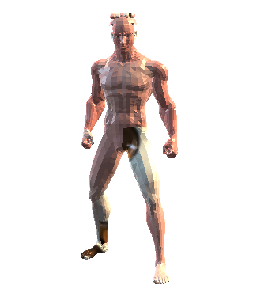

# Перенос клиента на Unity

Документ описывает архитектуру переноса и текущее состояние работ. Настройка
окружения — в [`unity-client/README.md`](../unity-client/README.md).

## Что переносится, а что нет

Realm of Ashes построен на авторитетном сервере: вся игровая логика — бой по AP,
инвентарь, экипировка, NPC, фракции, квесты, экономика и автономная симуляция
пустоши — живёт в `server.js` и `src/server/`. Браузерный клиент отвечает за
рендер, ввод и предсказание движения.

Поэтому Unity заменяет **только клиент**:

| Слой | Объём | Судьба |
|---|---|---|
| `server.js` + `src/server/` | ~38 400 строк | **Не трогаем.** Unity подключается к нему как ещё один клиент |
| `data/` — локации, карта, квесты, лут | 30 локаций + мировые данные | **Не трогаем.** Unity читает тот же JSON |
| `public/assets/models/` — 215 GLB, 146 МБ | — | **Не конвертируем.** Unity грузит те же файлы через glTFast |
| `public/js/game/` — Three.js клиент | ~52 700 строк | **Переносим** на C# |

Переписывание сервера на Mirror/Netcode рассматривалось и отклонено: это
означало бы заново реализовать 38k строк проверенной логики без выигрыша для
игрока.

Побочный эффект такого разделения: web-клиент продолжает работать всё время
переноса. Unity-клиент — второй клиент того же сервера, а не замена на месте,
поэтому обе версии могут ходить в один мир одновременно.

## Объём переноса

Игровой клиент перенесён единым набором C#-подсистем: аккаунт и персонажи,
локальные локации, движение и другие игроки, NPC и бой, инвентарь и экипировка,
HUD, глобальная карта, диалоги, торговля, задания, экономика, фракции и социальные
функции. Основная целевая платформа — **Standalone PC**; для мобильного landscape
есть отдельная раскладка управления. Критические и редкие игровые цепочки пройдены
собранными Windows-клиентами против изолированного авторитетного сервера.

WebGL не входит в текущую поставку Unity-клиента: для него отдельно нужен
браузерный транспортный мост (см. «Ограничение WebGL» ниже).

## Контракт с сервером

Протокол зафиксирован в [`docs/wiki/SOCKET_EVENTS.md`](wiki/SOCKET_EVENTS.md) и
проверяется на сервере скриптом `tools/check-socket-event-contract.js`. Это
позволило описать C#-модели без обратной инженерии трафика.

Вход состоит из двух шагов:

1. `POST /api/auth/login` → `token` и список персонажей.
2. Socket.IO `join` с `token`, `deviceId`, `clientInstanceId`, `characterId`
   и `enemyFrameVersion: 1` → ack с `characterLeaseId`, комнатой, собственным
   состоянием, списком игроков и `worldState`.

Стартовый экран больше не зависит от браузерного клиента: Unity вызывает
`/api/auth/register`, оба этапа `/api/auth/password-reset/*`, обновляет список
через `/api/characters`, продлевает сессию десятисекундным heartbeat и освобождает
блокировку аккаунта через logout. Удаление
персонажа доступно только после ручного ввода его точного ID и повторного
подтверждения; сервер дополнительно запрещает удалять активного персонажа.

Игровое меню доступно локально и на глобальной карте. Смена персонажа закрывает
Socket.IO без автоматического reconnect, очищает обе сцены и обновляет список;
logout сначала просит сервер завершить сессию и освободить блокировки. Под меню
блокируются движение, бой, взаимодействие, быстрые слоты и выбор цели на карте,
при этом авторитетный маршрут продолжает идти по серверному времени.
Встроенное обучение открывается из меню или по `F1`, адаптируется к landscape
экранам и объясняет оба набора управления без зависимости от HTML web-клиента.
Настройки графики используют шесть штатных URP-пресетов проекта, сохраняют
выбор в `PlayerPrefs`, начинают мобильный первый запуск со среднего качества и
на PC также переключают оконный/полноэкранный режим.
Режим редактирования HUD блокирует игровой ввод и даёт перетаскивать статус,
мини-карту, боевой журнал и быстрые слоты; координаты ограничиваются экраном,
сохраняются локально и могут быть сброшены. Панель слотов теперь видна и на PC,
а не только в touch-режиме.

Существенные детали, которые легко потерять при переносе:

- **`enemyFrameVersion: 1` обязателен.** Без него сервер шлёт полные
  `enemySnapshot` вместо компактных volatile `enemyFrame` — трафик вырастает
  на порядок.
- **Таймаут join — 5000 мс**, просроченный callback игнорируется, соединение
  уходит в reconnect. Игровой authority до нового ack считается потерянным.
- **`seq` в `state` должен строго расти.** Пакеты с не большим `seq` сервер
  молча отбрасывает.
- **`playerState` и `enemyFrame` — volatile.** Промежуточный пакет допустимо
  потерять; отбрасывать устаревшие по `seq` обязан клиент.
- **Пакеты чужой комнаты надо игнорировать** по `roomId` — во время перехода
  между локациями в полёте остаются сообщения предыдущей сцены.
- **Начало и остановка движения отправляются надёжно и немедленно**, промежуточные
  координаты — не чаще 20 Гц. Иначе персонаж «залипает» в беге у других игроков.
- Сервер может отклонить предложенную позицию по бюджету коллизий и прислать
  поправку через `authoritativePlayerState` с `reason: "movementCorrection"`.
  Обычная сверка позицию **не** трогает — применять `x`/`z` только при этой причине
  или при явном переходе.

## Система координат

Это главный источник тихих багов при переносе, поэтому преобразование
изолировано в единственном классе `RoaCoords`.

Сервер и вся авторская разметка работают в правосторонней системе Three.js/glTF.
Unity левосторонняя. glTFast при импорте GLB инвертирует ось Z, поэтому весь мир
переводится тем же преобразованием:

```
позиция:  x_unity = x_server,  y_unity = y_server,  z_unity = -z_server
угол:     yaw_unity(град) = 180 - angle_server(рад) * Rad2Deg
Euler XYZ: Q_unity = Qx(-x) * Qy(-y) * Qz(z)
тайл:     x = (tx - width/2 + 0.5) * TILE,  TILE = 2
```

Для авторских `rotation.x/y/z` недостаточно передать знаки в
`Quaternion.Euler`: Unity применяет другой порядок осей, и ошибка проявляется,
когда ненулевы сразу несколько углов. `RoaCoords.AuthoredRotation` явно повторяет
Three.js XYZ как `Qx * Qy * Qz`, одновременно отражая Z. Пять синтетических
одноосевых и комбинированных поворотов сверяются математически; реальный Windows
player выполнил тот же комбинированный случай `(0.37, -0.81, 1.13)` с
`abs(dot) = 1,000000`.

Серверный `angle` — это `atan2(dx, dz)`: 0 означает взгляд вдоль +Z, рост против
часовой стрелки при взгляде сверху.

Three.js-клиент дополнительно доворачивает модель персонажа на 180°
(`playerGroup.rotation.y = player.angle + Math.PI`), потому что модель смотрит
в −Z. После импорта glTFast модель смотрит в +Z, поэтому `ModelYawOffsetDeg`
нулевой. Это подтверждено по самому `character_male_medium.glb`: средний Z
геометрии глаз равен `+0,068 м`, бровей `+0,079 м`, то есть лицо направлено вдоль
локальной `+Z`. `check-actor-facing.js` прогоняет четыре стороны света и обратное
преобразование угла; скрытый Windows-кадр с камерой на `+Z` также показал лицо,
а не спину.

## Формат локации

`data/locations/*.json` уже полностью декларативен. Каждый объект несёт готовый
URL на GLB, мировую позицию, поворот, масштаб, режим коллизии, теги и — для NPC —
блок `entity` с фракцией, диалогом и торговым профилем.

Конвертировать нечего: Unity читает тот же файл через `GET /api/locations`.

Одна ловушка: NPC и враги лежат в `objects` вместе с декорациями, но их
авторитетные позиции приходят в `enemySnapshot`. Загрузчик пропускает только
живые типы `npc`/`enemy`/`monster` и их теги. Нельзя отбрасывать любой
`entity.kind`: 44 авторских станка и доска заданий тоже имеют `entity`, но
остаются статическими GLB-объектами.

## Ограничение WebGL

C#-библиотеки Socket.IO используют `System.Net.WebSockets`, которого в браузере
нет. Для WebGL-сборки понадобится `.jslib`-мост к JS-клиенту socket.io — тот же,
что уже лежит в `public/vendor/socket.io.min.js`.

Работа отложена намеренно: сначала играбельный клиент на PC, где всё работает
из коробки, потом мост. Сетевой слой изолирован в `RoaSocketClient`, так что
мост подменит транспорт, не задев игровой код.

## Транспорт Socket.IO

Клиент Socket.IO написан своим кодом поверх `System.Net.WebSockets`
(`Assets/Scripts/Net/SocketIo/RoaSocketIoConnection.cs`), а не взят сторонним
пакетом: в реестре Unity его нет, а любая C#-библиотека всё равно потребовала бы
замены под WebGL. Транспорт отделён от игрового слоя, поэтому `.jslib`-мост
подменит один класс.

Реализованы Engine.IO v4 и Socket.IO v5 — протокол `socket.io@4.7.5` с сервера.
Класс не зависит от `UnityEngine`, что позволило прогнать его против живого
сервера обычным .NET-приложением, не запуская редактор.

## Состояние

Проект собран на **Unity 6000.5.8f1**, URP 17.5.0 и компилируется без ошибок.
Отдельная пакетная проверка на чистой временной копии проекта собрала
`Wasteland.unity` в Windows-плеер (`Build Finished, Result: Success`) и запустила
его на 15 секунд с Null graphics device: Mono, Input System и PhysX
инициализировались без исключений или ошибок загрузки.
Живой Windows-прогон подтверждает вход, join, сборку локации `settlement`, движение,
desktop/mobile landscape HUD, два одновременных Unity-клиента, автоматический reconnect
обоих клиентов после перезапуска сервера, PvP-урон, серверное возрождение, полный маршрут
через глобальную карту, drop/pickup и двухклиентный финал каравана с боем и добычей.
Сводка редких веток приведена в разделе «Итоговое покрытие редких веток».
Дополнительный пакетный аудит в настоящем Unity прогоняет десять детерминированных
редакторских проб. В том числе он загрузил реальный `male_medium.glb`, применил
лицо/причёску/цвет, проверил записанный цвет в настоящем свойстве
`baseColorFactor` glTFast-материала, отрисовал экран создания в `RenderTexture`
320×360 и получил 19 313 отличимых пикселей. Проверка сетевой и предметной чётности отдельно
сверяет с web-клиентом 43 исходящих и 43 входящих события, 58 предметов,
18 рецептов, 19 модификаций оружия и шесть стартовых перков.

| Компонент | Файл | Статус |
|---|---|---|
| Преобразование координат | `Assets/Scripts/World/RoaCoords.cs` | проверено в Play Mode |
| Модели протокола | `Assets/Scripts/Net/RoaProtocol.cs` | проверено на сервере |
| HTTP-авторизация | `Assets/Scripts/Net/RoaAuthClient.cs` | живой Windows player прошёл вход и выбор персонажа; регистрация, восстановление, heartbeat, logout и CRUD персонажей сверены с HTTP-контрактом |
| Транспорт Socket.IO | `Assets/Scripts/Net/SocketIo/RoaSocketIoConnection.cs` | проверено на сервере |
| Игровой сетевой слой | `Assets/Scripts/Net/RoaSocketClient.cs` | проверено в Play Mode |
| Модель локации | `Assets/Scripts/World/RoaLocationData.cs` | метры/тайлы и technical map сверены с сервером |
| Загрузчик и земля | `RoaLocationLoader.cs`, `RoaLocalTerrain.cs` | 69 объектов, GLB, серверная сетка, terrain и точные части коллайдеров проверены в Windows player |
| Создание персонажа | `RoaCharacterCreator.cs`, `RoaCharacterPreview.cs` | полный контракт и формулы проверены; настоящий GLB с idle-позой и вариантами внешности отрисован в Unity и визуально проверен |
| Контроллер игрока | `Assets/Scripts/Game/RoaPlayerController.cs` | движение и серверная позиция проверены в Windows player |
| Другие игроки | `Assets/Scripts/Game/RoaRemotePlayers.cs` | два клиента одновременно вошли в `settlement`; второй создал одну remote-модель |
| Камера | `Assets/Scripts/Game/RoaCameraRig.cs` | дистанция 8–40 м, сохранение локального zoom, блокировка колеса под UI и независимые zoom/pan глобальной карты проверены в Unity |
| День, ночь и освещение | `Assets/Scripts/Game/RoaWorldLighting.cs` | формулы, профиль локации и применение реальных коэффициентов проверены пакетным Unity-аудитом; desktop/mobile кадры прошли визуальную проверку |
| Мини-карта | `Assets/Scripts/Game/RoaMinimap.cs` | визуально проверена в 1280×720 и mobile landscape 896×414 |
| Прозрачность крыш | `Assets/Scripts/Game/RoaRoofCutaway.cs` | геометрия, авторская разметка и настоящий переход URP-материала `opaque → alpha 0.24 → restored` проверены в Unity |
| Боевые эффекты и речь NPC | `Assets/Scripts/Game/RoaCombatFx.cs` | профили, сетевые траектории, runtime-пулы трассеров/вспышек, ракетное кольцо/свет и очистка проверены в Unity |
| Мобильное управление | `Assets/Scripts/Game/RoaMobileControls.cs` | touch-слой и модальные панели проверены в landscape 896×414 |
| Быстрые слоты | `Assets/Scripts/Game/RoaQuickbar.cs` | 8 слотов и landscape-геометрия сверены; назначение `knife` в слот 1, save/load и reconnect пройдены живым Windows player |
| Сборка среза | `Assets/Scripts/Game/RoaGameBootstrap.cs` | проверено в Play Mode |
| Reconnect | `RoaSocketClient.cs`, `RoaGameBootstrap.cs` | два Windows player автоматически переподключились и получили новые lease после перезапуска сервера |
| Глобальная карта | `RoaGlobalMap.cs`, `RoaGlobalMapSiteMeshBuilder.cs` | живой маршрут `wasteland → карта → settlement`, территории и 3D-модели проверены в Windows player |
| NPC, диалоги, квесты, торговля и локальные переходы | `Assets/Scripts/Game/RoaInteraction.cs` | живой dialogue focus, принятие/отмена/завершение квеста с наградой и unlock, NPC-бартер, двусторонний обмен с торговым автоматом, ввод/вывод из столичного хранилища и ограбление каравана проверены |
| Трупы и контейнеры | `Assets/Scripts/Game/RoaInteraction.cs` | пустой и непустой runtime-контейнеры, терминальный взлом, перенос всего лута, `inspectCorpse` и `lootEnemy` пройдены живым Windows player; результат пережил reconnect |
| Лечение и действия с предметами | `RoaInventory.cs`, `RoaPipboy.cs` | drop/pickup, самолечение и лечение другого Unity-игрока, разрядка, ремонт, разбор и независимые модификации двух runtime-оружий проверены живыми Windows player и пережили reconnect |
| Каталог предметов и переносимый вес | `RoaItemData.cs`, `RoaInventory.cs` | все 58 id, названия, веса и формула грузоподъёмности сверены с web-клиентом; живой inventory/drop/pickup пройден Windows player |
| Ресурсы и крафт | `RoaInteraction.cs`, `RoaCraftingData.cs` | 27 узлов/44 станка сверены с живым API; износ топора/кирки, истощение и респаун узла, добыча древесины/руды и по одному рецепту на всех шести типах станков проверены живым Windows player и пережили reconnect |
| Мировые работы и фракции | `RoaInteraction.cs` | 20 досок сверены с `/api/wasteland`; живая доска прошла `accept/track/cancel/deliver/claim`, вступление в `old_klim` и reconnect |
| PIP-BOY, навыки и таланты | `RoaPipboy.cs`, `RoaProgressionData.cs` | 16/41 id и требования сверены; `lightWeapons +5` и `specialStr +1` подтверждены authoritative self и пережили reconnect |
| Друзья и кланы | `RoaPipboy.cs` | два Unity-клиента прошли заявку/принятие дружбы и приглашение/вступление в клан |
| PvP, взрывы и режимы оружия | `RoaCombat.cs` | живой Windows player прошёл `single`/`aimed`/`auto`/`dual`, включая расход обоих пистолетных магазинов; ракета списала заряд и нанесла самоурон. Два Unity-клиента подтвердили безопасный отказ, точный курсорный PvP hit/miss, PvP-урон, полный/частичный drop и подбор |
| Смерть и адресный перенос | `RoaSocketClient.cs`, `RoaGameBootstrap.cs` | смерть от NPC и оба PvP-режима вызвали `serverRespawn` в `settlement` без повторного join; HP, экипировка, остаток сумки и добыча пережили reconnect |

Сцена: `Assets/Scenes/Wasteland.unity`.

### Подтверждено прогоном в Play Mode

Против сервера, поднятого через `npm run start:preview`:

- вход по HTTP → `join` → `characterLeaseId` выдан, комната `settlement`;
- локация собрана из авторского JSON и настоящих GLB: **62 объекта, 0 ошибок**;
- 320 MeshRenderer, 120 материалов, **ни одного сломанного шейдера** —
  glTFast корректно отдаёт `Shader Graphs/glTF-pbrMetallicRoughness` под URP;
- первый прогон обнаружил землю 152×152 м: Unity ошибочно считал авторские
  `map.width/depth = 76` числом тайлов, хотя это метры; после сверки с серверной
  сеткой `38×38` масштаб исправлен на 76×76 м; последующие Windows-прогоны
  подтвердили размер, центр, коллизии и 69 объектов локации;
- персонаж стоит на земле (`y = 0.89`);
- **обратное преобразование координат совпало с сервером точно**: сервер выдал
  точку входа `x=1 z=13`, позиция игрока в Unity переводится обратно в `x=1 z=13`.

Отдельно, до Unity, тем же кодом транспорта из обычного .NET-приложения были
проверены Engine.IO handshake, ack-путь, отправка `state` и приём
`enemySnapshot`, `groundItemsSnapshot`, `worldContainersSnapshot`, `snapshot`
и 16 пакетов `enemyFrame` за 4 секунды.

### Ошибки, найденные и исправленные прогоном

Три дефекта, которые компиляция пропустила:

1. **Персонаж проваливался сквозь мир** (`y = −955`). У локации нет земли как
   модели. `RoaLocalTerrain` теперь строит отдельный плоский игровой коллайдер и
   непрерывную визуальную backplate, принимает каноническую `worldState.map` от
   Node-сервера и рисует мягкие дороги, выжженную землю, воду и слои двора без
   видимой квадратной сетки. `map.width/depth` трактуются как метры, а число
   тайлов вычисляется через `grid.step`.
   Динамические `worldSiteInstance` используют `map.technicalWidth/depth`, поэтому
   их уменьшенная игровая область не сдвигает общую серверную сетку 38×38.
   Четыре невидимых коллайдера по `playableBounds` останавливают локальное
   предсказание на той же границе, где сервер запрещает движение.
   Полнотайловая физика зеркалит `isRoomTerrainWalkableTile`: вода блокирует
   движение везде, а клетки деревьев — только в legacy-поселении. Соседние такие
   клетки объединяются в прямоугольники. Процедурные деревья, камни, руины и
   ресурсы используют точные повёрнутые OBB своих GLB из `model-colliders.json`,
   как `roomStaticCollisionMoveAllowed` на сервере, и не получают лишний квадратный
   запрет размером с технический тайл.
   Для предпросмотра выстрела отдельно повторён `roomBlockingDistanceOnRay`: дерево
   баллистически закрывает весь тайл, а камень, ресурс, руины и нефть — весь тайл
   только присевшему стрелку. После этого проверяется точный физический OBB модели;
   вода по-прежнему прозрачна для пуль.
   Деревья, камни, ресурсы и руины таких точек создаются тем же целочисленным
   hash и теми же GLB, что `roomProceduralModelSpec()` на сервере. Коллизия всех
   статических моделей берётся из сгенерированного `model-colliders.json`; bounds
   остаётся только явным резервным путём при недоступности каталога. Каталог
   хранит низкий walk-slab до ≈0.95 м: его высота сохраняется для канонических
   низких укрытий, а полноценные стены расширяются вверх только в физическом
   объёме, чтобы стоящий боевой луч не проходил над стеной.
2. **`NullReferenceException` при выходе из Play Mode.** Порядок `OnDestroy` не
   определён: транспорт уничтожался раньше контроллера игрока, а `Phase`
   оставалась `Joined`. Теперь фаза снимается до `Dispose`, а `SendState`
   дополнительно проверяет сам транспорт.
3. **Вход существующим персонажем не работал** — сервер отвечал «Не выбран
   персонаж». В списке персонажей идентификатор приходит в поле `id`
   (`summarizeState`, server.js:1317), а модель ожидала `characterId`.
   Первый .NET-прогон этого не поймал, потому что список был пуст.

## Модели персонажей и управление мышкой

Персонажи больше не капсулы: грузится авторская GLB-модель по внешности —
`character_{sex}_{bodyType}.glb`, те же шесть утверждённых баз, что и в вебе
(04b_character_glb_runtime.js:167). Модель общая для своего игрока, удалённых
игроков и человеческих NPC.

`faceId` масштабирует кость головы по четырём каноническим профилям,
`hairId` включает причёску или бритую голову, а `hairColorId` красит отдельный
экземпляр материала волос — общий кеш GLB не меняется. Надетый шлем скрывает
волосы; при снятии они возвращаются с прежним цветом.

Управление повторяет web-клиент: **персонаж смотрит на курсор, а ходит
независимо от взгляда**. Угол прицела считается так же — `atan2` от вектора
«цель минус игрок» по горизонтали (06c_combat_stats_modes.js:148), цель берётся
пересечением луча камеры с плоскостью земли на высоте ног.

Из-за расхождения взгляда и пути нужны направленные клипы. В базовых GLB лежат
только `idle`, `walk`, `run`; `walk_back`, `run_back`, `crouch_walk`,
`crouch_walk_back` живут в `npc_humanoid_animations.glb` на том же 65-костном
риге.

### Почему клипы из библиотеки требуют выравнивания префикса

Three.js привязывает треки анимации к костям **по имени узла**, поэтому веб-клиент
просто подмешивает клипы библиотеки к базовой модели. Legacy-анимация Unity
привязывается **по полному пути трансформа**, и здесь этого недостаточно.

Замер в Play Mode показал, в чём разница:

```
walk       (клип базы):      путей 65, совпало 65  -> полностью
walk_back  (клип библиотеки): путей 65, совпало 0   -> НЕ ПРИВЯЗАН
   нет в риге: npc_humanoid_root/root/pelvis/spine_01
```

Скелеты идентичны, различается только имя корневого узла:
база — `character_root/...`, библиотека — `npc_humanoid_root/...`.

Это опаснее обычной поломки: клип добавляется в `Animation`, числится доступным,
но не анимирует ничего — то есть честный фолбэк (реверс `walk`) не срабатывает,
и персонаж просто замирает.

Переписать пути в рантайме нельзя: `AnimationUtility` доступен только в редакторе.
Поэтому клиент выравнивает префикс переименованием корня модели и берёт клипы
целиком из библиотеки — там есть и `idle/walk/run`, и `attack/death/hurt/turn`,
которые понадобятся для боя. Переименование выполняется только после успешной
загрузки библиотеки, иначе перестали бы привязываться собственные клипы базы.

Исправление повторно проверено и редакторской пробой путей, и живым Windows
player: `walk_back` привязывает все 65 путей после переименования корня, а
движение назад использует отдельный клип без замирания персонажа.

### Скорость: серверный потолок — не скорость ходьбы

Первая версия двигала персонажа со скоростью `PLAYER_SPEED = 7.0` из
`server.js:144`. Это ошибка: 7.0 — потолок валидации, сервер лишь отвергает
перемещение быстрее него с запасом ×1.35. Фактическая скорость персонажа
выводится из SPECIAL (`derivedFromStats`, 08_character_creation_save.js:96):

```
speed = 4.35 + Ловкость * 0.13 − (Тяжёлый удар ? 0.18 : 0)
```

При средней Ловкости это ≈5.0 м/с, то есть клиент бежал почти в полтора раза
быстрее нормы. Это ломало и анимацию: stride sync подтягивал темп клипа к
завышенной скорости, и ноги «крутились».

Правильные значения, все взяты из web-клиента:

| Величина | Значение | Источник |
|---|---|---|
| Скорость | `4.35 + agi·0.13 − bruiser·0.18` | 08_character_creation_save.js:96 |
| Ботинки | +0.12…+0.34 м/с по предмету | 03_items_inventory_core.js:29–32 |
| Перелом ноги | ×0.68 | 03b_inventory_actions_ui.js:448 |
| Инфекция | ×0.92 | 03b_inventory_actions_ui.js:448 |
| Присед | ×0.62 | 09_update_fog_movement_ai.js:1284 |
| Порог walk → run | 3.4 м/с | 04b_character_glb_runtime.js:783 |

SPECIAL приходят в авторитетном `self`, поэтому скорость пересчитывается
на входе в мир и при каждой серверной сверке. Слот ботинок читается из
`equipmentRuntime` с разбором runtime-id, а перелом ноги и инфекция — из
авторитетного `injuries`. Лечение, смена обуви и новый статус поэтому меняют
скорость немедленно, не дожидаясь повторного входа.

Физические травмы видны и на общем humanoid-риге: сломанная правая рука теряет
идеальный IK-хват, перелом ноги меняет силуэт и даёт лёгкое покачивание,
сотрясение раскачивает голову и верх корпуса. Над моделью показываются четыре
цветовых маркера активных травм, включая инфекцию; они проходят через тот же
`RoaVisibilityGate`, что персонаж. Unity показывает клиентский прогноз шанса и
стоимости ОД, но результат атаки и все штрафы применяет только авторитетный сервер.
Кость ноги привязана к фактическому имени утверждённого рига `thigh_l`; прежнее
`upperleg_l` отсутствовало в GLB и молча пропускало локальный изгиб. Четыре
материала маркеров теперь принадлежат `RoaCharacterView` и явно освобождаются при
удалении персонажа.

Перенесены и два нюанса, без которых походка «плывёт»:

- **stride sync** — темп клипа подтягивается к фактической скорости по таблице
  натуральных скоростей, измеренной `tools/check-locomotion-clip-sync.js`
  (walk 1.26, run 3.72, walk_back 1.20, run_back 3.41 м/с), с клэмпом 0.6–2.9;
- **гистерезис заднего хода** — вход −0.17, выход +0.17, иначе на границе
  «вперёд/назад» поза дребезжит.

### Переступание на месте

Без него модель просто проворачивалась вслед за курсором, не переставляя ног.
Портирована логика `characterTurnInPlaceState()`
(04b_character_glb_runtime.js:683) вместе с порогами: поворот засчитывается
при `|delta| ≥ 0.003` рад и угловой скорости `≥ 0.18` рад/с, сила берётся как
`clamp(угловая скорость / 2.8, 0.28, 1)`, темп клипа — `1 + |сила| · 0.5`.

Ключевая деталь — **удержание (hold) 0.14–0.38 с**. Короткий доворот курсором
даёт всплеск угловой скорости на один-два кадра; без удержания клип успевал бы
только дёрнуться. Поэтому поворот «держится» ещё некоторое время после того,
как курсор уже остановился.

Флаг `turning` теперь уходит на сервер в событии `state` — раньше клиент всегда
слал `false`. Сервер ретранслирует его другим игрокам, поэтому без этого
персонаж проворачивался на месте и у них тоже.

## Процедурная поза

`Assets/Scripts/Game/RoaCharacterPose.cs` — портированы два слоя web-клиента
поверх клипов: `applyCharacterGlbDirectionalPose()` и
`applyCharacterUpperBodySwayDamping()`.

### Ноги по пути, корпус на прицел

Ключевой приём: корень модели доворачивается на `lowerBodyYaw` — ноги уходят
на направление движения, — а вверх по цепи позвоночника идёт контр-поворот
с коэффициентами

```
spine_01 0.16 + spine_02 0.18 + spine_03 0.18 + neck_01 0.22 + head 0.26 = 1.00
```

Сумма ровно единица, поэтому голова возвращается точно на прицел, а между тазом
и плечами возникает естественная скрутка. При стрейфе персонаж бежит боком,
глядя вперёд, — как в браузере.

Доворот таза ограничен по угловой скорости (`CHARACTER_LOWER_BODY_YAW_RATE`,
5.2 рад/с). Без предела смена режима вперёд/назад или быстрый доворот прицела
перекидывали ноги на 1200–1600 град/с — это читается как «ноги глючат».

Замер в Play Mode подтверждает поведение:

| Движение при прицеле вперёд | Доворот таза | Клип |
|---|---|---|
| вперёд | 0° | `run` |
| вперёд медленно (2 м/с) | 0° | `walk` |
| стрейф влево | −90° | `run` |
| стрейф вправо | +90° | `run` |
| назад | 0° | `run_back` |

Ноль при ходе назад — не ошибка: авторский клип заднего хода сам шагает назад,
доворачивать таз незачем. По той же причине его темп не реверсируется
(`playbackTarget = 1`), тогда как фолбэк без клипа играет `walk` со скоростью
−0.88.

### Демпфирование верха

Клипы авторизованы с размашистым верхом — в `run` шея и голова качаются на ±40°,
в игре это читается как «мотание головой». Верх подтягивается к позе покоя
slerp-ом на `(1 − keep) · blend`, где keep тем меньше, чем выше кость:
spine_02 0.65, spine_03 0.45, neck_01 0.30, head 0.22.

Поза покоя снимается один раз сразу после создания модели, до первого клипа.

### Порядок кадра

Смещения применяются в `LateUpdate()` — строго после того, как Legacy-анимация
записала свой кадр. В `Update()` их бы затёрло. Web-клиент выдерживает тот же
порядок: `mixer.update` → демпфирование верха → направленная поза.

## Foot IK

`Assets/Scripts/Game/RoaFootIk.cs` — портирует `applyCharacterFootIk()`
и `solveCharacterLegChain()` (04b:1106–1355).

Запечённые клипы проигрываются с изменённым темпом (stride sync), а персонаж
движется со скоростью сервера. Даже при точной подгонке темпа остаётся
расхождение, и стопы подскальзывают. IK ловит опорную стопу в момент контакта,
пришивает её к точке касания и держит, пока анимация не поднимет ногу.

### Как отличается опора от переноса

Не по высоте — у этих клипов она почти не меняется. По **знаку скорости стопы
относительно корпуса**: опорная нога «уезжает назад» под корпусом, переносимая
летит вперёд примерно вдвое быстрее корпуса.

```
along = ((Vфут − Vкорпус) · Vкорпус) / |Vкорпус|
опора  = along < |Vкорпус| · 0.15
перенос = along > |Vкорпус| · 0.7
```

Когда корпус почти стоит (|V| ≤ 0.3 м/с), решает абсолютная скорость стопы,
причём в развороте пороги выше: клип всё равно свипует стопы, и замок должен
пересиливать свип, иначе ноги «шагают вперёд» на месте.

### Решатель

FABRIK по цепи бедро → голень → стопа, 8 итераций, с быстрым выходом при
недостижимой цели (нога вытягивается прямо). Вращаются только бедро и голень —
ориентацию стопы задаёт анимация.

В Unity это проще, чем в оригинале: `Transform.rotation` принимает мировую
ротацию и сам пересчитывает локальную, тогда как в Three.js приходилось вручную
инвертировать кватернион родителя.

### Порядок и защита от рывков

Foot IK идёт последним в `LateUpdate`, после направленной позы: та вращает таз,
а ноги — его дети, и их мировые позиции к этому моменту окончательные.

Замок хватает быстро (скорость смешивания 24) и отпускает мягко (6): резкий
возврат к анимации на полном сносе выглядел бы рывком. Отпускание принудительно
при сносе больше 0.44 м, скручивании корпуса больше 0.55 рад или подъёме стопы
выше `0.05 · 2.4`. После отпускания — пауза 0.08–0.18 с, иначе опускающаяся нога
ловится и рвётся по нескольку раз за шаг. Скачок позиции больше 1.6 м (телепорт,
серверная поправка) сбрасывает замки, а смена клипа перепришивает стопы.

### Проверено в Play Mode

- кости `thigh/calf/foot` обеих ног найдены, высоты покоя сняты (0.086 и 0.091 м);
- в стойке зафиксированы **обе** стопы;
- в беге замки размыкаются, когда клип поднимает ноги (стопы на 0.158 и 0.561 м).

Отсутствие скольжения при реальном перемещении проверяется только глазами:
прогнать движение клавишами через MCP нельзя.

## Просадка корня и присед

### kneeFlex

Колени не рисуются отдельным клипом. Корень модели опускается на `kneeFlex`,
а foot IK возвращает стопы на настоящую землю — ноги подгибаются сами.
Красивое следствие: глубина приседа задаётся одним числом, а сгиб получается
анатомически правильным, потому что его считает решатель.

| Состояние | Просадка |
|---|---|
| стоя | 0.04 м |
| в движении | 0.055 м |
| присед | 0.26 м |
| смерть | 0 |

Из-за просадки «земля клипа» ниже настоящей, поэтому foot IK считает высоту
стопы с поправкой `+ kneeFlex`. Без неё в приседе стопа всегда числилась бы
«у земли», замок хватал бы её в воздухе, а свободная стопа уходила бы под пол.

### Поза приседа

Корпус наклоняется вперёд (таз 0.06, spine_01 0.14, spine_02 0.12, spine_03 0.08),
а шея −0.10 и голова −0.14 отклоняются назад, чтобы взгляд остался на цели.

Отдельно исправлено: присед **на месте** — это `idle` плюс поза приседа,
а не клип ходьбы. В вебе клип локомоции выбирается только когда персонаж
действительно движется (04b:783); первая версия включала `crouch_walk`, и
персонаж маршировал на месте, сидя на корточках.

### Проверено в Play Mode

```
стоя:       kneeFlex = 0.04  (ожидание 0.04)
движение:   kneeFlex = 0.055 (ожидание 0.055), клип run
присед:     kneeFlex = 0.26  (ожидание 0.26)
снова стоя: kneeFlex = 0.04
```

## Оружие и прицеливание корпусом

### Почему это одна задача, а не две

Корпус доворачивается не «на курсор», а на остаток, который не смог отработать
сам ствол:

```
delta     = угол между стволом (socket_grip_r → socket_muzzle) и направлением на курсор
requested = delta
delta     = clamp(delta, ±0.35)   // предел выкручивания оружия в кисти
residual  = requested − delta     // остаток забирает корпус
```

`rotateApprovedTorsoTowardAim` раскладывает `residual` **поровну** по
`spine_01/02/03` с пределом ±1.2 рад, после чего оружие монтируется заново:
рука уехала вместе с корпусом, и остаток уже укладывается в предел.
(Веса 0.18 / 0.34 / 0.48 — это другая система, поза ближнего боя.)

Без оружия в руках ствола нет, `residual` всегда ноль, и доворот корпуса —
пустая операция. Поэтому перенесён срез системы оружия целиком.

### Состав

| Файл | Что делает |
|---|---|
| `RoaWeaponGrip.cs` | однокадровая поза хвата на 41 кость + матрица крепления `hand_r⁻¹ · mount` |
| `RoaWeaponView.cs` | монтирование, сведение ствола, доворот корпуса |

Поза хвата применяется **записью трансформов по имени кости**, а не
проигрыванием клипа. Это снимает конфликт: Legacy-клип привязывается по полному
пути, а корень модели переименован ради клипов локомоции. Веб делает так же.

### Сэмплировать позу надо на корне сцены glTF, а не на своей обёртке

Первая версия давала `HandToMount` длиной 0.711 м при длине предплечья 0.246 м:
оружие висело в воздухе. Проба показала причину однозначно:

```
mount родитель: Scene
ДО позы:    hand_r=(0.71, 1.47, -0.07)  расстояние=0.718 м
ПОСЛЕ позы: hand_r=(0.71, 1.47, -0.07)  расстояние=0.718 м
кисть повернулась на 0.0°
```

Поза не применялась вообще. `glTFast` кладёт содержимое glTF в промежуточный
объект (обычно `Scene`), поэтому относительно своей обёртки пути клипа
превращаются в `Scene/character_root/...` и не разрешаются —
`AnimationClip.SampleAnimation` при этом **молча ничего не делает**, без ошибки.
Снималась поза привязки, в которой узел крепления действительно далеко от кисти.

Сэмплирование перенесено на корень сцены glTF (первый ребёнок обёртки).

Оставлена и страховка: если крепление оказывается дальше 0.25 м от кисти,
клиент отказывается подключать оружие с явной ошибкой в консоли, вместо того
чтобы показывать летающий автомат. Персонаж просто остаётся без оружия.

Диагностика — меню **Realm of Ashes → Проверить хват оружия**: печатает
расстояние от кисти до крепления до и после применения позы и угол поворота
кисти. Запускать при **активном окне Unity**: без фокуса редактор не выполняет
асинхронные продолжения, и загрузка GLB не идёт.

После правки проба даёт:

```
сэмплируем на объекте: Scene
ДО позы:    hand_r=(0.71, 1.47, -0.07)  расстояние=0.718 м
ПОСЛЕ позы: hand_r=(0.17, 1.33, 0.25)   расстояние=0.092 м
кисть повернулась на 18.5°
```

В игре: `HandToMount = 0.091 м`, `socket_grip_r` в **0.084 м** от кисти.

### Замер прицеливания

Цель под ~102° от ствола, контроллер игрока отключён (иначе он доворачивает
корпус к курсору сам и остатка не остаётся):

```
доворот ствола  = 0.35 рад  (ровно предел)
доворот корпуса = 1.20 рад  (ровно предел)
остаточный промах = 12°
```

Суммарно система закрывает 0.35 + 1.2 = 1.55 рад ≈ **89°**. Цель под 102° —
остаток 13°, замер дал 12°. Сходится: пределы работают, и промах появляется
только когда корпус искусственно лишён возможности повернуться.

Диагностическое свойство `TorsoResidual` публикует **применённый** доворот,
а не запрошенный: запрошенный может превышать предел, и цифра врала бы о позе.

### Точка прицела берётся на высоте ствола

Оружие наводится **не** на курсор, спроецированный на землю. У наклонной камеры
проекции одного и того же курсора на землю и на высоту груди расходятся почти
на метр, и доворот доходил бы до 48° — на таких углах оружие выкручивается
из кисти и выворачивает локоть (04d:1222).

Поэтому контроллер считает две точки: разворот персонажа — по земле (курсор
совпадает с точкой на карте), а прицел оружия — по плоскости на высоте
`socket_grip_r`.

### Смена оружия

Огнестрел — двенадцать моделей — держится одним и тем же хватом, различаются
только GLB и узел перезарядки. Id берётся из авторитетного состояния:
при входе из `combat.weapon`, дальше из `equipmentRuntime.weapon`
в `authoritativePlayerState` (базовый id извлекается как в `serverBaseItemId`,
server.js:4753). У других игроков — из `publicPlayer.weapon`.

Кулаки оставляют руки свободными. Нож использует отдельную одноручную стойку,
а `axe`, `pickaxe` и `handPump` — двуручные стойки с IK обеих рук и тремя
фазами замаха; они не проходят через хват огнестрела.

### Поднятое положение у препятствий

Щуп идёт вдоль ствола на 0.55 и 0.95 м от рукояти сферой радиуса 0.18 м.
При упоре ствол поднимается вокруг рукояти на `blend · 1.05` рад, а доворот
к курсору гасится множителем `1 − blend`: иначе оружие «летает», пытаясь
навестись сквозь стену. Свои коллайдеры персонажа и оружия щуп игнорирует —
рукоять у самой груди, и он неизбежно задевал бы их.

### Левая рука на цевье

Цепь `clavicle_l → upperarm_l → lowerarm_l → hand_l`, FABRIK 12 итераций,
ориентация кисти задаётся напрямую. Цель — сокет `socket_grip_l` самого оружия
плюс поправка из позы хвата, поэтому рука садится правильно на любую модель,
а не только на автомат.

Решатель вынесен в `RoaIkChain.cs` и общий с ногами: они отличаются лишь длиной
цепи, числом итераций и тем, задаётся ли ориентация последнего звена.

### Перезарядка

Левая рука уходит от цевья к узлу перезарядки и возвращается. Узел свой
у каждого оружия (`magazine`, `cylinder`, `energy_core`, `reload_shell`…),
берётся первый найденный из профиля; если нет ни одного — фиксированное
смещение из того же профиля.

Края фазы сглажены: первые и последние 22% — разгон и возврат через smoothstep,
поэтому рука не дёргается. Длительность по умолчанию 0.82 с.

Триггер: у других игроков — событие `playerReloaded` (server.js:20343, несёт
только момент и оружие). У себя `R` отправляет `reloadWeapon`; рука начинает
анимацию только после успешного ack, а свежий `combat` сразу обновляет HUD.

## Враги и NPC

`RoaEnemies.cs` — сущности комнаты. Сервер шлёт два потока, и путать их нельзя:
надёжный `enemySnapshot` задаёт **состав**, а volatile `enemyFrame` только
двигает уже известных. Кадр никого не создаёт и не удаляет, поэтому неизвестный
id в кадре молча пропускается — его появление придёт снимком.

Карта `modelKey → GLB` перенесена из `02a_materials_static_models.js:740`,
таблица «передних осей» — из `00a_actor_facing.js:6`. Она используется для
гулей, супермутантов и естественных существ. Часть этих моделей авторизована
лицом в +Z, и после инверсии Z в glTFast им нужен доворот на 180°.

Старые `trader_npc`/`npc_raider`/караванные GLB не имеют skin и анимаций.
Как и web-клиент, Unity больше не показывает их человеческим NPC: торговцы,
поселенцы, охрана, караванщики и рейдеры строятся на unified humanoid.
Внешность выводится детерминированно тем же FNV-1a seed из id, имени, роли,
фракции, visual и modelKey, поэтому два клиента видят одного и того же человека.
Локомоция, присед, attack/hurt/death, хват и экипировка переиспользуют
`RoaCharacterView`.

У существ (гуль, волк, брамин и другие) остаются собственные GLB и клипы
`idle/walk/run/attack/death/hurt`. Таким образом человеческий и природный
пути различаются явно, а серверный снимок по-прежнему задаёт их состояние.

## HUD

`RoaHud.cs` — здоровье, очки действия, оружие, патроны. Данные берутся
из трёх источников, и это устройство протокола, а не избыточность:

| Что | Откуда | Почему |
|---|---|---|
| HP, AP, уровень | `snapshot` | своих витальных полей в `authoritativePlayerState` нет, но снимок комнаты включает и себя (server.js:21996) |
| магазин, запас, состояние | блок `combat` в ack | только там есть боеприпасы |
| урон | `playerDamaged` | приходит адресно и раньше следующего снимка, иначе полоса HP запаздывала бы до секунды |

## Бой

`RoaCombat.cs` — стрельба по врагам. Урон считает **только** сервер.

Клиент строит боевой луч от игрока через проекцию курсора на землю и выбирает
первую живую цель вдоль него. Радиус попадания удалённого игрока — 0.58 м;
для NPC он зависит от масштаба модели. Дальность ограничена фактической
дальностью оружия и режима, как в web-клиенте, затем отправляются два события:

- `shoot` — визуальное реле для остальных игроков, volatile, урона не наносит;
- `enemyHit` — авторитетный запрос; сервер сам проверяет доступность боя
  в локации, дистанцию, очки действия, магазин и темп стрельбы.

Показывается то, что вернул ответ: попадание с уроном и критом, промах
с фактическим шансом, смерть цели. Отказы сервера («мало ОД», «магазин пуст»,
«в мирной локации нельзя атаковать НПС») выводятся как есть — они уже на русском.

Клиент не дублирует ни одной серверной проверки и не считает урон локально
(docs/wiki/SERVER_AUTHORITATIVE_RULES.md).

У каждой атаки есть уникальный `attackToken`; огнестрельное оружие отправляет
volatile-реле `shoot`, а кулаки и холодное оружие — `melee`. Ответ `enemyHit`
одновременно обновляет публичное состояние цели, `self` и блок `combat`, поэтому
сразу видны потраченные ОД, патрон и износ. `R` выполняет серверную
`reloadWeapon`; количество патронов, стоимость ОД и парная перезарядка пистолетов
определяются сервером.

## Инвентарь и экипировка

`RoaEquipmentView.cs` отображает четыре серверных слота — armor, helmet, boots
и backpack — на локальном игроке, удалённых игроках и unified humanoid NPC.
Для 17 предметов выбирается вариант под `sex_bodyType`: всего 102 утверждённых
GLB. Импорт кешируется, но экземпляр не использует собственный неподвижный
скелет файла. Каждый `SkinnedMeshRenderer` перепривязывается по именам к 65
костям владельца, поэтому броня следует за walk/run/crouch/attack/death.

Быстрая последовательность смен слотов защищена номером запроса, телосложением и
ссылкой на корневой объект владельца. Загрузка, завершившаяся после нового
серверного снимка, смены тела или удаления владельца, не может вернуть старую
броню/шлем. Неудачный импорт удаляется из кеша и автоматически повторяется через
пять секунд; один слот не может одновременно запустить несколько повторов.

Меню **Realm of Ashes → Проверить экипировку персонажа** создаёт в Play Mode
мужскую среднюю базу с четырьмя слотами и проверяет каждую ссылку bones.
Контрольный прогон: шесть skinned-мешей, все 390 ссылок (6 × 65) указывают на
живой скелет тела, ошибок Unity Console нет.

Скрытый двухклиентный Windows-прогон на изолированном сервере проверил локального
`male_medium`, удалённого `female_large` и 11 экипированных humanoid NPC. Все
четыре слота следовали живым костям в idle/walk/run/attack/death, шлем скрывал и
возвращал волосы, а быстрая смена `heavyArmor` → `metalArmor` оставила только
последнюю серверную модель. Отдельный `female_slim` получил `leather` после
искусственного первого ответа HTTP 503: встроенный повтор через пять секунд
успешно восстановил меш без нового серверного снимка.

`RoaInventory.cs` — сумка и слоты (Tab). Данные берутся из авторитетного `self`:
`inventory`, `equipmentRuntime`, `equipmentRevision`.

Локально ничего не перекладывается. Смена слота атомарна, стоит 1 очко действия
и несёт две защиты, которые перенесены как есть:

- **`requestId`** — повтор с тем же id сервер считает тем же действием и не
  списывает очки дважды;
- **`expectedRevision`** — если экипировка уже изменилась, запрос отклоняется
  и приходит свежее состояние.

Свежий `self` принимается **и при отказе** — иначе картинка разошлась бы
с сервером.

## Предметы на земле

`RoaGroundItems.cs` — физические модели в мире и подбор по клавише E.

Состав задаёт серверный снимок, а адресные `groundItemDropped` и
`groundItemPicked` немедленно обновляют одну точку между снимками. Следующий
baseline всё равно остаётся окончательной авторитетной сверкой.

Метка **не убирается локально** после нажатия E: подбор может оказаться
частичным (не хватило веса или места в стаке) или отклонённым, и правду о том,
что осталось лежать, скажет следующий снимок.

Unity загружает те же 57 GLB-представлений, что и web-клиент: 24 узла из
`ground_item_library.glb`, 16 отдельных моделей оружия и 17 вариантов
экипировки. Импорты кешируются по URL, а экземпляры нормализуются по размеру,
ориентации и нижней границе. Для неизвестного id или сбоя сети остаётся жёлтая
метка-заглушка, поэтому предмет не становится невидимым и не теряет подбор.

Общая библиотека после инстанцирования изолируется до единственной нужной
ветки. Это важно для тумана войны: переключение видимости найденного предмета
не может заодно включить остальные меши библиотеки. Асинхронный результат
принимается только пока существует та же серверная точка с тем же `itemId`;
завершившаяся после подбора или смены комнаты загрузка выбрасывается.

Неудачный импорт больше не оставляет предмет на жёлтой метке навсегда: задача
удаляется из URL-кеша, а экземпляр повторяет загрузку через 1,5/3/6/12 секунд.
Все загрузочные метки используют один материал компонента, который освобождается
вместе с `RoaGroundItems`. Публичные `SubmitDropItem` и `RequestPickupNearest`
используют те же серверные ack, что UI; мобильная кнопка действия после проверки
NPC/контейнера подбирает ближайший предмет тем же путём, что клавиша E.

Изолированный Windows player на живом сервере выбросил `water`, `knife` и
`leather`. Получены ровно три физические модели без активных жёлтых меток;
проверены центрирование, допустимый масштаб, `castShadow`/`receiveShadows` и
скрытие/возврат всех Renderer туманом. Новый процесс восстановил те же три
серверные точки. При искусственной четырёхсекундной задержке импорта он подобрал
`leather`, когда все три предмета ещё были fallback-метками; после завершения
оставшихся загрузок присутствовали ровно две модели, а запоздалой модели
подобранного предмета и дублей не появилось.

## Ближний бой

`RoaMeleeGrip.cs` — профили ножа, кирки, топора и помпы.

Порядок обратный огнестрелу, и это принципиально: у огнестрела оружие ставится
**в кисть**, а у ближнего боя оружие сначала занимает позицию **стойки**
в системе координат персонажа, и уже к его рукояти подтягивается кисть через
IK правой руки.

Стоек три — покой, замах, удар. Фазы удара: до 0.34 замах, до 0.58 удар,
дальше возврат, все переходы через smoothstep. Корпус доворачивается с весами
0.18 / 0.34 / 0.48 снизу вверх, поэтому изгибается дугой. У двуручного оружия
дополнительно решается левая рука на цевье.

Авторские координаты — из правосторонней системы Three.js, поэтому по Z они
зеркалятся, а знак крена меняется.

## Компиляция без запуска Unity

```bash
./unity-client/Tools/compile-check.sh
```

Гоняет тот же Roslyn и те же reference-сборки, которыми пользуется сам редактор,
поэтому результат совпадает с его консолью. Нужен один предварительный запуск
Unity — чтобы в `Library/ScriptAssemblies` лежали сборки пакетов (glTFast и
прочие). Путь к редактору нестандартный и вынесен в переменную `UNITY_DATA`.

Важно понимать границу: скрипт проверяет **только компиляцию**. Все серьёзные
промахи этого переноса компилятор не поймал — их ловили запуск и глаза.

## HUD по образцу web-клиента

Web-HUD собран из готовых артов с процентным позиционированием текста поверх —
и Unity теперь повторяет ровно эту схему:

- **Панель игрока** (слева сверху) — PNG `player-name-panel-transparent.png`,
  поверх только личность: FPS, имя, чипы Уровень/Опыт/Перки/Навыки
  (проценты из `17_player_frame_hud.css`). HP и ОД здесь не живут.
- **Оружейная консоль** (низ по центру) — арт `weapon_ui` (webp конвертирован
  в PNG через ffmpeg, лежит и в `public/assets`, и в `Resources/RealmUi`).
  Раскладка — проценты из `15_location_loading_screen.css:649–802`:
  ряд диодов (горит `floor(ОД)`, максимум 15), боксы ЗДОРОВЬЕ/ОД/БРОНЯ слева,
  сцена с режимом, стоимостью ОД, счётчиком патронов `000`, именем оружия
  и полосой состояния в центре, УРОН/В МАГ./ЗАПАС/КАЛИБР справа.
- **Журнал** — слева снизу, без рамки, как `#log`.
- **Квикбар** пустым не показывается — как `#quickbar` с `display:none`.

Справочные данные оружия (`RoaWeaponData.cs`) — клиентская копия
`SERVER_WEAPONS` (server.js:4427), как ITEMS в web: сервер шлёт только
состояние (loaded/magSize/reserve/condition, `serverCombatAck`, 8406),
а имя, урон и стоимость выстрела — каталог. Режимы повторяют
`getWeaponModes()` (06c:360).

Проверено скриншотом Play Mode: панель, консоль с 8 горящими диодами при
8 ОД, «Ближний бой» / 2 ОД / УРОН 2-4 для кулаков, «без патронов» в калибре.

### Доведение консоли до web

- **Порог БРОНИ** — сумма по слотам брони и шлема из каталога
  `RoaArmorData.cs` (копия SERVER_ARMOR_ITEMS, server.js:4671). Экипировка
  берётся уже из join-ответа: authoritativePlayerState приходит только при
  изменениях, и без этого порог до первого события оставался нулевым.
- **Пинг** — рядом с FPS, как в web: `networkPing` каждые 2 с, сглаживание
  0.68/0.32, цветовые пороги 80/160 мс (05c_multiplayer_socket_room.js).
- **Арт оружия** в центре сцены — `RoaWeaponArt.cs`: web-SVG заменён рендером
  той же GLB-модели оружия в RenderTexture (профиль, стволом вправо).
  Грабли ракурса: первый вариант повернул модель на 90° и рисовал ствол
  в торец — от винтовки оставалась точка.
- **Авто-режим** — стоимость с бонусом навыка 70%+ (automaticApCost, 06c:65);
  проценты навыков приходят из skillRanks.
- Text выше своей области не рисуется вообще (verticalOverflow=Truncate
  по умолчанию): значения «В МАГ.»/«ЗАПАС» в узких боксах просто исчезали.

Проверено живьём с винтовкой, кожаной бронёй и шлемом (правка серверного
сохранения в изолированном temp DATA_DIR): БРОНЯ 2 (1+1), УРОН 28-40,
КАЛИБР .223, перезарядка R — магазин 5/5, запас 60→55, «005» на счётчике,
пинг 6–7 мс зелёным.

## Бартер как в web

`RoaBarterCanvas.cs` — окно торговли в структуре #trader-window: заголовок
БАРТЕР, строка «Бартер N% · Вес X/Y», три колонки — «Ваши вещи» с крышками
игрока, центр «ИТОГ ОБМЕНА» с корзиной, ориентировочным сальдо и кнопками
«Подтвердить обмен» / «Вернуться к разговору», справа «Товар торговца» с его
крышками и ассортиментом. Клик по строке кладёт товар в корзину, −1 в корзине
возвращает.

Логика не дублируется: очереди, сверка ассортимента и серверные
npcTradeExchange / tradeMachineExchange остаются в RoaInteraction — канва
получила к ним публичные точки (TradeQueueAdd/Remove/Confirm и данные),
а IMGUI-вариант торговых панелей выключен флагом TradeCanvasDriven.

Цены: покупка — из ассортимента сервера; продажа — ориентир по getSellPrice
web (07c:131) без караванных интересов, о чём окно прямо пишет в подвале.
Итог сделки объявляет сервер.

Проверено настоящей сделкой со Старым Климом: продан нож + куплен стимулятор,
крышки 19→8, стимулятор в инвентаре; у торговца крышки 1025→1036, проданный
нож появился в его ассортименте (x1 · 9 кр.), стимуляторов стало на один меньше.

Две находки uGUI: эмодзи-крышка 🪙 (суррогатная пара) молча гасит строку
legacy-Text — заменена текстом «кр.»; отдельный право-выровненный лейбл в
рядах LayoutGroup не отрисовывался — имя и цена собраны в один текст.

## Карта локации, лут и хранилище как в web

- **Карта (M)** — `RoaMapWindowCanvas.cs`: #map-window web — окно с именем
  локации и холстом 680×520. Рендер не дублируется: тайлы — StaticTexture
  из RoaMinimap, поверх — его же маркеры (цвета drawMinimapActors, 13:85)
  и стрелка игрока. До этого карты локации в Unity не было вовсе.
- **Лут и хранилище** — `RoaLootCanvas.cs` поверх фасада RoaInteraction
  (LootOpen/StorageOpen, TakeLoot/TakeAllLoot/LootSecurity,
  StorageDeposit/Withdraw/TransferAll). Лут — одна колонка, клик берёт один,
  «Забрать всё» и Space; запертый контейнер показывает взлом. Хранилище —
  «Рюкзак | Ящик», клик переносит один, внизу «Положить всё / Забрать всё»
  одним батчем storageTransfer. Хранилище фракционное: без членства ящик
  не открывается, как и в web.
- **Фракции** — добавлена кнопка «Вступить» / «Сменить сторону» для
  вступаемых фракций (world-faction-join, 03a:1613) — раньше в Unity
  вступить было неоткуда.

Проверено живьём: карта с маркерами NPC и стрелкой игрока; вступление
в Старый Клим через кнопку, после чего фракционный ящик открылся и руда
перенеслась в него (x5→x4 в рюкзаке, x1 в ящике).

Грабли процесса: перекомпиляция скрипта ПОКА идёт Play Mode (Unity
подхватывает правку при возврате фокуса) делает domain reload — приватные
состояния (Session сокета, _location миникарты) обнуляются при живых
Unity-объектах, и клиент показывает противоречивую картину («Ближний бой»
при винтовке, «КАРТА: ЗАГРУЗКА»). Это не баг кода: править — только
при остановленном Play.

## Диалог NPC и доска работ как в web

- **Диалог** — `RoaDialogueCanvas.cs` (#npc-dialogue-window,
  07c_trader_dialogues_quests.js:394): имя собеседника, реплика курсивом,
  варианты-кнопки: «Показать товары», поручения с состоянием и действиями
  Принять / Сдать / Договориться / Отказаться, «Ограбить караван» на встречах,
  «Уйти». Реплика торговца — `RoaInteraction.TraderDialogueLine()`, дословно
  перенесённый web-текст по профилю (klim / scrap / relay) и состоянию его
  поручений (klimSupplies, klimTerminal, scrapParts, relayCalibration), с
  учётом наличия квестовых предметов; у прочих NPC — расписание «Сейчас я …».
- **Доска работ** — то же окно в режиме доски: строка поселения и владельца,
  «Вступить во фракцию / Сменить сторону / Фракция выбрана», карточки работ
  (заголовок, описание, «Награда: XP, крышки, репутация · мест в группе»)
  с действиями Взять / Отслеживать / Доставить / Отменить / Забрать награду
  и «Обновить список». Логика и запросы остаются в RoaInteraction
  (фасад DialogueCanvasDriven, NpcQuests, JobBoardSite, JobBoardTasks,
  JobBoardAction…); IMGUI-вариант этих панелей выключен флагом.

Проверено живьём: диалог со Старым Климом показывает web-реплики, поручение
klimSupplies принято и сдано кнопками (XP 0→56, материалы списаны, реплика
сменилась); доска у караванного двора открылась с работами и «Взять».

Грабли uGUI: у RectTransform, созданного через `new GameObject`, sizeDelta
по умолчанию (100,100) — контейнер списка с якорями 0..1 получается на 100 px
шире области прокрутки, и перенос строк (Wrap) «уезжает» за правый край.
Всем контейнерам списков выставлен `sizeDelta = Vector2.zero`; после
пересоздания рядов вызывается `LayoutRebuilder.ForceRebuildLayoutImmediate`,
иначе первый кадр рисуется до расчёта ширины и текст не переносится.

## Терминал PIP-ASH: инвентарь и Pip-Boy как в web

`RoaPipboyCanvas.cs` — окно в структуре web-клиента (#inventory-window,
index.html:55): затемнение мира, латунная рамка 980×800 по центру, фосфорный
экран (#9fdb7a на тёмно-зелёном, палитра .pipboy-screen из
13_fallout_weapon_console.css:1004), сводка WG/HP/AP/DT/Caps/УРОВЕНЬ и ряд
вкладок снизу: Статус · Инвентарь · Навыки · Перки · Крафт · Задания · Мир ·
Фракции · Друзья · Клан · Радио.

Клавиши как в web: TAB — статус, I — инвентарь, B — навыки, P — крафт,
Esc — закрыть, повторное нажатие клавиши страницы закрывает окно.

Данные и серверные действия остаются в RoaInventory и RoaPipboy — новый класс
их только рисует; старые IMGUI-окна выключены флагом CanvasDriven по той же
схеме, что и HUD. Инвентарь: карточки с именем, количеством и весом,
экипированное — первыми с золотой рамкой и бейджем (как сортировка web),
клик выбирает предмет, кнопки Экипировать/Снять/Использовать/Выбросить идут
через существующие revisioned-запросы equipmentAction. Навыки и перки — списки
с описаниями и кнопками +5/+1 через SendProgressionProfile.

### Крафт

Страница CRAFT повторяет renderCraftingWindow() web-клиента (03d:520):
карточка рецепта — имя ×количество, описание, «Нужно: материалы · станок
рядом/нужен станок · комиссия N». Доступность считается как canCraft():
материалы + крышки на комиссию + станок нужного типа в радиусе 4.2 м
(объекты локации с моделью craftStation*; сервер затем проверяет свои 4.6 м).
Заказ уходит событием `craftingStationUsed` с recipeId/station/fee/locationId/
stationObjectId — сервер пере-проверяет всё и возвращает авторитетный self
(recordWastelandCraftingStationFee, server.js:11444).

Проверено настоящим крафтом у Патронного станка: руда 6→5, древесина 6→5,
крышки 20→19, +8 патронов 9mm; карточка «Ржавый автомат» сама погасла,
когда руды осталось меньше рецепта.

Грабли C#: статические поля инициализируются в порядке объявления — словарь
описаний, объявленный ПОСЛЕ каталога рецептов, был null внутри их
инициализатора и валил TypeInitializationException при первом обращении.

### Остальные вкладки: Задания, Мир, Фракции, Друзья, Клан, Радио

Данные и серверные действия всех шести вкладок уже жили в старом IMGUI-окне
RoaPipboy; ему добавлен публичный фасад (Wasteland/EnsureWorldData,
SubmitWorldTask, SubmitSocialState, SubmitNearbyAction, SubmitHeal,
TryNearestPlayer, RadioChannel, статические лейблы), а канва рисует их
в структуре web (03a_pipboy_social_world_tasks.js): карточка с заголовком,
описанием и рядом кнопок действий.

- **Задания** — worldTaskRecords с отметкой ★ отслеживаемого, наградой и
  кнопками Отслеживать/Доставить/Получить награду/Отменить.
- **Мир** — сводка «час мира · точки · группы · караваны», кнопка Обновить,
  секции Поселения / Ресурсы и аванпосты / Группы на карте / События;
  сводка подгружается с /api/wasteland раз в 5 с, пока страница открыта.
- **Фракции** — текущая сторона и восемь фракций с отношением и
  статистикой точек/отрядов/спорных/репутации.
- **Друзья** — игрок рядом (торговля, дружба, клан, лечение из рюкзака),
  друзья, заявки. **Клан** — создание с полем имени, состав, приглашения.
  **Радио** — четыре канала, активный помечен ▶.

Проверено живьём: сводка мира с 118 точками и 35 группами, фракции,
создание клана «Пепельные псы» (сервер вернул роль «Основатель»),
переключение радиоканала.

Два бага по пути: `ToObject<bool>()` на JSON-null валил FactionStats
(«Can not convert Null to Boolean») — теперь везде null-безопасный разбор;
`Mathf.RoundToInt` на значении больше int.MaxValue даёт int.MinValue —
так у Ретранслятора рисовалось «крышки −2147483648». Числа в карточках мира
сворачиваются в тыс./млн/млрд (CompactNumber).

Серверная находка, не по этой задаче: у поселения «Станция Ретранслятор»
запас крышек в живой симуляции дорос до 2.9e+74 — где-то в экономике
пустоши мультипликативный рост. Вынесено отдельной задачей.

Не перенесено: у карточек инвентаря нет drag&drop и артов предметов;
категории инвентаря не фильтруются; бонус количества крафта от навыков
(skillOutputQty) не показывается — сервер вернёт фактическое.

Грабли uGUI, дважды наступленные: у контента ScrollRect pivot обязан быть
в левом верхнем углу — с центральным pivot контент, переросший viewport,
съезжает влево и режет первую колонку/названия строк.

## Экран входа и выбора персонажа как в web

- `RoaAuthCanvas.cs` — #character-screen (index.html:467, CSS 01_base_layout_hud.css:561):
  тёмная подложка с радиальным свечением, карточка «ВХОД В ИГРУ / ВЫБОР
  ПЕРСОНАЖА» с пояснением и панелью шага: вход (логин, пароль, сервер — в web
  его задаёт адрес страницы), регистрация, восстановление пароля (в Unity по
  коду из письма, как в RoaAuthClient), новый пароль, выбор персонажа.
  Карточка растёт по содержимому, как в web (auto height).
- Карточки персонажей — `.character-card-row`: «☢ Имя», строка meta
  «Пол · Телосложение · Уровень N · Локация: <имя> · обновлён: дата»,
  кнопки «Играть» и красная «Удалить». Удаление — через модалку как
  openGameConfirmPanel (01_bootstrap_online_save.js:729): «Удалить персонажа
  навсегда?», уровень, предупреждение, «Оставить / Удалить».
- Tab переключает поля, Enter отправляет форму. Вся логика остаётся в
  RoaGameBootstrap — фасад `Auth*` (AuthStep, AuthLogin/Password/…,
  AuthSubmitLogin/Register/ResetRequest/ResetConfirm, AuthPlayCharacter,
  AuthDeleteCharacter, AuthOpenCreator, AuthLogout, AuthLocationLabel).
  Имя локации берётся из каталога /api/locations, который теперь
  запрашивается уже на экране выбора (AuthCatalogVersion перестраивает
  карточки, когда он пришёл).
- Исправлено в протоколе: сервер (listStoredUserCharacters) отдаёт
  `updatedAt`, а CharacterSummary ждал `savedAt` — дата всегда была пустой.
- IMGUI-фон RoaUiTheme (ShowsFrontendBackdrop) и HUD-канва выключены, пока
  виден экран аккаунта: IMGUI рисуется поверх uGUI и закрывал его целиком.
- Создание персонажа — шаг `creator` той же канвы (#character-creator-panel):
  слева превью (RawImage из RenderTexture RoaCharacterPreview, наведение
  поворачивает модель, подпись «БАЗОВАЯ МОДЕЛЬ · Мужской · Среднее»), справа
  степперы `[<] значение [>]` для пола, телосложения, лица, причёски и цвета
  волос (с образцом цвета) и зелёная заметка про нижнее бельё. Ниже сетка
  из четырёх блоков `.char-layout`: «Имя и SPECIAL» (ряды ST/PE/…, «−/+»,
  свободные очки), «Профильные навыки 0/2» (карточки с «Боевые · база 30% →
  35%»), «Стартовые перки 0/2», «Производные параметры» (ОЗ, ОД, скорость,
  вес, меткость, крит, обзор, сопротивление, продажа, крафт, удача). Внизу
  подсказка готовности и кнопки «НАЗАД» / «СОЗДАТЬ И НАЧАТЬ» (неактивна,
  пока не распределены очки, нет имени, навыка или перка). Данные и правила —
  по-прежнему RoaCharacterCreator (фасад: публичные Stats/Traits, Cycle*,
  HasSkill/HasTrait, ReadinessHint, Notice, HairColorSwatch); bootstrap —
  Creator, CharacterPreview, NewCharacterName, CreatorSubmit/Cancel.
  Динамические части (статы, карточки) пересоздаются по сигнатуре выбора,
  как renderCharacterCreator в web.

Проверено живьём: вход hud_probe через форму, список с «Странник · Мужской ·
Среднее · Уровень 1 · Локация: Караванный двор Старого Клима», модалка
удаления открыта и отменена, «Играть» привёл в мир (InWorld), экран скрылся.
Создание: «Канвовик» (ST 7, PE 6, AG 7, лёгкое оружие, Меткий глаз, рыжие
волосы) создан кнопкой, вошёл в мир; затем удалён через модалку — сервер
подтвердил (saves.json без записи, список 2→1).

## Инвентарь PIP-ASH: категории, арт предметов, сортировка

- `RoaItemCategories.cs` — копия itemCategoryFor / ITEM_CATEGORY_TABS
  (03b_inventory_actions_ui.js:896) и itemArtKey / ITEM_ART_DEFS
  (03_items_inventory_core.js:235): таблица id → категория (weapons / armor /
  aid / ammo / tools / materials / misc) и id → ключ арта, сгенерированная из
  web ITEMS; `Art(id)` отдаёт Texture2D из Resources/RealmUi/items.
- Арт предметов в web — 47 инлайновых SVG. Они отрисованы в PNG 128×128
  встроенным браузером (страница с `` →
  canvas.toDataURL) и лежат в `unity-client/Assets/Resources/RealmUi/items/
  item_{key}.png`; фон и блик SVG (.item-art-bg/.item-art-sheen) впечатаны
  с цветами из 18_hud_readability.css. Перегенерация: собрать страницу из
  ITEM_ART_DEFS тем же способом (см. историю: node-скрипт + javascript_tool).
- Страница Items PIP-ASH: строка веса + кнопка «Сортировать · по типу / по
  весу» (SORT_MODE_SEQUENCE web без «по стоимости» — у Unity нет таблицы цен
  вне рынка торговца), ряд вкладок категорий (#inventory-category-tabs:
  активная — золотая рамка, недоступные — приглушены, как :disabled),
  сетка карточек `.inv-card` 112×96: тег ЭКИПИРОВАНО/быстр. слева сверху,
  вес справа сверху, арт 42px, имя по центру, количество справа снизу для
  стопок (патроны, материалы, крышки). Пустая категория — «В разделе «…»
  пока пусто.». Порядок «по типу» — compareItemEntries(type) web.

Проверено живьём: Items показывает карточки с артом (винтовка, куртка, шлем,
нож, патроны, древесина, руда, крышки), теги ЭКИПИРОВАНО/быстр., вес и
количество; вкладки «Мед.»/«Инструм.» приглушены без предметов; «Патроны»
оставляет две стопки; «Сортировать · по весу» переключается.

## Меню, графика, обучение и редактор HUD как в web

- `RoaSystemCanvas.cs` (sortingOrder 45 — z-index 180 web): кнопка ⚙
  справа сверху (#game-settings-btn) и панель «Меню» 310px под ней
  (#game-settings-panel): Сменить персонажа, Выйти из аккаунта,
  Редактировать HUD, Сбросить HUD, Настройки графики, Обучение (F1); заметка
  снизу показывает «Локальная локация / Глобальная карта · Esc — закрыть» или
  статус текущего действия. Состояния и действия — фасад `Menu*` bootstrap
  (MenuOpenGameMenu/Graphics/Tutorial, MenuBeginHudEdit/EndHudEdit/ResetHud,
  MenuLogout, MenuSetQuality); IMGUI-варианты выключены SystemCanvasDriven.
- «Настройки графики» (#graphics-window, 480px по центру): пресеты
  QualitySettings (Очень низкое … Ультра, активный — золотая рамка),
  «Текущий режим», строки «Разрешение рендера / Тени / Туман войны /
  Дальность статики / Сглаживание / Текстуры / Экран» с реальными значениями
  URP-ассета и QualitySettings; строка «Экран» на ПК переключает полный экран
  (как ⛶ в web). Пресет сохраняется в PlayerPrefs.
- «Обучение» (#tutorial-window): разделы h4/p с прокруткой.
- Редактор HUD: у канва-HUD раньше перетаскивания не было вовсе (drag жил в
  IMGUI). `RoaHudDragHandle.cs` вешается на пять панелей RoaHudCanvas
  (status, minimap, console, quickbar, combatLog): в режиме редактирования
  включается золотой ловец кликов (рамка + подсветка, как body.hud-edit-mode),
  drag сдвигает панель, смещение хранится в PlayerPrefs
  (`roa.hud.canvas.{id}.dx/dy`) относительно авторской позиции — переживает
  смену разрешения; `RoaHudLayout.Reset()` чистит и поднимает ResetVersion.
  Тулбар «Сохранить HUD / Сбросить позиции» — вверху по центру.

Проверено живьём: меню и ⚙; окно графики с значениями (100% · 1212×719,
тени вкл · 50 м, туман вкл · обзор 5 кл., MSAA выкл, текстуры полные), клик
по «Низкое» переключил QualitySettings 5→1 (возвращён Ультра); обучение;
смещение миникарты (−200, −100) пережило перезапуск Play и вернулось по
«Сбросить HUD».

## Подписи над персонажами и системный журнал как в web

- `RoaActorNameplates` получил uGUI-вариант (CanvasDriven): свой Canvas с
  sortingOrder 5 (z-index 6 web — под всеми окнами, указатель не ловит), пул
  плашек `.actor-nameplate`: фон rgba(9,14,10,.52), рамка, имя 11px bold
  (#dbe7c8; игрок #8fd3ff; враждебный #f3b58a), состояние здоровья (#9fd7a0 /
  hurt #f0c65b / critical #ff6a52), тень текста; ширина растёт под имя
  (white-space: nowrap), центр над точкой (translate(-50%,-100%)); раскладка
  без наложений та же, что у IMGUI (TryResolveScreenRect).
- Подсказка взаимодействия: в web нет отдельного бокса — setReadout пишет
  строку в системный журнал (#system-log-panel справа под миникартой,
  190px, заголовок «Система»). Панель SystemStatus RoaHudCanvas переделана в
  такой журнал: строки приходят из `RoaInteraction.InteractionHint`
  («E — поговорить: <имя>»), `RoaInteraction.StatusLine` и статуса глобальной
  карты; хранятся последние 4. IMGUI-бокс «Взаимодействовать» и IMGUI-статус
  выключены флагом HintCanvasDriven (мобильная кнопка действия остаётся в
  RoaMobileControls).

- По замечанию игрока (скриншот web): плашки — только текст с тенью, без
  фона и рамки; подписи только у игроков и именных NPC (canDialogue — тот же
  фильтр, что collectNameplateActors web); подсказка при наведении —
  только «N%» ярко-красным у курсора (.hit-chance), без фона, рамки и
  подписи; над своим персонажем — тоже ник и здоровье (данные RoaHud). Расчёт — RoaCombatPreview через
  `RoaCombat.TryGetTargetHint`; IMGUI-подсказка выключена
  TargetHintCanvasDriven.

Проверено живьём: плашки охраны и жителей Старого Клима на uGUI без рамок,
«E — поговорить: Караванный двор Старого Клима: охрана» в журнале «Система»,
наведение курсора (через перемещение системного курсора на Game view) даёт
«Караванный двор Старого Клима: охрана [Старого Клима] / Шанс попадания: 96%».
Теперь поверх uGUI-окон не рисуется ни один IMGUI-элемент мира.

## Сверка PIP-ASH по вкладкам с web (второй проход)

Сравнение делалось по DOM/вычисленным стилям web (тестовый аккаунт
`cmp_probe`) и скриншотам Unity. Исправлено:

- **Баги данных.** Навыки показывали 0% — `RoaPipboy.SkillPercent` повторяет
  skillPercent web (ранг из self.skillRanks, иначе база по SPECIAL с +5 за тег).
  Статус площадок: web читает `site.security || 100`, т.е. ноль = 100 — Unity
  писал «низкая безопасность» там, где web «стабильно». Страница «Задания»
  показывала только принятые работы — теперь, как renderPipboyInfoPanels,
  секции «Активные / Выполненные» со всеми работами пустоши
  (`RoaInteraction.PipboyWorldTasks`: подпись Работа/Взято/Метка/…, текст с
  «Осталось около N ч.», маршрут «Где взять / Цель / Координаты», награда,
  кнопки «Взять работу / Недоступно / Нужна доска» с подсказкой, Отслеживать,
  Отменить, Забрать награду). Состояние мира подтягивается `EnsureWorldState`.
- **STATUS** перестроен по pipboy-status-layout: пластина персонажа (имя капсом,
  «Уровень · оружие», силуэт), шесть слотов-карточек с артом и подписью слота,
  панель SPECIAL из семи плиток, 17 строк stat-line (Активно, руки, Урон,
  Дальность, Патроны, Броня, СИЛА = gearPowerTotal через `RoaGearData`,
  Скорость, Вес, Обзор, ОД, Фракция, очки навыков/перков, навыки выше базы,
  изучено перков), панель «Состояние».
- **ITEMS**: панель персонажа слева — «МОДЕЛЬ / имя / N/6 слотов», 3D-модель
  с экипировкой (второй `RoaCharacterPreview`, FOV 40; меши экипировки
  переводятся на слой превью после загрузки, иначе камера их не видит),
  слоты по сторонам модели (клик — снять; выбранный подходящий предмет —
  надеть), ряд быстрых слотов 1–8 (выбрать предмет → нажать слот; клик по
  занятому без выбора — очистить).
- **Дашборды-плитки** (pipboy-*-dashboard) на «Мир», «Фракции», «Друзья»,
  «Клан», «Навыки», «Перки»; карточки площадок с рамкой по состоянию
  (stable/warning/danger), карточки фракций с цветной полосой фракции и
  тремя мини-плитками Точки/Отряды/Спорно; навыки сгруппированы по разделам
  с «Навык X% / 100%» и «+5%»; перки — по веткам, со статусом
  МОЖНО/ЗАКРЫТ/ИЗУЧЕН и требованиями.
- **Крафт**: арт результата и ингредиентов в строке «Нужно: … · результат: …».
- Грабли uGUI: `Outline` дублирует графику со смещением, и у полупрозрачного
  фона карточки цвет рамки просвечивает сквозь альфу (фракционные карточки
  стали синими/оливковыми). Фоны карточек сделаны непрозрачными.

- **Навыки и перки** (третий проход, `RoaPipboyCanvas.Progression.cs`,
  partial-класс) — структура окна «Развитие персонажа» web (#talents-window):
  навыки — шапка «НАВЫКИ · очков», панель плана «Свободно / В плане ·
  Сбросить / Применить» (план копится локально, «Применить» шлёт шаги +5%
  последовательно, ожидая ack каждого), группы, две колонки карточек
  (имя, эффект, «Формула: база 15 + AG×2 + PE = 38% …» из
  `RoaPipboy.SkillFormulaText`, «Навык X% / 100%», ряд плана «− n +5%»).
  GridLayoutGroup не умеет строки разной высоты, поэтому сетка собрана из
  строк-пар карточек в VerticalLayoutGroup. Перки — ряд статусов (Очки
  перков / Уровень / Доступно / Изучено / Раздел), строка фокуса с поиском
  и легендой-фильтрами Можно/Закрыт/Изучен, раскладка «категории (Доступные,
  Все, шесть веток Unity) | карточки с иконкой-боксом, состоянием, «раздел ·
  ур. N · Следующий ранг r/m» и эффектом | панель деталей (kicker, заголовок,
  чипы Ранг/Ур./Состояние, «Следующий ранг — Нужно: …», Эффект, Требования,
  кнопка «Изучить ранг N»)». Глифы категорий — буквы/ASCII: символы ☰⌁◌◆⚙
  в LegacyRuntime не рендерятся.

Не перенесено (осознанно): drag&drop предметов (вместо него выбор + клик),
«по стоимости» в сортировке.

## Глобальная карта и переходы как в web

- `RoaGlobalMapCanvas.cs` — сайдбар #global-map-window .global-map-side
  (340px справа): заголовок «ГЛОБАЛЬНАЯ КАРТА», разделы МАРШРУТ (тексты
  renderGlobalMapPanel: «Путь к: … · Цель: клетка/точка · прогресс · осталось»,
  «Вы в караванной группе…», «Вы на месте. Нажмите «Войти»…», выбор точки с
  дистанцией и сводкой клетки/территории), кнопки «Войти: <локация>» и
  «Стоп / Покинуть группу», блок контакта на маршруте «Войти / Обойти»,
  ДОСКА РАБОТ (работы площадки под игроком с «Взять работу»), СИСТЕМНЫЙ
  ЖУРНАЛ (последние статусы карты), ГРУППА. IMGUI-панель информации
  выключена `RoaGlobalMap.CanvasDriven`; подписи узлов — имена локаций
  (`NodeTitle`), не id. HUD на карте скрыт (web-окно карты перекрывает всё),
  ⚙ сдвигается левее сайдбара.
- Поведение как в web: **клик по карте сразу запускает маршрут**
  (selectGlobalMapDestination), **прибытие к локации не входит само** —
  остаёмся на карте с `pendingWorldDrop`-аналогом (`_pendingEntry`) и входим
  кнопкой «Войти» (globalTravelArrive + changeLocation); «Войти» также работает
  у узла/площадки с locationId под игроком. Повторный клик в ту же точку
  (≤0.35) не сбрасывает ожидание; авторитетное состояние карты от сервера в
  этом режиме не откатывает игрока (сервер хранит завершённый маршрут до
  arrive).
- **Выход с локации**: как updateWorldMapEdgeExit web — вход в полосу выхода
  (2 клетки от края) при закрытых окнах сам запрашивает globalTravelEnterWorld
  (`RoaGameBootstrap.UpdateWorldMapEdgeExit`, повтор через 0.75 с); клавиша G
  осталась.

Проверено живьём: авто-выход с края settlement, клик по узлу → маршрут →
«Вы на месте» → «Войти: Сторожевой пост Свалочного союза» → локация
scrapOutpost; выход с аванпоста даёт точку (525, 726.7) — южнее аванпоста,
как directedGlobalExitPoint; возврат кликом по аванпосту → ожидание «Войти».
Замечено: после старого потока (arrive без входа) сервер отдавал точки выхода
(0, 705)/(195, 0) — завёл задачу на проверку serverGlobalExitPoint.

## Оружейный верстак как в web

- `RoaWorkbenchCanvas.cs` — модальное окно #weapon-modification-window
  (19_weapon_modification_workbench.css): затемнение, оболочка 1180×760, шапка
  (кикер «ОРУЖЕЙНЫЙ ВЕРСТАК», «Модификация оружия», подзаголовок «<оружие> ·
  одно/двуручное · состояние N%», счётчик «N / 4 узлов», ×), сцена с артом
  оружия (`RoaWeaponArt`) и четырьмя угловыми пинами узлов (ствол/прицел/
  цевьё/магазин — «Пусто» или имя детали, активный выделен), панель выбора
  («УЗЕЛ k ИЗ 4», имя узла, подсказка, карточки совместимых деталей с буквой
  узла, описанием, строкой эффекта, «Нужно: <материал> есть/надо», метками
  «УСТАНОВЛЕНО»/«НЕ ХВАТАЕТ»), подвал с полосой характеристик УРОН/ДАЛЬНОСТЬ/
  ЁМКОСТЬ/ТОЧНОСТЬ/ТЕМП (текущие с учётом деталей + базовые) и статусом.
  Закрытие — ×, Esc, смена персонажа (`ClearClientWorldForAccountScreen`).
- Логика осталась в `RoaInventory` (фасад `OpenWorkbench/CloseWorkbench/
  ModifySlot/InstalledModsFor/SubmitModification/CanAffordCost/CountOf/
  ConditionOf/ActionStatus`); IMGUI-панель верстака больше не рисуется, когда
  есть канва. Числовые эффекты и описания деталей перенесены из
  WEAPON_MODIFICATION_CATALOG (04e:9) в `RoaWeaponModificationData.EffectsOf`
  (damageMul/rangeMul/accuracyBonus/magMul/fireRateMul/reloadApDelta), ёмкость
  и темп оружия — `MagazineSize/FireRate` из ITEMS.
- Вход: кнопка «Модификация» на странице Items PIP-ASH для выбранного
  огнестрела (web-контекстное меню 03d:250), PIP-ASH при этом закрывается.

Проверено живьём (hud_probe, винтовка): PIP-ASH → «Модификация» → окно
верстака с артом, 4 пинами, двумя деталями ствола «Прецизионный ствол» /
«Самодельный глушитель» с «Нужно: Металлолом 0/2 · Оружейные детали 0/2» и
«НЕ ХВАТАЕТ», полоса 28–40 / 24 м / 5 / +0% / 0,90 с; × и Esc закрывают.

## Окно ожидания каравана как в web

- `RoaCaravanStagingCanvas.cs` — #caravan-staging-window
  (20_caravan_staging_window.css, refreshCaravanStagingWindow 03a:524): панель
  320px по центру под верхней полосой HUD (top 84px), «СБОР КАРАВАНА ·
  <площадка>», имя работы, «Погрузка: откуда → куда», ряд таймера «ДО ВЫХОДА»
  с крупным счётчиком (оранжевый `is-urgent` за 10 с, «выходит» после нуля),
  строка «В очереди: N из M. Караван выйдет с теми, кто успел записаться.» и
  кнопка «Выйти из очереди» (cancelWorldTask). Обновление раз в секунду,
  скрыто на экране входа и на глобальной карте. Данные — из `RoaPipboy`
  (фасад `StagingTask/StagingSeconds/SiteName/CancelWorldTask/ActionPending`),
  окно само держит публичное состояние мира тёплым через `EnsureWorldData`.
  IMGUI-версия `DrawCaravanStaging` осталась только для режима без канвы.

Проверено живьём на scrapTown с подставленной принятой работой
escort_caravan (staging, 2 из 4): «Погрузка: Караванный двор Старого Клима →
Свалочный пост», счётчик 2:43 и «выходит» после истечения.

## Хранилище как в web (второй проход)

- `RoaStorageCanvas.cs` заменяет двухсписочный режим RoaLootCanvas (тот теперь
  рисует только лут): #storage-window 760px — имя ящика и ×, подсказка
  .trade-hint, колонки «Рюкзак» (вес/ёмкость) и «Ящик» (предметов · вес),
  «Сортировать рюкзак/ящик · по типу/по весу» (SORT_MODE без «по стоимости»),
  вкладки категорий .item-category-tab (недоступные — 38% прозрачности,
  активная — янтарная), сетка .storage-grid 4×N с карточками .inv-card
  (арт, вес, количество, зелёная рамка «НАДЕТО» для экипированного, метка
  «до N»/«ТЯЖЕЛО» и приглушение для вещей, которые не унести — carry-limited /
  carry-blocked) и пустыми ячейками «·» до 20, внизу «Положить всё» /
  «Забрать всё» (второе недоступно, если не хватает веса — canCarryFullLootList).
- Перенос: клик — один, Shift+клик — стопка (вместо drag&drop и панели
  количества web); защищённые предметы (крышки, надетое, патроны текущего
  оружия) не кладутся с web-сообщением. Логика — прежние
  `StorageDeposit/Withdraw/TransferAll` RoaInteraction.

Проверено живьём у ящика Свалочного союза в scrapTown: сетки, вкладки,
клик по «Древесина» перенёс 1 шт. (2→1 в рюкзаке, 1 в ящике), «Забрать всё»
ожило, статус «Предмет помещён в хранилище».

## Экран загрузки и панель количества как в web

- `RoaLoadingCanvas.cs` — #location-loading-screen (15_location_loading_screen.css):
  пелена на весь экран (в режиме startup непрозрачная), карточка 520px с
  заклёпками, кикер «ВХОД В ИГРУ» / «ПЕРЕХОД МЕЖДУ ЛОКАЦИЯМИ», имя локации
  крупно, подзаголовок, полоса прогресса (догоняет значение за 170 мс),
  текущий шаг и подсказка. Состояние — фасад `RoaGameBootstrap.Loading*`:
  шаги и проценты повторяют web (02c:831+): «Подготовка перехода… 4%» →
  «Подготавливаю графику… 12%» → «Загружаю ассеты N/M…» 18–58% (из
  `RoaLocationLoader.Progress/StepText`) → «Прогреваю крышу, тени… 78%» →
  «Синхронизирую локацию… 90%» → «Готовлю первый кадр… 97%» → «Мир готов.
  100%»; минимум показа 360 мс (LOCATION_LOADING_MIN_VISIBLE_MS). Вход на
  глобальную карту — тот же экран с «Глобальная карта · Разворачиваю карту
  пустоши…». IMGUI-подложка и стартовая панель bootstrap на это время
  выключены (`LoadingCanvasDriven`), иначе они рисовались поверх карточки.
- `RoaQuantityCanvas.cs` — #quantity-side-panel (03:927/1282): затемнение
  0.38, карточка 330px по центру: заголовок, подсказка, «− [число] +»,
  ползунок, «1 / 1/2 / Все», «ОК / Отмена»; Enter/Esc. Фасад
  `RoaInteraction.Quantity*` + `StorageRequest/TradeRequest/LootRequest` с
  web-текстами («Положить в хранилище. Доступно: N», «Добавить в покупку.
  Осталось у торговца: N. Цена: P за 1 шт.», «В стаке: N. Можно унести
  сейчас: M.»). Хранилище, торговля и лут теперь открывают её для стопок
  (requestStorageTransfer / queueBuy / queueSaleFromInventoryWithAmount),
  Shift+клик в хранилище по-прежнему переносит всё сразу. IMGUI-панель
  количества выключена `QuantityCanvasDriven`.
- `#global-encounter-panel` web всегда скрыт (renderGlobalEncounterPanel
  только прячет его) — в Unity не переносится.

Проверено живьём: выход с края scrapTown → «Глобальная карта · Получаю
состояние пустоши… 30%», вход по «Войти» → «Свалочный пост · Загружаю
ассеты 2/18…»; в хранилище клик по «Патроны 9mm ×8» открыл панель
«Положить в хранилище. Доступно: 8», ОК отправил storageTransfer (сервер
ответил «Подойдите ближе к хранилищу» — окно было открыто принудительно
издалека).

## Бартер, крафт и радио как в web

- `RoaBarterCanvas.cs` переписан под #trader-window.barter-window
  (01:1288, renderTraderWindow 07d): окно 1180×760, шапка «Имя · БАРТЕР» с
  линией, строка «Бартер N% · крышки торговца: C · интерес: …» (web тоже
  подставляет «Всё» для неизвестных категорий вроде chemicals) и «Вес
  проектный/ёмкость» (оранжевый при перегрузе), три колонки: «ВАШИ ВЕЩИ»
  (крышки игрока, вкладки категорий, строки .barter-row: арт 30px, имя с
  бейджем ЭКИПИРОВАНО, «вес · продажа P кр.», «xN / в обмене K»), центр
  «ИТОГ ОБМЕНА» (леджер +продажи/−покупки, «Вы платите / Вам платят /
  Ровный обмен», списки «ВЫ ОТДАЁТЕ / ВЫ БЕРЁТЕ» из мини-строк — клик
  убирает 1 шт., предупреждение tradeAcceptState: крышки игрока/торговца,
  перегруз, «Принять обмен / Сбросить»), «ТОВАР ТОРГОВЦА» (имя · крышки,
  вкладки, строки «вес · покупка P кр. · осталось N», цена справа, рамка
  зелёная в обмене / оранжевая при нехватке крышек или веса). Стопки идут
  через панель количества. Фасад: `RoaInteraction.TradeClear`.
- Крафт: `#craft-grid` — сетка 2×N карточек .recipe-card (13:2335): арт +
  имя, описание, «Нужно: [арт]N … · результат: [арт]xN», строка станка с
  комиссией; вся карточка — кнопка, недоступная приглушена до 48% (ресурсы
  с «!» оранжевым). Кнопка «Создать» убрана, как в web.
- Радио: .pipboy-radio-row — четыре строки-кнопки с именем ЗАГЛАВНЫМИ и
  описанием, активная — янтарная рамка и тёплый фон; отдельной кнопки
  «Настроить» больше нет.

Проверено живьём: бартер с Караванщиком (покупка фляги ×2 через панель
количества, продажа руды, «Вы платите 6 кр.», мини-строки в центре), страницы
Крафт и Радио PIP-ASH в caravanCamp.

## Быстрый старт (гостевой вход) как в web

- На экране входа добавлен блок .quick-start-panel web: «БЫСТРЫЙ СТАРТ ·
  Сразу в пустошь» и кнопка «Начать сразу», ниже разделитель «— или войдите
  в постоянный аккаунт —» и обычная форма. `RoaAuthClient.Guest()` — POST
  /api/auth/guest (профиль привязан к deviceId из заголовка X-Device-Id),
  `RoaGameBootstrap.AuthQuickStart` повторяет handleQuickStart: есть персонажи
  гостя — «Продолжаю последнюю вылазку...» и вход первым; нет — быстрый
  персонаж по шаблону prepareQuickStartCharacter (`RoaCharacterCreator.
  PrepareQuickStart`: SPECIAL 5/7/6/5/5/7/5, Лёгкое оружие + Странник, Меткий
  глаз + Падальщик, имя «Странник») и сразу JoinNew. Это закрыло проверку
  check:unity-parity (маршрут /api/auth/guest).

Проверено живьём: «Начать сразу» на чистом устройстве → «Сервер: guest» →
персонаж создан и вошёл в Караванный двор Старого Клима.

## Подсказки и контекстное меню предметов как в web

- Инвентаризация web-панелей против Unity: из `index.html` не перенесёнными
  оставались `#tooltip`, `#item-context-menu`, `#online-status`/`#device-status`
  (на десктопе скрыты, 04:167), `#controls` (display:none) и `#pause-screen`
  (нигде не показывается) — переносятся только первые два.
- `RoaItemInfo.cs` — сгенерированный из `ITEMS` web каталог: описание,
  строка характеристик (`itemStatLine` 03b:501: урон/тип/хват/дальность/
  режимы/требования/навык/защита/лечение/вес), тип, руки, наличие патронов,
  пригодность к использованию. Регенерация: `node tools/build-unity-item-info.js`.
- `RoaItemPopups.cs` — один канвас (order 58): подсказка web `#tooltip`
  (имя #f0d28a, описание #aeba92, характеристики #7fb3bd, 280px, следует за
  курсором +14px с прижимом к краям) и меню `#item-context-menu` (210px,
  `.ctx-option` 28px, hover-подсветка, закрытие кликом мимо/Esc).
  `Bind(card, id, extraStat)` — наведение, `BindMenu(card, build)` — правый клик.
- Подсказки навешены на карточки Items/слоты экипировки PIP-ASH, хранилище
  («можно унести: N»), бартер («Продажа: P крышек за 1 шт.» / «Цена покупки:
  P крышек · возможна доплата/перегруз», предупреждение про надетое) и лут.
- Контекстное меню Items повторяет `showItemContextMenu` (03d:229):
  «Снять из правой/левой руки», «В обе руки / В правую руку / В левую руку /
  Надеть», «Использовать», «Разрядить», «Модификация», «Починить» (disabled
  для целого), «Разобрать», «В быстрый доступ 1–4», «Выбросить на землю
  (сначала снять)». Меню слота экипировки — `showEquippedItemContextMenu`
  (03d:265). Фасад `RoaInventory`: `IsRepairable/IsSalvageable/IsFirearmItem/
  IsMedical/ConditionPercent/ItemAction(repair|unload|salvage)`.

Проверено живьём: подсказка «Охотничья винтовка» с описанием и «Урон 28-40 ·
… · состояние 100%», меню карточки и меню слота «Правая рука» со всеми
пунктами.

## WebGL-сборка Unity-клиента (эксперимент: Unity в браузере на том же сервере)

- **Транспорт**: `RoaSocketIoConnection` теперь работает поверх
  `IRoaWebSocketTransport` (`Net/SocketIo/RoaWebSocketTransport.cs`):
  `RoaNativeWebSocket` (ClientWebSocket + фоновый приём, как раньше) и
  `RoaWebGlWebSocket` — мост к браузерному WebSocket через
  `Assets/Plugins/WebGL/RoaWebSocket.jslib` (в WebGL нет ни сокетов .NET, ни
  потоков). Протокол Engine.IO/Socket.IO общий; колбэки в WebGL приходят на
  главном потоке, маршалинг RoaSocketClient не меняется.
- **Сервер по умолчанию** в WebGL — origin страницы (`Application.absoluteURL`),
  как `defaultServerApiBase()` у браузерного клиента.
- **Шрифт**: в WebGL нет системных шрифтов, `LegacyRuntime.ttf` без кириллицы —
  все канвы берут `RoaUiFont.Default` = Noto Sans (OFL) из
  `Resources/RealmUi/Fonts`.
- **Сборка**: меню «Realm of Ashes → Build WebGL» (`Assets/Editor/RoaWebGlBuild.cs`)
  → `public/unity/` (в .gitignore). Настройки: gzip + decompressionFallback,
  имена файлов — хэши содержимого (иначе кеш браузера смешивает framework/wasm
  разных сборок → LinkError), `stripEngineCode = false` (компоненты вроде
  `SphereCollider`/`CharacterController` добавляются из кода, стрипинг их
  вырезал), шаблон `Assets/WebGLTemplates/RealmOfAshes` (холст во весь экран,
  экран загрузки в стиле игры).
- **Сервер** (`server.js`, статика): для `/unity/*.unityweb|.gz|.br` —
  `Content-Encoding`, для `/unity/Build/` — `immutable`, для `/unity/` —
  `no-cache`.
- **Диагностика**: `?roadebug=1` включает `RoaWebGlInputProbe` — раз в 2 с
  в консоль браузера: FPS, позиция мыши, модуль EventSystem, фокус.

Замеры (локальный сервер, Chrome, RTX 3060 Ti, 1584×805): сборка 20 МБ
(wasm 15 + данные 5.7, первая загрузка — секунды локально), экран входа и
мир — **60 FPS** (упор в vsync), гостевой вход → локация «Караванный двор
Старого Клима»: 72 модели / 45,7 МБ за 3,2 с, JS-куча ~90 МБ. Две ловушки
при замерах: встроенная панель браузера и перекрытое окно Chrome троттлят
rAF до ~1 Гц (`document.hidden = true`) — мерить только в видимом окне или с
`--disable-backgrounding-occluded-windows`; синтетический клик без
предшествующего движения мыши оставляет `Input.mousePosition` = (0,0).

Не проверено: мобильные браузеры, https/brotli на rangir.ru, долгие сессии
(рост памяти), ввод с клавиатуры в InputField (в тестах ввод шёл через
гостевой старт).

## Туман войны и линия видимости

`RoaFogOfWar.cs` — единый источник **игровой** видимости, `RoaAuthoredVision.cs` —
разбор авторской разметки, `RoaVisibilityGate.cs` — само сокрытие.

Камера и туман решают разные задачи, и их нельзя смешивать. Камера отвечает,
что попало на экран; туман — какую информацию персонаж имеет право знать.
Поэтому экранное «просвечивание» стены не может показать сущность, которую
закрыл gameplay LOS (`docs/wiki/CAMERA_AND_VISION.md`).

### Радиус

`perceptionTileVisionRadius()`, 09:483:

```
radius = 5.5 + per·0.7 + бдительность
присед −1, контузия −2, инфекция −0.5
итог = clamp(Math.round(radius / 2), 3, 9)
```

Деление на два — не оптимизация: камера подведена к модели вдвое ближе прежнего,
и полный радиус открывал бы карту далеко за краем экрана. Границы уполовинены
вместе с ним, иначе нижний порог не дал бы радиусу упасть.

Восприятие берётся из авторитетных SPECIAL вместе с бонусом перка `specialPer`,
как в `clientStatValueWithTalentRanks()` (04:397). Контузия и инфекция берутся
из того же авторитетного состояния игрока и передаются в каждый пересчёт.
Округление повторяет именно JavaScript `Math.round`: положительная половина идёт
вверх. `Mathf.RoundToInt` здесь нельзя использовать — он округляет 4.5 к чётному
4 и при PER=5 ошибочно отнимал целый тайл обзора.

Меню **Realm of Ashes → Проверить травмы** в Play Mode одновременно проверяет
runtime-id разведботинок, оба множителя скорости, радиус 5→3 при PER=5 и четыре
видимых маркера. Успешный результат начинается с `[ТРАВМЫ] готово`.

Дополнительно скрытый Windows player загрузил настоящий `male_medium` GLB с
65-костным ригом и измерил каждый визуальный эффект после анимации и foot IK:
правая рука отклонилась на 45,61°, `thigh_l` — на 5,54°, корень при переломе
ноги качался до 1,40°, голова при сотрясении — до 2,78°. Одновременное состояние
дало скорость 3,341, обзор 5→3 и ровно четыре маркера. Проверка сначала обнаружила
несуществующее имя `upperleg_l`, после исправления завершилась строкой
`[INJURY-PROBE] PASS` без исключений.

### Что перекрывает обзор

Решение принимает не одно поле, а цепочка (`authoredObjectVisionKind`, 02a:1910),
и её порядок неочевиден. Первым идёт реестр моделей `STATIC_MODEL_VISION_RULES`,
но только на «сквозной» вердикт: модель, объявленная прозрачной — крыша, окно,
пол, — не станет стеной, даже если объект помечен тегом `wall`. Затем явное поле
`vision` объекта, затем режим модели, роль окклюзии и лишь потом теги с режимом
коллизии.

Исходов четыре, и сводить их к двум нельзя: `Block`, `Cover` и `Clear` — принятые
решения, а `Unknown` значит «правило промолчало, спрашиваем дальше». Ранняя
свёртка `Unknown` в `Clear` обнулила бы весь остаток цепочки.

Низкое укрытие ведёт себя не как стена. Оно не режет обзор наблюдателю, если тот
стоит; перекрывает луч, только когда наблюдатель **присел**
(`isVisionBlockingTileForObserver`, 09:98); и отдельно скрывает **присевшую цель**,
если та стоит в первой клетке сразу за укрытием (`isCrouchedTargetHiddenByLowCover`,
09:141). Дальше по линии эффект пропадает: там человек уже не «за ящиком».

### Лучи

`markVisibilityRay()` (09:534) — Брезенхэм ко всем тайлам круга радиуса.
Ключевая деталь: препятствие останавливает луч **после** того, как его
собственный тайл отмечен видимым. Иначе стены были бы невидимы, а существо
у стены пропадало бы.

Одной проверки набора видимых тайлов для сущности мало. Луч к дальней цели
попутно метит промежуточные тайлы, и из-за округления туда попадает тайл,
к которому прямого луча нет. Поэтому набор даёт быстрый отказ, а решение
принимает строгая линия видимости `hasStrictTileLineOfSight()` (09:496) —
она проверяет **следующий** тайл после шага и не считает препятствием тайл
самой цели.

### Порядок кадра

Туман пересчитывается лениво: `EnsureCurrent()` вызывается и из `Update`,
и из каждого запроса видимости, а внутри стоит защита по номеру кадра.
Без этого ответ зависел бы от того, чей `Update` Unity выполнил раньше, —
а этот порядок не задан и меняется от сборки к сборке.

Смена тайла, стойки или радиуса применяется сразу. Положение внутри тайла
квантуется по 0.1 м и обновляет поле не чаще раза в 0.14 с: так узкие проёмы
реагируют на шаг в сторону без полного пересчёта на каждом кадре. Независимый
таймер 2.4 с восстанавливает поле после редких динамических изменений мира.

### Затенение земли

`RoaFogOfWar` теперь портирует и `updateVisibilityGridVisual()` (09:666).
Вокруг наблюдателя строится круг `radius + 4`: невидимые клетки получают
чёрный слой с прозрачностью 0.22, видимые клетки-препятствия — слабый
коричневый слой 0.045. Видимая свободная земля не подсвечивается, а разведанная,
но сейчас невидимая клетка выглядит как неизвестная — во всех актуальных
web-пресетах `fogSeenOpacity = 0`.

Это один динамический `Mesh` с двумя submesh, а не отдельный объект на тайл.
При типичном PER=5 проба построила 172 тёмных клетки / 688 вершин; меш меняется
только вместе с фактическим пересчётом видимости. Он лежит над землёй и полом
зданий, не пишет глубину, не принимает и не отбрасывает тени, поэтому модели
персонажей и окружения остаются сверху. При выходе на глобальную карту слой
выключается, новая локальная карта строит его заново.

### Сокрытие

Гасятся рендереры, а не `GameObject`. Выключенный объект перестал бы получать
`Update`: анимация и интерполяция замерли бы, и сущность выныривала бы из тумана
в позе полуминутной давности.

Скрываются только динамические и интерактивные сущности — враги, NPC, другие
игроки, предметы на земле. Статическая геометрия не исчезает.

### Точные границы моделей

Как и web-клиент, Unity уточняет лучи по **OBB каждой части** коллайдера GLB
(`isAuthoredExactVisionBlockingWorldLine`). `RoaLocationLoader` читает созданный
генератором `model-colliders.json`, переводит центры, размеры и повороты частей
в координаты Unity, а `RoaFogOfWar` пересекает с ними как лучи открытия тайлов,
так и строгий луч к фактической позиции сущности. Поэтому тонкая многосекционная
стена сохраняет узкий дверной проём, а присевшую цель скрывает только низкое
укрытие непосредственно перед ней. Смещение наблюдателя внутри тайла переносится
вдоль всего луча, как в web-клиенте. Если у модели нет записи в каталоге,
остаётся безопасный потайловый fallback из авторской разметки.

### Дифференциальная проверка

`unity-client/Tools/FogParityTest` — отдельная .NET-утилита, где рядом лежат
дословная транскрипция web-клиента и перенесённый алгоритм. Обе гоняются по
одним случайным картам, ответы сравниваются потайлово:

```bash
dotnet run -c Release --project unity-client/Tools/FogParityTest
```

460 800 потайловых запросов, 120 000 случайных лучей по повёрнутым OBB и
120 000 тайловых баллистических лучей (включая инверсию Unity Z) дали ноль
расхождений; 8 929 лучей действительно пересекли точную геометрию. Unity для
этого не нужен — обе стороны работают на числах и массивах, поэтому геометрию
лучей можно проверить, не открывая редактор.

На этой проверке и вскрылась ошибка переноса: `lineTilesBetween` (09:107) **не
включает** тайл наблюдателя, а первая версия порта включала. Низкое укрытие
проходимо, стоять на ящике можно — и такой игрок прятал от себя всех присевших
соседей. Тест даёт на той версии 284 расхождения.

Отдельно тест падает, если ветка низкого укрытия не сработала ни разу: без
этого он «прошёл бы», ничего не проверив. Первый прогон именно так и обманул —
в генераторе карт укрытие под игроком зачищалось, и различающий случай просто
не возникал.

### Проверка без Play Mode

Меню **Realm of Ashes → Проверить туман войны**
(`Assets/Editor/RoaFogProbe.cs`): прогоняет разбор разметки по всем 30 локациям,
печатает число стен и укрытий в каждой, отдельно отмечает локации, где обзор
не перекрывает ничто, показывает таблицу радиусов по восприятию и прогоняет
синтетический тест линии видимости — стена видна, тайл за ней нет, открытый
тайл сбоку виден. В Play Mode та же проба дополнительно требует тёмные клетки
и ровно три клетки стены в двух submesh.

Меню **Realm of Ashes → Показать визуальный туман** включает/выключает временную
production-копию слоя поверх открытой сцены. Проверено в Free Aspect и 16:9:
Console вывела 172 тёмных тайла и 688 вершин, сетка не перекрыла персонажей.

Дополнительно production-слой проверен в изолированном Windows player на
`1280×720` и мобильном landscape `896×414`. В синтетической локации стена была
видима, клетка за ней скрыта, открытый боковой коридор видим; получилось 198
тёмных и 7 стеновых клеток, 820 вершин. Видимые персонаж и предмет остались над
слоем, скрытая сущность погасла через `RoaVisibilityGate`; оба кадра отрисовались
без ошибок материалов. `check-unity-fog.js` закрепляет геометрию двух submesh,
прозрачные материалы и подключение LOS к динамическим сущностям.

## Уроки о тихих отказах

За сессию трижды повторилась одна и та же ошибка, стоившая больше всего времени:
**сбой без сообщения**.

| Что молчало | Как проявлялось |
|---|---|
| `AnimationClip.SampleAnimation` при несовпадении путей | поза хвата не применялась, оружие висело в метре от руки |
| `_ = LoadModel(...)` — исключение в незаваршиваемой задаче | NPC создавались невидимыми, консоль пустая |
| два `return` без логов в том же загрузчике | то же самое |

Вывод, закреплённый в коде: **любая ветка отказа обязана писать в консоль**.
После того как отказы стали громкими, причина невидимых NPC нашлась с первого
прогона — `URI must be absolute`, забытый префикс сервера в пути модели.

Отдельно отделены штатные гонки: если объект уничтожен во время загрузки
(вышел из комнаты, остановился Play Mode), это не ошибка и в консоль не идёт.

## Поза и оружие

Стойки, IK обеих рук и сгибы пальцев перенесены для дальнего и ближнего оружия.
Как и браузерный `applyApprovedMeleeFingerPose`, Unity применяет к melee общий
утверждённый профиль пальцев `approved_assault_rifle_grip.glb`; отдельных
профилей пальцев для разных рукоятей в исходном клиенте нет.

### Фоновые и пакетные проверки без фокуса окна

Обычный Play Mode Unity 6 может перестать тикать, когда окно редактора не в
фокусе. Поэтому сетевой клиент не полагается на такой режим для автоматической
приёмки: собранные Windows player запускаются с `Run In Background`, а
детерминированные визуальные подсистемы проверяются отдельным batchmode-процессом
на чистой копии проекта. Для редакторской загрузки GLB используется штатный
`UninterruptedDeferAgent` glTFast, которому не нужен Play Mode.

Отдельно исправлено то, что вскрылось по пути: в настройках проекта был выключен
`Run In Background`. Для сетевого клиента это дефект — без фокуса замирал главный
поток, очередь сетевых событий не разбиралась, и сервер разрывал сессию
по таймауту. Теперь включено и записано в `ProjectSettings`.

Для проверки ассетов без Play Mode есть меню
**Realm of Ashes → Проверить модели персонажей**
(`Assets/Editor/RoaCharacterProbe.cs`): грузит базовую модель и библиотеку
анимаций, печатает кости, шейдеры, список клипов и сверяет пути курвов
`walk_back` с ригом базы — то есть отвечает, привяжется клип или сработает
реверсный фолбэк.

`RoaClientAuditRunner.Run` объединяет десять таких проб в один пакетный прогон
с ненулевым exit code при любой ошибке. GLB для предпросмотра раздаёт только на
loopback команда `npm run start:unity-assets`; она не запускает `server.js`, не
читает сохранения и не открывает порт в LAN.

### День, ночь и визуальный профиль локации

`RoaWorldLighting.cs` переносит формулы из
`public/js/game/02b_lighting_time.js`: высоту и азимут солнца, дневную,
сумеречную и лунную доли, отдельные солнце/луну/контровой свет, дневные тени,
цвет неба и тумана, трёхцветный окружающий свет и мягкий ночной оттенок земли.
`visualProfile` теперь читается из того же определения локации, поэтому двор
Старого Клима сохраняет свои авторские цвета, плотность тумана и множители
яркости.

Текущий web-клиент намеренно фиксирует время на **16:12** и прямо отключает
ночной штраф обзора. Unity по умолчанию повторяет это поведение, а не связывает
локальную картинку с часами мировой симуляции. Для будущего живого цикла у
компонента есть выключенный по умолчанию `FollowServerWorldHour`: он читает
`worldHour` из `/api/wasteland` и плавно продолжает серверный темп
«один реальный час — одни игровые сутки», не меняя состояние сервера.

Меню **Realm of Ashes → Проверить день и ночь**
(`Assets/Editor/RoaLightingProbe.cs`) чисто вычислительно сверяет полдень,
полночь, рассвет, фиксированный web-час и полный профиль Старого Клима. Туман и
локальные источники отключаются при переходе на глобальную карту и
восстанавливаются при входе в локацию.

Настоящий пакетный Unity-прогон дополнительно поймал зависимость разбора чисел
от русской локали: `JValue(1.06)` превращался в строку `1,06`, а invariant parse
отбрасывал авторский множитель. Числовые JSON-токены теперь читаются напрямую,
а строковые значения поддерживают invariant и текущую культуру; контрольные
множители Старого Клима применились как `sun=1.68`, `moon=0.72`.

### Создание персонажа

`RoaCharacterCreator.cs` заменяет прежнюю кнопку, которая молча отправляла
серверу шаблонного персонажа. Полноэкранная прокручиваемая форма повторяет
ограничения web-клиента: 40 очков SPECIAL с диапазоном 1–10, от одного до двух
из 16 профильных навыков, от одного до двух из шести стартовых перков, пол,
три телосложения, четыре лица для каждого пола, поддерживаемые причёски и
восемь цветов волос. Рядом пересчитываются ОЗ, ОД, скорость, вес, меткость,
критический шанс, обзор, сопротивление, торговля, крафт и проверки удачи.
Названия и пояснения SPECIAL и стартовых перков совпадают с web-клиентом;
внешность явно сериализует `realm.character-appearance.v1` и `skin_03`.

`RoaCharacterPreview.cs` возвращает функциональность canvas-предпросмотра из
web-клиента: отдельная камера, `RenderTexture` и три источника света показывают
тот же `character_{sex}_{bodyType}.glb`. Смена лица, причёски и цвета применяется
к уже загруженному телу без повторного HTTP-запроса; смена пола или телосложения
безопасно заменяет body GLB. Сцена предпросмотра вынесена на слой 31 и на 10 км
вниз, а камера и свет видят только этот слой, поэтому модель не может попасть в
игровой мир. Наведение мыши слегка поворачивает персонажа, без ввода работает
медленное idle-движение.

Исправлен и сам контракт первого входа: `JoinRequest` теперь передаёт `special`,
а `RoaSocketClient` сохраняет его вместе с внешностью, навыками и перками до
успешного серверного `join`. При отклонении соединение закрывается для
безопасной повторной отправки исправленной формы. Опциональный авто-вход для
отладки использует детерминированный валидный профиль на 40 очков, а не старую
сумму 35.

Меню **Realm of Ashes → Проверить создание персонажа**
(`Assets/Editor/RoaCharacterCreatorProbe.cs`) сверяет лимиты, формулы,
нормализацию внешности и сериализованный пакет `join` без создания аккаунта или
записи сохранения на сервер.

Вторая проба, **Проверить предпросмотр создания персонажа**, загрузила настоящий
`male_medium.glb`, переиспользовала его при смене лица/волос/цвета, проверила
цвет волос непосредственно в `baseColorFactor` материала, изолированный слой,
три источника света и непустую GPU-отрисовку. Контрольный
кадр после сэмплирования игрового `idle`:



### Локальная мини-карта

`RoaMinimap.cs` переносит поздний слой `13_minimap_hud_loop.js`. Размер берётся
из текущего авторского определения локации; фон и стены, дороги, вода,
растительность, строения и ресурсные клетки запекаются в маленькую точечную
текстуру один раз при входе. Каждые 120 мс поверх неё обновляются только
разрешённые туманом войны живые маркеры: враги, другие игроки, предметы,
контейнеры и доступные ресурсы. Собственный персонаж показан направленной
стрелкой, причём координаты проходят через общий `RoaCoords`, поэтому инверсия
серверной оси Z не дублируется.

При выходе на глобальную карту локальная мини-карта очищается, а при возвращении
строится из новой локации. Меню **Realm of Ashes → Проверить мини-карту**
(`Assets/Editor/RoaMinimapProbe.cs`) использует настоящий `settlement.json` и
проверяет серверный размер 38×38 (76×76 м при шаге 2 м), статический слой и
центр координат без запуска сервера.

### Прозрачность крыш и видимость интерьера

`RoaRoofCutaway.cs` переносит ветку авторских крыш из
`02d2_cutaway_geometry_visibility.js` и `02d3_cutaway_transparency_warmup.js`.
Загрузчик отдаёт корень статического объекта по его стабильному авторскому id,
а компонент выбирает только явно помеченные `trader-cutaway`/`roof-cutaway`
крыши. Общие материалы кешированной GLB не меняются: для крыши создаются свои
экземпляры, которые безопасно возвращаются в исходное состояние при смене
локации.

Крыша становится полупрозрачной с тем же alpha `0.24`, если хотя бы одна клетка
её проекции разрешена игровым LOS, если её объём пересекает луч от камеры к
голове персонажа или если экранная проекция закрывает уже видимый пол. Обратное
переключение задерживается на 220 мс, поэтому граница не мигает при движении
между клетками. Тени крыши отключены, как в web-клиенте; туман войны остаётся
источником истины и не раскрывает NPC или предметы за стенами.

Меню **Realm of Ashes → Проверить прозрачность крыш**
(`Assets/Editor/RoaRoofCutawayProbe.cs`) проверяет все три геометрических условия
и подтверждает, что в настоящем `settlement.json` ровно одна авторская крыша с
тегом `trader-cutaway`. Пакетный Unity-аудит также создаёт настоящий URP Lit
материал, переводит его в alpha `0.24`, сверяет transparent queue, surface,
keyword и `ZWrite`, а затем подтверждает полное восстановление исходного
материала после выхода из зоны.

### Боевые эффекты и речевые облака

`RoaCombatFx.cs` переносит визуальный слой `06a_combat_visual_fx.js` и речевую
часть `06b_explosions_speech.js`. Двадцать четыре трассера и шестнадцать
дульных вспышек создаются один раз и затем переиспользуются; выстрелы не
создают тяжёлую геометрию и источники света в каждом кадре. Цвета и времена
жизни отдельных профилей для лазера, плазмы, пулемёта, огнемёта, дробовика и
ракетницы совпадают с web-клиентом.

Локальный выстрел показывает эффект сразу, а выстрелы игроков и NPC читаются
из визуального события `shot`; оно по-прежнему не наносит урон. Два допустимых
сетевых формата — готовые `start/end` и направление с дальностью — проходят
через `RoaCoords`, а пакеты другой локации и глобальной карты отбрасываются.
Успешный авторитетный `explosionAttack` создаёт расширяющееся кольцо, вспышку и
короткий свет. Активные `speechText/speechUntil` из снимков NPC показываются
экранным облаком только пока сам NPC разрешён туманом войны.

Меню **Realm of Ashes → Проверить боевые эффекты**
(`Assets/Editor/RoaCombatFxProbe.cs`) сверяет канонические профили и обе формы
траектории, включая инверсию Z. Та же проба создаёт настоящий компонент и его
пулы, проигрывает пять трассеров/вспышек автоматической очереди, строит кольцо,
ядро и свет ракетного взрыва, затем проверяет освобождение всех эффектов.
Удалённые выстрелы и ракетные смерти дополнительно пройдены двумя собранными
Windows-клиентами; речевое облако использует серверный `speechUntil` и общий
фильтр видимости NPC.

### Мобильное управление

`RoaMobileControls.cs` переносит основной ввод из
`08a_mobile_controls_panels.js`. На мобильной сборке касание левой игровой
области создаёт плавающий стик; после deadzone он задаёт только направление и
всегда использует полную скорость персонажа, как актуальный web-клиент. Справа
расположены удерживаемый огонь, взаимодействие, цикл видимых враждебных целей,
присед, перезарядка и режим оружия, сверху — сумка, Пип-бой, глобальная карта и
быстрый переход к социальным действиям над ближайшим игроком.

Автоцель выбирается только из живых NPC, которые разрешены тем же
`RoaVisibilityGate`, и обводится отдельным кольцом. Без выбранной цели огонь
идёт на 18 м по текущему направлению. Сенсорный режим отключает наведение по
курсору и синтетический мышиный клик Unity, поэтому одно касание не создаёт два
выстрела; сервер получает `deviceType: mobile` и `controlType: touch`. При
открытом игровом окне движение и боевые кнопки гасятся, а кнопки сумки и
Пип-боя остаются доступны для закрытия.

Меню **Realm of Ashes → Проверить мобильное управление**
(`Assets/Editor/RoaMobileControlsProbe.cs`) сверяет deadzone, оси, единичную
скорость и зоны безопасного landscape-интерфейса на 1920×1080 и 896×414.
Проба отражением получает шесть настоящих `ActionRect`, проверяет минимальную
touch-цель и отсутствие пересечений; зоны стика и огня независимы для двух
одновременных pointer id. Скрытый player в принудительном mobile-режиме также
прошёл визуальную проверку 896×414. Финальная приёмка пальцами на целевом
устройстве остаётся рекомендацией релизного QA, а не отсутствующей веткой ввода.

`RoaQuickbar.cs` переносит восемь слотов из `07f_quickbar_drag_slots.js`.
Кнопка `быстро` рядом с экипировкой, расходником или боеприпасом включает режим
назначения, тап по слоту активирует серверное действие через `RoaInventory` или
`RoaCombat`, а режим `Очистить` удаляет ссылку. Активная экипировка и временно
недоступные предметы имеют отдельное состояние цвета.

На PC короткое `E` сохраняет обычное взаимодействие, а удержание открывает
радиальный выбор вокруг курсора; цифровые клавиши `1–8` используют слот сразу.
Назначение из сумки также открывает радиальный выбор, ограниченный границами
экрана. На глобальной карте быстрые слоты остаются доступны на обеих платформах.

Поле `quickbarSlots` не входит в `join.self`, поэтому после получения character
lease Unity читает полный документ через `GET /api/characters/:id`, а перед записью
ещё раз получает свежую версию и меняет только быстрые слоты. `POST .../save`
сливает документ с живым авторитетным игроком на сервере, поэтому Unity не может
перезаписать координаты, HP, AP, инвентарь или экипировку устаревшим снимком.
HTTP-заголовки реального мобильного билда теперь также передают `deviceType: mobile`
и `controlType: touch`.

Меню **Realm of Ashes → Probe → Quickbar Contract**
(`Assets/Editor/RoaQuickbarProbe.cs`) сверяет восемь слотов, разбор runtime-id и
границы панели на 1920×1080 и 896×414. Живая загрузка, назначение `knife` в слот 1,
запись, активация и повторный вход подтверждены Windows player. Геометрия touch-
назначения не пересекается с мобильными действиями; физический палец на целевом
устройстве входит в финальную релизную приёмку.

Выбор количества больше не сводит операции к одному предмету или всему стеку:
торговля, хранилище, обыск и выбрасывание открывают общий слайдер с шагом,
половиной и всем стеком. В серверный ack всегда уходит явно выбранное количество.

### Зоны выхода на глобальную карту

Выход из локации ручной: клавиша **G** или кнопка HUD шлют `globalTravelEnterWorld`
с пустым payload — направление и мировую точку выхода сервер считает сам из
авторитетной позиции (`serverGlobalExitDirection`, server.js:19958). Полоса
выхода — два крайних тайла игровой зоны с каждой стороны
(`serverPlayerAtGlobalMapExit`, 18668) плюс круги авторских `exit`/`transitions`
с `to: wasteland`.

Живой прогон в редакторе (аккаунты `exit_probe*`, изолированный preview-сервер):

- запрос из центра локации — отказ «Сначала дойдите до границы локации»,
  клиент остаётся `InWorld`;
- запрос из полосы (тайл 37 у южного края settlement, персонаж стоит на земле,
  упёршись в границу) — `Stage=GlobalMap`, комната снята сервером.

**Гонка первого запроса.** Сервер соглашается только по свежей позиции, а она
уходит обычным потоком движения. Запрос сразу после остановки у края может
получить отказ — web из-за этого держит паузу 0.75 с и повторяет
(GLOBAL_MAP_EXIT_RETRY_DELAY, 12b:276). В Unity выход ручной, поэтому повторное
нажатие G решает; статус подсказывает причину.

**Найденный и исправленный дефект: дыра за краем мира.** Ни одна из 30 авторских
локаций не задаёт `playableBounds`, а `BuildPlayableBoundary` строил стены
только когда зона УЖЕ карты — то есть нигде. Персонаж свободно выходил за край
земли и падал (живой прогон: y улетел к −270; выход при этом всё равно
срабатывал, потому что сервер сверяет только XZ). Web за границу не пускает
всегда: `isWorldTerrainWalkableTile` → false вне зоны (02c:1398). Теперь стены
строятся всегда по границе игровой зоны; проверено живьём: персонаж упирается
в невидимую стену на z=−37.57 (граница −38.12 минус капсула), не проваливаясь,
и тайл 37 остаётся внутри полосы выхода — до неё стена дойти не мешает.

**Новая проверка `check:exit-reachability`** (в составе `npm run check`,
`tools/check-global-exit-reachability.js`): для всех 30 локаций собирает те же
OBB-блокираторы движения, что сервер (`transformedModelBlockers` по
model-colliders.json), и заливкой от спавна доказывает, что спавн не заперт,
авторский выход достижим и полоса выхода открыта — сейчас со всех четырёх
сторон на каждой локации. Различающая сила проверена: с раздутым радиусом
игрока чек падает на шести локациях.

### Глобальная карта: серверный вертикальный срез

Если персонаж сохранён на глобальной карте, `join` возвращает `roomId: ''`:
сервер вызывает `leaveCurrentRoom` и не включает игрока ни в одну комнату
(server.js:19384). Такой клиент не получает ни `playerState`, ни `enemyFrame` —
он физически вне комнаты, поэтому Unity переключается из локальной сцены в
отдельный режим глобальной карты.

`RoaGlobalMap.cs` реализует полный базовый цикл:

- `GET /api/global-map` загружает те же 900 авторских ячеек, четыре столицы и
  пять линий инфраструктуры, которыми пользуется web-клиент;
- `/api/wasteland` обновляется раз в пять секунд и добавляет поверх карты живые
  точки интереса, отряды, караваны, активные мировые зоны и области угроз;
- серверные `territories` собираются в компактные цветные меши по силе контроля,
  а отдельный слой подчёркивает внешние границы и линии фронта без сотен объектов
  сцены; если сервер не прислал сетку, используются круги влияния с формулой
  радиуса web-клиента;
- правая прокручиваемая панель показывает клетку, местность, сложность, шанс
  встречи, PvP-режим, владельца и силу территории, состояние поселения, рынок,
  занятость и площадь владений всех активных фракций;
- четыре столицы имеют разные составные 3D-силуэты, а живой цвет владельца,
  тревожное состояние и флаг обновляются из `/api/wasteland`; 114 остальных
  точек разрешаются в те же смысловые семейства, что у web-клиента (караван,
  обломки, вода, руда, лом, химия, электроника, нефть, аванпост, производство,
  логово, клиника, ферма и святилище);
- динамические модели точек объединяются в один меш с общими материалами, поэтому
  пятсекундный снимок симуляции не пересоздаёт сотни отдельных `GameObject`;
- `G` или кнопка выхода запрашивает `globalTravelEnterWorld`; сервер сам
  проверяет, дошёл ли игрок до границы локальной карты;
- щелчок выбирает точку или ближайшее поселение, а `globalTravelStart` возвращает
  авторитетный маршрут, длительность и clock-safe прогресс;
- маркер движется по серверным `routePoints`; по завершении Unity запрашивает
  `globalTravelArrive`, не назначая прибытие локально;
- вход в поселение или встречу завершается `changeLocation` с серверным билетом,
  после чего тот же Socket.IO-сеанс получает новый комнатный baseline;
- события лидера (`globalTravelEnteredWorld`, `Started`, `Cancelled`, `Arrived`,
  `GroupReleased`) обрабатываются и для ведомых участников группы.
- реальный контакт с дружественным отрядом или активной зоной ставит визуальный
  маршрут на паузу и отправляет группе `pending`; лидер выбирает «войти» или
  «обойти», решение подтверждается `globalTravelEncounterDecision`. Враждебные
  отряды по тем же фракционным правилам, что в web-клиенте, остаются
  принудительными. Если выбранный отряд сам был конечной точкой, «обойти» теперь
  отменяет серверный маршрут и оставляет группу перед контактом, а не запускает
  немедленное прибытие в тот же отряд;
- нулевой серверный resume-сеанс после reconnect задаёт только сохранённую точку:
  Unity не принимает его за завершённый маршрут и не входит самопроизвольно в
  ближайшую локацию.

Локальная геометрия, сущности и туман удаляются до построения карты. При возврате
переиспользуется объект игрока, но восстанавливаются камера, наблюдатель тумана,
комната и все авторитетные снимки.

Динамическую точку, отряд или зону можно выбрать как назначение; Unity передаёт
`siteId`, `partyId` или `worldZoneId` обратно в авторитетный запрос прибытия.
Автоматическое обнаружение контактов вдоль произвольного маршрута и решение
«войти/обойти», территории и подробная сводка фракций перенесены. В Play Mode
редакторская проверка получила 799 живых территорий, сотни участков границ,
четыре модели поселений, четыре статуса и 114 моделей точек, сверила выбранное
поселение и фракционную сводку; резервное влияние осталось выключенным. Важно:
web-клиент строит эти значки из примитивов, а не загружает GLB, поэтому Unity
переносит каноническую процедурную семантику и оптимизирует её в общий меш.
Текущий срез позволяет
выйти из любой локации, выбрать серверный маршрут, остановиться, продолжить путь
после переподключения и войти в авторскую или динамическую точку назначения.

Там же вскрылся дефект фильтра комнат: `IsForCurrentRoom` отбрасывал пакет,
если известная клиенту комната пуста. Web-клиент отбрасывает только когда обе
стороны знают комнату и они разные
(`public/js/game/05_multiplayer_core_state.js:390`); теперь поведение совпадает.

### Локальные взаимодействия: NPC, задания, торговля, ресурсы и крафт

`RoaInteraction.cs` собирает один сервер-авторитетный контур вместо отдельных
локальных копий систем web-клиента:

- `E` выбирает ближайшего дружественного NPC, труп или контейнер; кнопка внизу
  экрана даёт тот же ввод на сенсорном устройстве;
- окно разговора удерживает NPC через `npcDialogueFocus`, включая heartbeat и
  освобождение при закрытии, поэтому его расписание и другой игрок не создают
  две одновременные сцены разговора;
- определения заданий берутся из живого `/api/quests`, а `accept`, `complete`,
  `cancel` и `negotiate` отправляются через `npcQuestAction`;
- ассортимент запрашивается через `syncNpcTradeState`; покупки и продажи
  собираются в одну корзину и подтверждаются единым `npcTradeExchange` или
  `tradeMachineExchange`. Клиент ограничивает очередь текущими остатками, но
  итог, вес, крышки и допустимость runtime-оружия определяет сервер;
- мирного караванщика или патруль в случайной встрече можно ограбить через
  `robEncounterActor`. Только успешный ack закрывает разговор и переводит всю
  фракционную группу во враждебное состояние; остальные Unity-клиенты применяют
  тот же список NPC из `encounterFactionHostile`;
- семь авторских торговых автоматов выбираются по `interactive`/тегам локации,
  получают рынок через `tradeMachineMarketState`, проводят сделку через
  `tradeMachineExchange` и принимают широковещательный `tradeMachineMarketUpdated`;
- четыре фракционных хранилища столиц используют канонические `self.storage` и
  `storageTransfer`; заряженное runtime-оружие сервер по-прежнему отклоняет;
- труп сначала удерживается `inspectCorpse`, затем добыча берётся через
  `lootEnemy`; при закрытии отправляется `releaseCorpseLoot`;
- контейнеры строятся из `worldState` и `worldContainersSnapshot`, обновляются
  через `worldContainerUpdated`, грузят те же `crate`, `storageChest` и
  `tradeMachine` GLB, что web-клиент, и используют `openWorldContainer`,
  `pickLock`, `hackTerminal`, `lootWorldContainer`.
- `Tab` показывает серверный инвентарь: медпредметы лечат самого персонажа через
  `healPlayer`, ремонт/разбор идут через `inventoryItemAction`, а активное
  огнестрельное оружие можно безопасно разрядить обратно в рюкзак;
- у огнестрельного оружия кнопка «моды» открывает четыре серверных узла: ствол,
  прицел, магазин и, для двуручного оружия, цевьё. Unity показывает канонические
  19 деталей, их совместимость и наличие материалов, но сборку не меняет заранее:
  `inventoryItemAction/modifyWeapon` списывает ресурсы, ограничивает новый магазин,
  сохраняет моды конкретного runtime-экземпляра и возвращает `self`/`combat`;
- `worldState.resources` и `resourceUpdated` задают HP и доступность узлов;
  авторские GLB скрываются при истощении, а серверно созданные узлы получают
  резервный маркер. `E` отправляет `harvestResource` с runtime-инструментом,
  но тип инструмента, AP, износ, вес, количество и награду решает сервер;
- 44 авторских станка распознаются по `craftingStations`/`interactive`/тегам.
  Окно показывает 18 канонических рецептов и комиссию, а
  `craftingStationUsed` повторно проверяет конкретный `stationObjectId`,
  расстояние, мастерскую, материалы, вес, стек и итоговый предмет.
- 20 авторских досок работ открывают актуальные `worldTasks` из
  `/api/wasteland`. `accept`, `track`, `deliver`, `claim` и `cancel` идут через
  единый атомарный `worldTaskAction`, поэтому вступление/выход из мирового
  отряда, награда и отметка задания переживают reconnect. На доске территории
  можно вступить в одну из четырёх разрешённых фракций через `worldFactionJoin`;
  сервер снова проверяет место, фракцию и отсутствие активных обязательств.

Любой ack с `self` проходит через единый `ApplyAuthoritativeSelf`: инвентарь,
экипировка, HUD и следующий запрос видят один канонический снимок. Ack экипировки
дополнительно применяется через `ApplyGameplayAck`, потому что сервер возвращает
активный магазин отдельным блоком `combat`; следующий выстрел поэтому не использует
магазин ранее экипированного оружия. Нажатия по
окнам не проходят в стрельбу, а подбор предмета на `E` уступает более близкой
цели взаимодействия. Тот же авторитетный снимок переключает локальную сцену на
глобальную карту, если мировая работа немедленно прикрепила персонажа к движущемуся
отряду, и обновляет уже открытую карту при выходе из группы. Этот срез прошёл
Roslyn-компиляцию, сверку socket-событий и сценарный прогон собранным Windows player.

`RoaSocketClient` измеряет прикладной RTT через `networkPing` раз в две секунды и
показывает сглаженное значение в HUD. При транспортном обрыве он сбрасывает старый
authority, закрывает прежний WebSocket и повторяет соединение через 1/2/4/8/15 с.
Успешный транспорт всегда проходит новый `join`, поэтому сервер заново выдаёт
комнату, global-map состояние, self и все baseline-снимки. Отказ `sessionRejected`
не зацикливается как временный сетевой сбой.

Если комнатный `worldState` отсутствует в стартовом ack, Unity, как браузер,
посылает только адресный `requestWorldState` с короткой причиной. Ответ повторно
фильтруется по текущей комнате и применяется до сборки динамической геометрии;
клиент никогда не загружает на сервер собственную карту или ресурсы.

Список входящих Socket.IO-событий теперь сверен напрямую с 39 обработчиками
web-клиента: Unity принимает их все (плюс собственный `sessionRejected`). Редкие
`enemyActivityDelta` обновляют расписание и доступность сервиса без полного снимка;
`enemyMelee`/вражеский `shot` запускают атаку NPC, `enemyAttack`/`enemyAttackMiss`
дают реакцию, боевой текст и бронепоглощение, `enemyKilled` немедленно превращает
цель в труп, а `playerStatusEffect` обновляет HP/травмы при инфекции. Надёжные
`groundItemDropped`/`groundItemPicked` точечно меняют предметы до следующего baseline.

### Прогрессия, друзья и кланы

`P` открывает `RoaPipboy`: он показывает уровень, XP, эффективные SPECIAL,
все 16 навыков и 41 талант вместе с каноническим описанием каждого эффекта.
Базовые проценты навыков считаются по тем же формулам SPECIAL и профильному
бонусу, а уровень/характеристика/навык в требованиях перка сверены с
`SERVER_TALENT_REQUIREMENTS`.

Вкладки «Мир» и «Фракции» обновляют `/api/wasteland` раз в пять секунд и
показывают поселения, ресурсы, отряды, события, запасы, контроль, отношения и
репутацию. «Радио» переносит четыре клиентских канала браузерной версии. Работы
показывают авторитетные личные записи и отправляют track/deliver/claim/cancel
только через `worldTaskAction`.

Покупка ранга отправляет `state` с `profileOnly: true`, но не списывает очки локально. Только
пришедший `authoritativePlayerState` меняет окно; бюджет, максимум, порядок SPECIAL-перков,
требования и запрет возврата повторно проверяет `serverApplyProgressionRequest`.

`check-unity-progression.js` системно сопоставляет Unity со всеми серверными
наборами: 16 навыков, 41 талант, порядок, максимальные ранги и каждое требование
уровня/SPECIAL/навыка. Отдельно охраняются клиентские эффекты `awareness` и
`vigilance`, поправки SPECIAL к обзору, скорости и весу, а также 11 боевых талантов
в точном прогнозе попадания/урона. Для остальных эффектов проверяется прямой
авторитетный вызов в серверной механике и отсутствие локального списания очков в
Unity. Таким образом клиент отображает и предсказывает разрешённое, но результат
лечения, торговли, крафта, лута, защиты и боя принимает только из ack/snapshot.

В социальной вкладке ближайший живой игрок в радиусе 4.5 м получает `socialAction`:
торговля, заявка в друзья или приглашение в клан. Постоянные списки меняются только через
`socialStateAction`: принять/отклонить/удалить друга, создать/принять/отклонить/покинуть клан.
Unity слушает и мгновенные `socialActionReceived`, и адресные `socialStateUpdated` для офлайн-персистентных изменений.

### Проверка Windows player и адаптивного HUD

Изолированный Windows player проверен против отдельного сервера 7.76.6 с копией только
авторских данных. Пройдены HTTP-вход, Socket.IO `join`, загрузка `settlement`, 69 объектов,
GLB-персонажи и оружие, туман войны, крыши, мини-карта, движение и инвентарь. Материалы
URP/glTFast включаются в player через `RoaRuntimeShaderGuard`; сборка без них больше не
проходит молча с розовыми моделями.

Два разных Windows player затем одновременно вошли разными персонажами в одну комнату:
`/health` показал `players=2`, а второй Unity-клиент зарегистрировал одну remote-модель.
После остановки и повторного запуска только изолированного Node-сервера оба клиента
зафиксировали разрыв WebSocket, сами повторили `join`, получили новые `characterLeaseId`
и снова восстановили `players=2`; второй клиент снова получил одну remote-модель.

Без захвата окон отдельный двухклиентный smoke провёл инициатора к другому игроку
авторитетным движением, отправил `socialAction(friend)`, а второй Unity-клиент принял
заявку через `socialStateAction(acceptFriend)`. Затем инициатор создал клан, отправил
`socialAction(clan)`, а второй клиент принял приглашение. Сохранения подтвердили взаимную
дружбу, общий `clanId`, роли основателя/участника и отсутствие зависших заявок. Попытка
`playerHit` в `settlement` была адресно отклонена сервером сообщением «В столице нельзя
наносить урон», то есть клиентский ack-путь PvP и серверная политика безопасной зоны
проверены живыми двумя клиентами.

В отдельном прогоне оба Unity-клиента вошли в общую PvP-комнату `wasteland`. Атакующий
отправил `playerHit`, сервер вернул `ok=true`, `hit=true`, `damage=4`, а второй клиент
принял соответствующий `playerDamaged` с уменьшением HP на 4. Предыдущий прогон также
довёл одного клиента до смерти от NPC: `serverRespawn` перенёс его обратно в `settlement`
и применил новый комнатный baseline без повторного `join`.

Два последующих двухклиентных Windows-прогона довели PvP до смерти и проверили обе
политики лута. В `pvpFullDrop` из сумки жертвы выпали ровно `oil×3`, `medicine×2` и
`silver×7`; атакующий подобрал все три стопки, а экипированный нож остался у жертвы.
В обычном `pvp` выпала округлённая вверх половина `water×3` и `scrap×2`, тогда как
`water×2`, `scrap×1`, всё `silver×7` и нож сохранились у жертвы. Оба раза
`serverRespawn` перенёс её в `settlement` с 56 HP. Новые Unity-процессы после reconnect
подтвердили пустую землю, добычу атакующего, остатки жертвы, экипировку и локации.

Отдельный Windows smoke прошёл полный серверный маршрут из локальной сцены: персонаж
дошёл в `wasteland` до разрешённой границы (`z=-34.50`), получил
`globalTravelEnterWorld`, построил карту с 799 территориальными ячейками, 772 границами,
4 поселениями и 114 сайтами, запустил `globalTravelStart`, дождался прибытия и вошёл в
`settlement` через обычный `changeLocation` с тем же character lease.

Изолированный Windows-прогон собранного клиента отдельно прошёл контакты живых
отрядов. После reconnect на глобальной карте нулевой resume-сеанс остался в точке
`405,615`, затем сервер подтвердил маршрут к каравану длительностью 2,63 с. Unity
показал `pending`, решение «войти» загрузило `world_caravan_meeting`, а персонаж
обычным виртуальным движением сократил дистанцию до торговца с 28,07 до 3,24 м.
`robEncounterActor` вернул пять участников, и все пять стали враждебны в локальном
реестре. В отдельном прогоне рейдерский отряд вошёл принудительно без `pending`:
все 6 NPC были враждебны. Третий прогон выбрал «обойти» конечный караван,
подтвердил `globalTravelCancel`, остановился в точке `435,600` и остался на карте.

Финальный скрытый двухклиентный Windows-прогон вошёл в одну авторитетную комнату
`randomEncounter#unity_caravan_probe`. Нападающий вызвал штатный
`RoaInteraction.SubmitRobEncounterActor`: ack перевёл торговца и охранника во
враждебное к нему состояние, а второй Unity-клиент получил
`encounterFactionHostile` и применил обе viewer-specific строки через `RoaEnemies`,
оставаясь нейтральным свидетелем. Штатный `RoaCombat.TriggerAttackAt` выпустил ракету,
оба клиента получили две смерти, а самострел оставил нападающему 671 HP. Затем
production-пути `inspectCorpse` и `lootEnemy` открыли тело торговца и добавили в
авторитетный Unity-инвентарь два `trophy`. Оба процесса завершились кодом 0;
`tools/check-unity-caravan.js` закрепляет весь маршрут статическим контрактом.

Живой drop/pickup-прогон выбросил воду через `RoaInventory`: авторитетный инвентарь
изменился `1→0`, а `RoaGroundItems` получил новый объект `0→1`. Подбор удалил объект
`1→0` и вернул воду `0→1`. Этот прогон обнаружил и исправил пропущенное применение
`pickupGroundItem.self`: теперь ack проходит через `RoaSocketClient.ApplyGameplayAck`,
поэтому сумка не остаётся устаревшей после исчезновения предмета с земли.

Следующий Windows smoke дошёл до Старого Клима, нашёл его реальный runtime-ID
`enemy_*` из `RoaEnemies`, получил успешный `npcDialogueFocus` и рынок с 13 позициями.
Продажа одной воды изменила серебро `6→8`, обратная покупка — `8→3`; оба
`npcTradeExchange` обновили Unity-инвентарь через авторитетный `self`.

Квестовый smoke через того же runtime-NPC отменил уже активное `klimSupplies`, вернул
его в `available` и повторно принял: авторитетный `self.npcQuests.klimSupplies` снова
стал `active`. Затем player дошёл до серверного
`ctr_settlement_settlement_supply_1`, разрешённого из `worldState` по `defId`, и успешно
открыл его через `openWorldContainer`. Контейнер ожидаемо вернул `loot=[]`: на сервере
`ECONOMY_RULES.randomLootTables=false`, а у этого авторского ящика нет явного `loot`.
Поэтому перенос предмета из контейнера не заявляется проверенным — для него нужен
реально непустой труп или фракционный склад.

Отдельный изолированный Windows smoke завершил `klimSupplies` через тот же штатный
`RoaInteraction.SubmitQuest` и найденный Unity реальный runtime-ID Старого Клима.
Сначала отдельный `accept` перевёл задание `available→active`, не меняя припасы; затем
`complete` списал `ore 3→0`, `wood 3→0`, `water 1→0`, выдал `silver 0→42` и XP
`0→56`, выставил `klimSupplies=done` и открыл `klimTerminal: locked→available`.
Новый процесс Unity после reconnect и само `saves.json` подтвердили те же состояния,
награду и отсутствие входных предметов. Учётная запись и сохранение существовали
только во временной копии серверных данных.

Ещё один Windows smoke прошёл с глобальной карты в `klimAmmoWorks`, дождался полной
пересборки локальной сцены и подошёл к авторскому `klim_ammo_trade_machine`. Автомат
вернул живой рынок (`stock=1`, `caps=391`): продажа ножа изменила его количество `1→0`
и серебро `3→8`, затем покупка `ammo9` изменила патроны `0→1` и серебро `8→2`.
Оба `tradeMachineExchange` применили серверный `self`, а широковещательное обновление
рынка не сбросило очередь и активную панель.

На свежем персонаже отдельный Windows smoke дошёл до столичного хранилища и открыл
его обычным `TriggerInteract`. `storageTransfer` сначала перенёс воду из инвентаря
`1→0` в `self.storage` `0→1`, затем вернул её обратно: инвентарь `0→1`, хранилище
`1→0`. Оба авторитетных `self` применились без повторного входа в комнату.

Сквозной сценарий лечения использовал только реальные игровые действия. Один Unity
player выбросил воду, второй подобрал её, продал Старому Климу за две крышки и купил
стимулятор. После локального перехода в `wasteland` враждебный NPC нанёс фактический
урон (`102→95`, затем в продолжающемся бою до `60`), а `useItem(stim)` восстановил
HP `60→81` и уменьшил количество стимуляторов `1→0`. Серверный ответ сообщил
`восстановлено HP: 21`.

Изолированный Windows smoke на отдельной копии серверных данных прошёл ресурсно-крафтовую
цепочку настоящими игровыми событиями. Персонаж купил у Старого Клима топор и кирку,
выработал узел древесины `3→0`, получил дерево `0→4`, а состояние топора изменилось
`100→95,5`; сокращённый только для временного сервера таймер затем вернул узел `0→3`.
Один удар по рудному узлу изменил его HP `3→2`, руду `0→1` и состояние кирки
`100→98,5`. Наконец авторский патронный станок и `craftingStationUsed` выполнили
`ammo9craft`: патроны `0→8`, дерево `4→3`, руда `4→3`, крышки `1→0`. Для локальности
сценария канонические узлы дерева и руды были добавлены только во временную копию
`settlement`; основной сервер, авторские данные репозитория и сохранения не менялись.

Ещё один изолированный Windows smoke закрыл пять остальных типов станков через штатный
`RoaInteraction.Craft` и живые `craftingStationUsed`. Из подготовленных `ore=8`,
`wood=7`, `oil=2`, `scrap=1`, `silver=5` последовательно выполнены `knifecraft` на
`weapon_bench`, `pickaxecraft` на `tool_bench`, `repairkitcraft` на `repair_bench`,
`energycellcraft` на `energy_bench` и `napalmcraft` на `chem_station`. Авторитетный
результат составил `knife=1`, `pickaxe=1`, `repairKit=1`, `energyCell=8`, `napalm=12`;
все материалы и пять единиц серебра списаны до нуля, а последняя серверная запись
станка сохранила `chem_station`, `napalmcraft`, сбор `1` и правильные требования.
Новый процесс Unity после reconnect получил тот же инвентарь, и `saves.json`
подтвердил его без остаточных входных ресурсов. Фикстура, учётная запись и копия
серверных данных существовали только во временном удаляемом стенде.

Отдельный изолированный Windows smoke прошёл живую доску работ в `settlement` через
обычное `TriggerInteract`. Unity-клиент вступил в `old_klim`, принял контролируемую
работу, автоматически начал её отслеживать, снял и вернул метку, затем отменил работу.
Вторая работа прошла `accept → deliver → claim`: вода `1→0`, крышки `6→13`, XP `0→9`,
репутация `old_klim` `0→3`; серверная казна поселения оплатила все 7 крышек. Новый
процесс Unity подтвердил после reconnect фракцию `old_klim`, полученную награду,
пустые accepted/tracked, воду `0`, крышки `13`, XP `9` и репутацию `3`. Контролируемые
работы и казна существовали только во временной копии симуляции; основной сервер и
авторские данные не менялись.

Следующий изолированный Windows smoke проверил прогрессию и быстрые слоты одним
персонажем третьего уровня. Приватное действие PIP-Boy запросило `lightWeapons +5`:
значение изменилось `38→43`, а очки навыков `10→9` только после
`authoritativePlayerState`. Затем `specialStr` изменился `0→1`, очки перков `1→0`,
и PIP-Boy снял ожидание отдельного серверного подтверждения. Принадлежащий персонажу
`knife` был назначен через `RoaQuickbar.Assign` в слот 1; authenticated character save
записал `quickbarSlots: ["knife", null, …]`. Новый процесс Unity подтвердил после
reconnect уровень `3`, `lightWeapons=43`, `skillPoints=9`, `specialStr=1`,
`perkPoints=0` и `slot1=knife`. Подготовленный уровень и очки существовали только во
временном сохранении изолированного сервера; основной сервер и данные не менялись.

Ещё один изолированный Windows smoke прошёл все оставшиеся действия `RoaInventory` с
предметами. Unity разрядил экипированный runtime-пистолет: магазин `1→0`, а `ammo9`
в сумке `0→1`. Затем ремонт ножа израсходовал `repairKit` `1→0` и поднял состояние
`knife` `40→94`; разбор `leather` `1→0` с талантом `recycler` дал `wood` `0→1`.
Новый процесс Unity после reconnect подтвердил `ammo9=1`, пустой магазин, отсутствие
ремкомплекта и кожи, `knifeCondition=94`, `wood=1` и тот же runtime-id
`ui_pistol_item_01`. Серверное сохранение отдельно подтвердило `loaded=0` у этого
экземпляра. Все предметы, навык и талант для сценария существовали только во временной
копии данных; основной сервер и авторские файлы не менялись.

Следующий изолированный Windows smoke проверил оружейную мастерскую на двух одинаковых
винтовках с runtime-id `ui_rifle_mods_a1` и `ui_rifle_mods_b2`. На первом экземпляре
Unity через штатный `RoaInventory` установил, а затем снял детали всех четырёх узлов:
ствол, прицел, магазин и цевьё. После этого первая винтовка получила сборку
`barrel_suppressor + scope_marksman + mag_extended + forend_grip`, а вторая — независимую
сборку `barrel_precision + scope_reflex + mag_quick + forend_bipod`. Сервер списал ровно
подготовленные материалы: `scrap 22→0`, `weaponParts 17→0`, `electronics 8→0`, `wood 4→0`.
Новый процесс Unity после reconnect подтвердил обе разные четырёхкомпонентные сборки у
правильных runtime-id; `saves.json` сохранил те же `weaponMods` отдельно в двух записях
`itemRuntime`. Фикстура и учётная запись существовали только в удаляемой временной копии.

Отдельный изолированный Windows smoke закрыл цепочку контейнера и трупа через штатные
приватные действия `RoaInteraction`. Unity открыл терминально защищённый контейнер,
успешно выполнил `hackTerminal` с первой попытки, получил автоматическое снятие замка и
забрал `water=2`, `scrap=1` через `lootWorldContainer`. Затем заряженная ракетница
отправила `explosionAttack`, сервер убил NPC, списал магазин `1→0` и начислил XP;
`inspectCorpse` открыл окно обыска, а `lootEnemy(mode=all)` перенёс `trophy=2` в сумку.
Новый процесс Unity после reconnect и отдельная проверка `saves.json` подтвердили
`water=2`, `scrap=1`, `trophy=2`, `rocketLauncher.loaded=0`, локацию `lootTest` и XP `36`.
Контейнер, NPC, учётная запись и сохранение существовали только во временном стенде;
основной сервер и авторские данные репозитория не менялись.

В окне 1280×720 PIP-Boy скрывает quickbar, мини-карту, статус, подсказки и мировые подписи.
Инвентарь оставляет quickbar доступным для назначения предметов, но размещает его слева
без пересечения. В мобильном landscape 896×414 видны все восемь слотов, компактная
мини-карта находится ниже них, а PIP-Boy скрывает весь touch-control layer и использует
собственную кнопку закрытия.

Unity 6000.5.8f1 на Windows теряет привязки `MonoScript` при чистой batch-сборке из пути
с кириллицей, хотя иногда возвращает `Build Finished, Result: Success`. Поэтому штатная
Windows-сборка выполняется `Tools/build-windows.ps1`: скрипт импортирует свежую ASCII-копию,
считает отсутствующие скрипты фатальной ошибкой и только затем копирует готовый player.

### PvP, взрывы и возрождение

`RoaCombat` больше не требует NPC под курсором. Каждое нажатие создаёт уникальный `attackToken`,
шлёт общий визуал `shoot`/`melee`, а затем выбирает одно авторитетное действие:

- `enemyHit` для ближайшего видимого NPC; дробовик и огнемёт отправляют все видимые цели своего
  конуса с одним `attackToken`, а сервер отдельно перепроверяет направление, ширину, дальность,
  препятствия, размер цели и запрет повторного расхода;
- `playerHit` для видимого игрока под курсором — режим PvP и потерю лута решает локация на сервере;
- `explosionAttack` для ракетницы: дальность, линию огня, радиус, падение урона, всех NPC/игроков и самоурон считает сервер;
- `combatAttack`, если под курсором нет цели: патрон, ОД, износ, темп и AI-шум всё равно подтверждаются.

`X` циклически выбирает `single`/`aimed`/`auto`/`dual`; набор зависит от оружия и двух одноручных
пистолетов. Сервер может сделать fallback с парного на одиночный при пустой второй руке; Unity принимает возвращённый `mode`.

Живой Windows player последовательно выстрелил из штурмовой винтовки в `single`,
`aimed` и `auto`: магазин изменился `10→9→8→7`, а сервер каждый раз вернул выбранный
режим. Затем `dual` из двух пистолетов списал оба магазина `1→0`; отдельный ракетный
выстрел списал заряд `1→0` и нанёс авторитетный самоурон `1351→1299` с переломом ноги
и сотрясением. Новый Unity-процесс после reconnect подтвердил все четыре остатка,
HP, травмы и исходную локацию.

Наведение курсора на видимую цель открывает подсказку с отношением, фракцией,
занятием, состоянием, режимом, дальностью, ОД, критическим шансом и прогнозом
попадания по тем же формулам оружия, модификаций, SPECIAL, навыков, талантов и
травм. «Осведомлённость» добавляет точные ОЗ и диапазон урона после защиты цели;
для PvP диапазон намеренно не обещается, потому что его окончательно определяет
серверная экипировка другого игрока.

Курсорный выбор теперь повторяет web-клиент буквально: направление берётся от
персонажа к экранной точке на плоскости земли, удалённые игроки проходят
перпендикулярный допуск 0.58 м и выбираются по ближайшей проекции; NPC используют
свой масштабный радиус, а при почти равной дистанции игрок имеет тот же приоритет
`+0.05 м`. Двухклиентный Windows-прогон подтвердил одновременно положительный и
отрицательный случаи: центр удалённой модели разрешился в её socket ID, точка на
1.2 м в сторону не разрешилась, хотя прежний поиск по кругу 2.5 м выбрал бы её.
Настоящий `playerHit` с той же экранной точкой нанёс 18 урона с первой попытки;
после reconnect магазин штурмовой винтовки остался уменьшенным `12→11`.

`playerDamaged`/`playerHealed` сразу меняют HUD, состояние удалённой цели и канонический
`Session.Self`, если адресатом является этот клиент. `serverRespawn` и `serverWorldTransfer` меняют комнату
без повторного `join`: `RoaSocketClient` обновляет Session и публикует новый комнатный baseline через тот же `OnJoined`. Получатель
события удаляет или воссоздаёт модель другого игрока по `playerRespawned`.

В социальной вкладке тот же ближайший игрок лечится аптечкой, стимулятором, докторской сумкой или
антибиотиками через `healPlayer`; дистанцию, травму, шанс, расход предмета, ОД и XP проверяет сервер. В `Tab` любой предмет
можно выбросить по одному или весь стек через `dropItem`; заряженное runtime-оружие по-прежнему защищено сервером.

Два одновременных Windows player прошли лечение соседа штатным `RoaPipboy.HealNearby`.
Unity допускает действие до 4,2 м при серверном пределе 4,25 м, поэтому UI больше не
предлагает заведомо отклоняемое лечение на 4,25–4,5 м. На дистанции 1 м аптечка
изменилась `1→0`, AP врача `8→6`, XP `0→7`, а HP пациента `35→73`. Оба клиента
получили ровно одно `playerHealed`; у пациента одновременно стали `73` и HUD, и
`Session.Self`. Новые Unity-процессы после reconnect подтвердили HP `73`, XP врача
`7`, отсутствие аптечки и сохранение обоих персонажей в `settlement`.

### Итоговое покрытие редких веток

- **`playerLeft`** статически сверён со всеми тремя серверными отправителями:
  событие всегда является объектом с `id`, `characterId`, причиной и комнатой.
- **Земля** больше не зависит от неполной таблицы редакторских пресетов:
  визуальные слои строятся из канонической `worldState.map`, а базовая гамма и
  мягкие патчи повторяют runtime-материалы браузерного клиента.
- **Глобальная карта** получила и визуально показала живые территориальные ячейки,
  границы и фракционную сводку в Free Aspect и 16:9; маршрут
  `локальная сцена → карта → поселение` пройден живым Windows player. Собранный
  player также прошёл дружественный контакт с решением «войти», обход конечного
  отряда с серверной остановкой, принудительную встречу с рейдерами и ограбление
  караванщика: ack перевёл 5/5 участников во враждебное состояние. Двухклиентный
  финал также пройден: `encounterFactionHostile` дошёл до наблюдателя и применил
  viewer-specific состояние двух NPC, ракетный бой дал две смерти, а последующий
  `inspectCorpse`/`lootEnemy` добавил нападающему два трофея.
- **Взаимодействия** компилируются и используют существующие серверные события,
  а dialogue focus, принятие/отмена/завершение `klimSupplies` с наградой и открытием
  следующего задания, открытие обычного пустого контейнера, терминальный взлом,
  непустой `lootWorldContainer`, `inspectCorpse` и `lootEnemy`,
  двусторонний бартер со Старым Климом и торговым автоматом, а также ввод/вывод предмета
  из столичного хранилища пройдены живым Unity player и подтверждены после reconnect.
- **Предметные действия, добыча и крафт** сверены с живыми `/health` и
  `/api/locations` (27 авторских ресурсов, 44 станка шести типов), а drop/pickup,
  лечение стимулятором после фактического серверного урона, износ топора/кирки,
  истощение/респаун узла, добыча древесины/руды и `ammo9craft` на патронном станке
  пройдены с реальными ack и синхронизацией мира/сумки. Разрядка runtime-пистолета,
  ремонт ножа и разбор кожи также пройдены и подтверждены после reconnect. Установка и
  снятие всех четырёх узлов, две разные сборки одинаковых runtime-винтовок и reconnect
  проверены отдельно. `weapon_bench`, `tool_bench`, `repair_bench`, `energy_bench` и
  `chem_station` также прошли по одному живому рецепту и reconnect; вместе с ранее
  проверенным `ammo_bench` покрыты все шесть типов станков.
- **Доски работ и фракции** сверены с живым состоянием: 20 досок разрешаются в
  существующие world-site id, а `accept/track/cancel/deliver/claim`, вступление в
  `old_klim` и сохранение результата после reconnect пройдены живым Unity player.
  Отдельный Windows-прогон принял `join_patrol` у локальной доски, пока патруль был
  в пути: ack вернул `onGlobalMap=true`, Unity перешёл из `InWorld` в `GlobalMap`,
  а `attachedPartyId`/`attachedPartyTaskId` совпали в сессии и состоянии карты.
  Новый процесс восстановил участие; `cancel` очистил задание и прикрепление, не
  закрывая глобальную карту, и ещё один reconnect подтвердил сохранённый выход.
  Смена стороны также пройдена отдельным собранным player: в `scrapTown` сервер
  сначала отклонил попытку вступить в `relay_order` не у её территории и сохранил
  `old_klim`, затем принял `old_klim→scrap_union`. Ack, `Session.Self`, профиль,
  summary сохранения и новый процесс после reconnect показали `scrap_union`.
- **Прогрессия** полностью сверена: 16/41 id, порядок, ранги, требования и точные
  описания совпадают с авторитетными контрактами; каждый талант связан либо с
  серверной механикой, либо с явным клиентским эффектом обзора/интерфейса. Живой
  Unity player получил `lightWeapons +5` и `specialStr +1` через authoritative self,
  потратил очки и сохранил оба ранга после reconnect. Детерминированные проверки
  дополнительно проходят боевые прогнозы, лечение, скрытность, торговлю, взлом,
  крафт, лут, защиту, травмы, SPECIAL, HP/AP и переносимый вес. Основные цепочки
  дружбы и клана уже пройдены двумя Unity-клиентами.
- **PvP/взрыв/возрождение** используют живые серверные события и проходят combat
  runtime/smoke. Проверены безопасный отказ, фактический PvP-урон, все четыре режима,
  убийство NPC ракетой, ракетный самоурон, смерть от NPC, полный и частичный PvP-drop,
  подбор, `serverRespawn`, лечение соседа через `healPlayer` и сохранение результатов
  после reconnect. Буквальный cursor hit-test также пройден двумя Unity-процессами:
  центр модели выбрал удалённого игрока, смещение на 1.2 м дало промах (старый радиус
  2.5 м ошибочно выбрал бы цель), `playerHit` нанёс 18 урона с первой попытки, а
  reconnect стрелка подтвердил расход магазина `12→11`.
