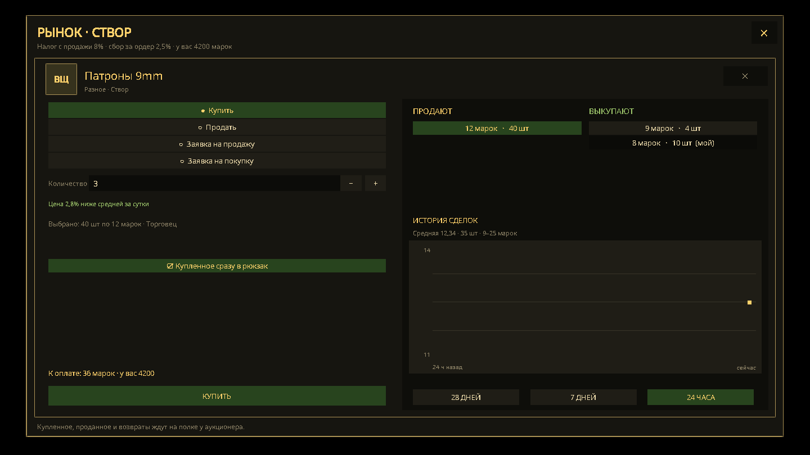

# Игровые системы «Кромки»

Эта страница — краткая карта действующих игровых контуров. Полные правила,
целевые числа и план внедрения находятся в
[`KROMKA_GAME_BIBLE_AND_PATCH_PLAN.md`](../KROMKA_GAME_BIBLE_AND_PATCH_PLAN.md),
а степень готовности — в
[`KROMKA_IMPLEMENTATION_STATUS.md`](../KROMKA_IMPLEMENTATION_STATUS.md).

## Основной цикл игрока

1. Создать независимого наёмника или выбрать быстрый старт.
2. Пройти подготовку в Сборном дворе №12 и отправиться с караваном
   «Двенадцатый».
3. Пережить засаду и прибыть в Ключи.
4. Брать временные контракты, ходить по зонам мира, сражаться, искать ресурсы,
   ремесленные детали, артефакты и сведения о «Векторе».
5. Развивать персонажа и приватную базу, выбирать полезных жителей и торговать.
6. По желанию вступить в клан и участвовать в борьбе за восемь публичных баз по
   расписанию.
7. Продвигать линейную кампанию, не теряя свободу открытой MMO-песочницы.

В мире пустоши персонаж остаётся независимым: репутация и временные контракты
определяют текущие отношения с сюжетными фракциями. Исключение одно —
Сердцевина: вход на центральную территорию открыт только по контракту наёмника
с одной из четырёх её фракций. Контракт подписывают у портала Сердцевины в её
зоне мира, он сохраняется между сессиями и меняется только у регистратора базы
после кулдауна; окно контракта называет этот срок (72 ч) ещё до подписи.
См. [локации и мир](LOCATIONS_AND_WORLD.md).

## Персонаж и прогрессия

- 40 очков распределяются между Мощью, Наблюдательностью, Стойкостью,
  Влиянием, Интеллектом, Реакцией и Чутьём; внутренние ID —
  `str/per/end/cha/int/agi/luck`.
- Выбираются 1–2 профильных навыка и 1–2 стартовые черты.
- Действуют 15 навыков и 41 перк. Уровень даёт 5 очков навыков, одно вложение
  повышает навык на 5 п.п.; очко перка выдаётся каждые три уровня.
- Вместимость базово равна `30 + Мощь × 8` кг, обычный рюкзак добавляет 20 кг.
- Все производные параметры и допустимый бюджет пересчитывает сервер.
- Названия, описания, лимиты и требования приходят из одного каталога
  `data/kromka/character-progression.json`; Unity не принимает каталог с
  пропущенными или повторяющимися ID.
- Вложенные очки навыков сохраняются как версионные шаги, поэтому перк
  характеристики, reconnect и рестарт не возвращают и не отнимают уже
  потраченные очки. Отклонённая прокачка показывает точную причину сервера.

Подробности: [игрок](PLAYER_SYSTEM.md),
[аккаунты и персонажи](AUTH_AND_CHARACTERS.md).

## Бой, травмы и смерть

Бой проходит в реальном времени с очками действия. Сервер проверяет дальность,
линию видимости, темп, патроны, магазин, состояние оружия, режим атаки и цену
ОД. Доступны одиночный, прицельный, автоматический, парный и ближний режимы.
Для баллистического, взрывного, энергетического, огненного, электрического,
токсического, радиационного и аномального урона действует одна цепочка:
критический сырой урон, плоский порог, броня, отдельное сопротивление, травма.

Травмы — перелом руки, перелом ноги, контузия и инфекция — сохраняются между
локациями; кровотечение проходит само за полминуты. В совместной мировой
активности союзник может поднять раненого на дистанции до 3,5 м с 30% ОЗ.
Обычное возрождение возвращает персонажа в последнее безопасное поселение с
55% ОЗ.

У локаций шесть режимов риска (`src/server/zone-rules.js`, библия 16.5):
мирный (PvP отключён), синий PvE (PvP запрещён) и жёлтый PvP (в обоих вещи
сохраняются, надетое теряет 5% состояния), публичное событие (PvP разрешён,
вещи сохраняются), красный с частичной потерей (выпадает рюкзак, экипировка и
установленные артефакты остаются, надетое теряет 20% состояния) и чёрный —
Сердцевина, где выпадает всё, а часть выпавшего становится ломом. Правила зоны
видны до входа: у ворот зоны, у портала и на любом другом переходе.
Стрелять можно и в мирных локациях, включая столицы: патроны, ОД и износ
расходуются как обычно. Союзные игроки (друзья, соклановцы, участники общего
отряда и союзных фракций) и дружественные НПС защищены от прямого урона,
дроби, огнемёта и взрывов во всех зонах. Попадания по ним не вызывают
травм, оглушения или враждебности. Ограничения урона в мирных зонах сохраняются.
Режим постоянно подписан на HUD. При частичной потере содержимое рюкзака —
вместе с запасным оружием и патронами в его магазинах — появляется на земле
одной серверной транзакцией; надетая экипировка, сам рюкзак, экипированный
контейнер артефактов со стабилизированными артефактами внутри, личная база и
клановое хранилище защищены. В чёрной зоне на землю уходит и надетое. Марки и
синь лежат на счёте аккаунта и не выпадают нигде. Перед входом в красную или
чёрную зону и на публичное событие Unity показывает правила: первый шаг в
проход ворот (или первое нажатие у портала) их показывает, второй — переводит.
Подробности: [лут](LOOT_SYSTEM.md),
[авторитетные правила](SERVER_AUTHORITATIVE_RULES.md).

## Инвентарь, предметы и ремесло

Слоты экипировки: оружие, вторая рука, броня, шлем, обувь, рюкзак, детектор и
пояс артефактов. Есть шесть быстрых ячеек. Оружие и снаряжение сохраняют
runtime-ID, состояние, модули и заряженный магазин.

Добыча объединяет трупы, предметы на земле, контейнеры, замки, терминалы и
ресурсные узлы. Случайных таблиц добычи и пополнения контейнеров нет: вещи
приходят из настоящего инвентаря NPC, авторских списков контейнеров, сбора и
крафта, а снаряжение с трупа NPC превращается в детали и лом. Шесть типов
рабочих мест поддерживают крафт; отдельно работают ремонт, разбор и оружейные
модули. Торговля с торговцем столицы или игроком проверяет товары, марки
Тракта, вес и итоговую вместимость одной серверной операцией.

Подробности: [инвентарь](INVENTORY_SYSTEM.md), [лут](LOOT_SYSTEM.md),
[предметы на земле](GROUND_ITEMS_SYSTEM.md),
[контейнеры](WORLD_CONTAINERS_SYSTEM.md), [торговля](TRADER_SYSTEM.md).

## Тиры, добыча и профессии

Мир разбит на пять тиров, как в Albion. Тир зоны равен её опасности (1–5), место
внутри зоны берёт тир зоны. Явная разметка важнее: поле `tier` локации или
`locationTiers` в `data/kromka/tiers.json` — все шесть городов первого тира при любой
опасности сектора, учебный двор, рынок Ядра и личное убежище тоже первого,
лаборатории Сердцевины — пятого. Встреча в пути берёт тир зоны, где случилась,
осада — тир осаждаемой базы (`serverLocationTier`, `serverRoomTier`). Правила и
числа лежат в `tiers.json`, разворачивает их `src/server/kromka-tiers.js`.

**Тир на картах.** `/api/world-map` несёт `tier` у каждой зоны и места, состояние
комнаты (`worldState.tier`) — тир текущей локации. Глобальная карта ставит цветной
значок «T3» у каждой зоны (вблизи — рядом с её номером), у места — только если
его тир другой, пишет тир в подписи «Вы здесь» и в карточке зоны («ресурсы и
враги только 3-го тира»). Миникарта держит чип тира в углу экрана, окно карты —
значок в заголовке, а узлы добычи на обеих рисуются цветом своего тира.

**Узлы добычи — только семейства тиров**: руда, древесина, волокно и нефть,
тира комнаты. Лом, вода, пища, медицина, химия, электроника и детали узлами не
бывают — их дают разбор, трофеи, контейнеры и торговля; кучи лома, баки и грядки
остались декором. Какие семейства растут, решают угодья (ниже); до своей
доли узлы дополняет `ensureTierResourceNodes`: узлы тира локации на свободной
проходимой земле, подальше от входов и других узлов, в городе — у стен. Так
ресурсы первого тира есть и в каждом городе. Учебный двор (сценарий) и арену
осады добор не трогает. Узлы без объекта локации клиент показывает префабом
тира с искрами, как авторские.

**Угодья — как биомы Albion** (библия, 4.5; `data/kromka/grounds.json` собирает
`tools/build-zone-grounds.js`, логика — `src/server/zone-grounds.js`). Каждая
зона мира, кроме Ключей, принадлежит угодьям одного из пяти городов: клину от
Ключей в сторону этого города. У угодий три семейства — основное, второе и
третье, двух нет совсем:

| Угодья | Основное | Второе | Третье | Нет | Город перерабатывает с бонусом |
|---|---|---|---|---|---|
| Створа | дерево | волокно | шкуры | руда, нефть | нефть → топливо |
| Раздолья | руда | дерево | нефть | волокно, шкуры | волокно → ткань |
| Контура-3 | нефть | руда | волокно | дерево, шкуры | шкуры → кожа |
| Мелового двора | волокно | шкуры | руда | дерево, нефть | дерево → брус |
| Перекрёстка | шкуры | нефть | дерево | руда, волокно | руда → металл |

Одиннадцать узлов локации делятся по долям 50/30/20 между семействами-узлами
угодий (шкуры узлов не имеют — их доля уходит остальным): в угодьях Раздолья 6
руды, 3 дерева и 2 нефти. Авторский узел семейства, которого в угодьях нет,
становится семейством угодий (по хешу его id). Место берёт угодья своей зоны,
город-сектор — свои или угодья сектора; у Ключей, обучения и личной базы угодий
нет, там узлы поровну, как прежде. Звери со шкурой (гарь, рыхляк, слухач,
фонарник, складень) заводят логова по угодьям: где шкуры основные — вдвое чаще,
вторые — как обычно, третьи — вдвое реже, где шкур нет — не заводятся. Жила —
зона, где основного ресурса угодий вдвое больше (узлов или зверей со шкурой):
по одной на тир для каждого из пяти ресурсов, 25 жил. Как в Albion, город
перерабатывает с бонусом (+15, как профильный станок) семейство, которого в его
угодьях нет, на любом станке: сырьё для своего ремесла город везёт из чужих
угодий. Карточка зоны на карте мира называет угодья, их семейства и жилу.

Профили станков участков (`plots.regions` в `economy.json`): Створ — оружие и
ремонт, Раздолье — инструменты и оружие, Контур-3 — энергия и химия, Меловой
двор — химия и ремонт, Перекрёсток — патроны и химия.

**Ресурсы.** Пять семейств, у каждого сырьё и полуфабрикат в тирах T1–T5:

| Семейство | Сырьё | Полуфабрикат | Инструмент | Где |
|---|---|---|---|---|
| Металл | руда (`ore`…`oreT5`) | болванка / сплав (`metalBar`…) | кирка | рудные жилы |
| Дерево | древесина (`wood`…) | доски / брус (`plank`…) | топор | деревья, валежник |
| Волокно | бурьян, лён… (`fiber`…) | ткань (`cloth`…) | серп | каждый двадцатый сухой куст зоны |
| Шкуры | шкура (`hide`…) | кожа (`tannedHide`…) | нож свежевальщика | туши гарей, рыхляков, слухачей, фонарников и складней; в городах — крысюков |
| Нефть | нефть (`oil`…) | топливо (`fuel`…) | насос | качалки |

У каждого тира свой цвет (`tiers[].color`): T1 бронза, T2 зелёный, T3 синий,
T4 фиолетовый, T5 золото. У каждого семейства в `visuals` по префабу
PolygonApocalypse на тир для точки добычи, сырья и полуфабриката; текстура модели
не меняется. Экипировка и материалы помечены чуть-чуть краски цвета тира, как из
баллончика (`RoaTierMark`): полоса поперёк рукояти, древка или доски, пояс по
бутылке или бочонку, полоса у основания пучка травы, пятно сверху на руде, мешке
или шлеме. Лишней геометрии нет: второй материал `RealmOfAshes/TierSpray` рисует
ту же поверхность и красит то, что попало в объём метки, с рваным краем и
брызгами. Объём редактор считает по треугольникам префаба (`RoaTierMarkLayout`) и
хранит в палитре: в сборке вершины моделей пака не читаются. Точки добычи не
красятся — у их основания поднимаются редкие искры цвета тира (`RoaTierGlow`,
шейдер `RealmOfAshes/TierGlow`): так видно, что здесь можно добывать и какого
тира ресурс. У значков тира — цветная точка в углу. Надетый комплект брони —
модель персонажа целиком, её не метим. Палитру собирает «Realm of
Ashes/PolygonApocalypse/Rebuild runtime model palette», иконки материалов —
«Напечь рендеры материалов тиров», листы ресурсов и экипировки — проба «Tiers:
resource sheets» (`Library/TierScreen`).

Узел зоны тира N отдаёт только сырьё тира N; тайники зоны переводят авторское
сырьё в тир зоны. Лом, вода, пища, электроника и детали тира не имеют. Навык
добычи берёт узлы на тир выше открытого (`gathering.skillTierAhead`,
`professionGatherLevel`): с нулевым навыком — T1 и T2, T3 — с уровня 10
(открыт T2), T4 — с 30, T5 — с 55, иначе «Тир 3 требует навык «Рудокоп» 10
(сейчас 0).». Переработка и изделия требуют открытого тира.

**Сбор — как в Albion** (`src/server/gathering.js`, блок `gathering` в
`tiers.json`). Клик левой кнопкой по узлу (или E у узла, на телефоне — кнопка
действия) начинает сбор (`startGather`), и персонаж добывает циклами, пока
стоит на месте: каждый цикл клиент засчитывает запросом `harvestResource`,
сервер принимает его не раньше срока, выдаёт единицу сырья тира узла и снимает
один заряд. Цикл длится 2,0 / 2,4 / 2,8 / 3,2 / 3,6 с для T1–T5. Узлы T1
(`toolFreeTier`) добывают голыми руками; узлу тира N (T2–T5) нужен инструмент
своей группы (кирка, топор, серп, насос, нож свежевальщика) тира N−1 или выше
в сумке или в руках (`gathering.requiredToolTier`), иначе сбор не начинается:
«Для добычи руды нужна кирка тира 2 или выше. У вас — тира 1.». Тир ниже
выбран, чтобы цепочка не замкнулась: топор T2 делается из досок T2, а дерево T2
рубят топором T1. Инструмент не ниже тира узла ещё и ускоряет цикл (×0,6), в
том числе на T1, и изнашивается на 1,5 за цикл; инструмент тиром ниже узла
только открывает его и не изнашивается. Полевой набор экспедиции заменяет
инструмент любого тира. Очки действия сбор не тратит. У узла 5 / 6 / 7 / 8 / 9
зарядов по тиру; остаток виден в подсказке («осталось 5/8») и на полосе сбора
над ней. Шаг дальше 0,9 м, урон после начала, выстрел, другой узел или смена
комнаты прерывают сбор (`stopGather`). Опустевший узел исчезает и возвращается
по таймеру. Комната видит сбор: сервер рассылает `playerGathering` при начале и
конце, и другие игроки играют ту же анимацию сбора, пока собирающий стоит на
месте.

Шкуру не выдают при убийстве: гарь, рыхляк, слухач, фонарник или складень
оставляют тушу — временный узел `hide` тира зоны с 2–4 зарядами на месте
зверя (`serverSpawnCarcass`). Её свежуют кликом, как любой узел; клетку карты
туша не занимает, освежёванная или через 3 минуты исчезает. Пыльники и
плакальщики — мутанты без шкур. Звери со шкурой водятся вплоть до пятого тира.

**Городская живность** (`src/server/city-critters.js`,
`data/kromka/city-critters.json`). В мирном городе логов нет, поэтому шкуру
тира 1 дают крысюки: в каждом городе их шесть, по местам во дворах внутри стен
(не ближе 7 клеток друг к другу и 6 клеток от входов, торговцев и склада;
места считаются по карте города детерминированно). Крысюк — мирный вид
каталога (`rat`, сторона `neutral`), не собеседник и не враг: в городе бить
можно только его, прочих защищает правило «Здесь драться нельзя». Удар или
промах не злит зверька и не поднимает против игрока никого — он удирает на 9 м
(3,5 с), потом возвращается к своему двору (`aiState` `flee` → `return` →
`idle`). Табличка пишет «ДОБЫЧА · Городская живность» («УДИРАЕТ» на бегу), на
телефоне он попадает в автоцель (`prey` в снимке NPC). С туши снимают 1–2
шкуры тира города. Убитый возвращается на своё место через 3 минуты после
смерти. Обычный случайный спавн пустоши крысюка не выбирает.

**Переработка.** Полуфабрикат тира N = сырьё тира N (2, 2, 2, 3, 4 единицы)
плюс полуфабрикат тира N−1. Поэтому высокий тир требует материалов всех тиров
ниже, и все зоны остаются нужны. Станки: металл и дерево — инструментальный,
волокно и шкуры — ремонтный, нефть — химическая станция.

**Снаряжение.** Всё оружие, вся броня и инструменты добычи есть во всех пяти
тирах. Исходный id предмета — вариант его авторского тира, остальные тиры
получают суффикс (`smgT1`, `smg` = T3, `smgT5`). Вариант выглядит как исходник
(`visualId`), в названии на клиенте показан тир. Рецепт изделия берёт
полуфабрикаты своего тира (`$metal`, `$wood`, `$fiber`, `$hide`, `$oil` в
`field-recipes.json`) и нетировые детали. Тиры одного оружия отличаются так:

| | T1 | T2 | T3 | T4 | T5 |
|---|---|---|---|---|---|
| Урон, доля защиты и пороги | ×1,00 | ×1,12 | ×1,25 | ×1,40 | ×1,56 |
| Прочность (износ делится) | ×1,00 | ×1,15 | ×1,32 | ×1,52 | ×1,75 |
| Слотов модулей у младших тиров | 1 | 2 | 3 | 4 | 4 |
| Уровень профессии для добычи и ремесла | 0 | 10 | 30 | 55 | 80 |

Скорострельность, ОД, дальность и магазин от тира не зависят. Множители
считаются от авторского тира предмета, авторский тир и старше сохраняют все
свои слоты модулей. Цена изделия не ниже стоимости его материалов.

**Профессии.** Шестнадцать навыков растут от самой работы, очки на них не
тратятся: пять добычи (Рудокоп, Лесоруб, Сборщик волокна, Свежевальщик,
Нефтяник), пять переработки и шесть ремёсел (холодное, огнестрел, тяжёлое,
метательное, броня, инструменты). Опыт — 20/40/80/160/320 за единицу работы
тира T1–T5. Уровень L требует 25·L² опыта, максимум 100. Работа тира учит только
до уровня, открывающего следующий тир (`professionXpCapForTier`): T1 — до 10,
T2 — до 30, T3 — до 55, T4 — до 80, T5 — до 100. Последняя единица доводит опыт
ровно до порога; дальше работа этого тира опыта не даёт, и строка добычи пишет
«Рудокоп: T1 больше не учит, дальше — T2». Опыт, накопленный раньше сверх
порога, не отнимается. Каждый уровень добычи
прибавляет 0,4% к шансу лишней единицы. Профессии видны в ПУТНИКе на вкладке
навыков: карточка добычи пишет, до какого тира она добывает (`gatherTier`),
остальные — открытый тир (`maxTier`). У станка все тиры изделия собраны в одну карточку с переключателем
T1–T5 и требованием навыка.

**Враги.** Вид заводит логова только в зонах своих тиров (`enemies.species` в
`tiers.json`): фонарники и пыльники — младшие зоны, складни и выжженные —
старшие, налётчики — везде. Зверь и враждебный налётчик сильнее своего
базового тира (здоровье, урон и опыт), налётчик одет в снаряжение тира зоны.
Мирные люди тира не имеют.

## Транспорт

- Четыре линейки транспорта по тирам (`data/kromka/vehicles.json`, предметы —
  категория `tools` со слотом `vehicle` и авторским диапазоном тиров `tierRange`):

  | Транспорт | Тиры | Скорость, м/с | Груз, кг | Разворот на ходу, °/с |
  |---|---|---|---|---|
  | Мопед (`moped`) | T1 | 7,5 | +10 | 150 |
  | Армейский мотоцикл (`motorcycle` … `motorcycleT5`) | T2–T5 | 11–14 | +15…+25 | 120 |
  | Пикап (`pickup` … `pickupT5`) | T2–T5 | 9–11,4 | +60…+125 | 75 |
  | Армейский грузовик (`armyTruck` … `armyTruckT5`) | T2–T5 | 7–8,8 | +150…+320 | 50 |

  Мотоцикл — самый быстрый транспорт игры, грузовик везёт больше всех, пикап —
  между ними; в каждом тире это соблюдается (`tools/check-vehicles.js`).
  Авторский id — вариант нижнего тира линейки (`motorcycle` — это T2), поэтому
  старые сохранения с мотоциклом не меняются.
- Груз транспорта прибавляется к переносимому весу только за рулём
  (`serverCarryCapacity`); пешком, даже с транспортом в слоте, — нет. Выйти из
  транспорта, снять или сменить его с грузом тяжелее пешего предела нельзя:
  сервер отвечает «Груз не унести пешком» — сначала разгрузиться (продать,
  сложить на склад, выбросить), не выходя. Удар, оглушение, потеря сознания и
  смерть высаживают и с грузом: тогда игрок пешком перегружен и ничего не
  поднимет, пока не облегчит рюкзак.
- Транспорт надевают в слот «Транспорт» на странице «Персонаж» ПУТНИКа.
  Торговец Свалочного поста продаёт нижний тир каждой линейки (мопед 320,
  мотоцикл 950, пикап 1380, грузовик 1800 марок); его запас собирают мастерские
  фракции на ремонтном верстаке (`data/economy-recipes.json`). Игрок собирает
  любой тир сам на ремонтном верстаке (`data/kromka/field-recipes.json`,
  линия «инструменты»): металл, нефть, волокно или шкуры своего тира и электроника.
- `B` (на телефоне — кнопка «ЕХАТЬ») вызывает транспорт и отпускает его. Решает
  сервер: без надетого транспорта, без сознания или под оглушением сесть нельзя,
  там, где корпусу не встать (стена, укрытие, враг, край локации), — тоже, а
  повторная посадка возможна не раньше чем через 0,7 с (у пикапа 1,2 с, у
  грузовика 1,5 с) после прошлой.
- За рулём управление не такое, как пешком: транспорт едет только вдоль своего
  носа и боком не ездит. `W` — газ до скорости транспорта, `S` — тормоз и
  медленный задний ход, отпущенный газ оставляет накат. Разгон, разворот и
  задний ход у каждого транспорта свои: сервер кладёт их в `self.vehicle`
  (`acceleration`, `turnStillDeg`, `turnFullDeg`, `reverseSpeed`). Присесть
  нельзя; бонусы скорости артефактов и травмы ног на транспорт не действуют.
- Рулит нос курсор мыши, а пока зажаты `A`/`D` — они (на телефоне стик: вверх —
  газ, вбок — руль). Над самим транспортом курсор его не вертит. Разворот
  зависит от скорости: мотоцикл на месте разворачивается на 220°/с, на полном
  ходу — на 120°/с и пишет дугу радиусом около пяти метров; грузовик — втрое шире.
- За рулём не стреляют и не бьют: сервер отклоняет атаку, клиент подсказывает
  «B — выйти из транспорта». Болт (нажатие колеса мыши) бросать можно.
- Прямой удар — врага, игрока, взрыва, аномалии, удара события или импульса
  Хранителя — выбивает из седла. Кровотечение и заражение не выбивают. Ссаживают
  также потеря сознания, смерть, оглушение артефактом и снятие транспорта со
  слота.
- Седло — состояние сессии: после входа в игру все пешком. Переход через ворота
  зон седока не ссаживает.
- Остальные игроки видят седока: сервер кладёт `vehicle` в публичное состояние
  игрока и рассылает комнате `playerVehicle`.
- Модели. Каркас мотоцикла с точками седока — «Military Motorbike» (Zsky,
  CC-BY 3.0), собранный `npm run build:vehicles` в
  `public/assets/models/vehicles/vehicle_motorcycle.glb` (атрибуция — в
  `public/assets/licenses/VEHICLE_MODELS.md`); видимая модель — байк пакета
  PolygonApocalypse. Мопед, пикап и грузовик — префабы того же пакета
  (`SM_Veh_Moped_01`, `SM_Veh_Ute_01`, `SM_Veh_Army_Truck_01`) из палитры
  `RoaApocalypseModels`, в натуральную величину; точки седла, руля и
  подножек/педалей для них задаёт разметка `PackRig` в `RoaVehicleView`,
  снятая с моделей. Мопед — верхом, как мотоцикл; в пикапе и грузовике водитель
  сидит в кабине за левым рулём, машины в вираже не кренятся, передние колёса
  и рулевое колесо поворачиваются. Колёса крутятся по пройденному пути, пыль
  летит из-под заднего моста, тон мотора свой у каждого вида. Посадку всех
  четырёх проверяет `RoaRiderPoseProbe` (снимки — в `Temp/RiderPoseReview`).
- Столкновения считает корпус транспорта, а не капсула водителя: `hull` в
  `data/kromka/vehicles.json` — длина, ширина и смещение прямоугольника от
  водителя, `pivotX`/`pivotZ` — ось поворота. Пикап и грузовик разворачиваются
  вокруг заднего моста (водитель смещается вместе с поворотом), двухколёсные —
  вокруг седока. Клиент (`RoaPlayerController`) протягивает бокс корпуса по
  пути со скольжением вдоль стен, выталкивает его из того, во что тот влез, и не
  даёт повернуть нос или занести корму в препятствие; земля и пологие склоны
  (нормаль вверх) и всё ниже 0,35 м корпус не останавливают — по ним едет капсула.
  Сервер (`serverApplyMovementProposal`) проверяет ту же позу цепочкой вписанных
  кругов (`vehicleHullCircles`) против предметов комнаты, врагов и НПС,
  непроходимых тайлов и края локации; если поза с новым углом не проходит, тот
  же ход принимается без поворота. Враги обходят корпус, а не только водителя.
  Машины других игроков на клиенте твёрдые (`RoaVehicleView.SetSolidHull`), на
  сервере игроки друг сквозь друга по-прежнему проходят. Проверки:
  `tools/check-vehicles.js` (сервер) и `RoaVehicleHullProbe` (клиент в Play Mode).

## Искажения, болт, детектор и артефакты

- Искажения постоянно различимы визуально или по звуку.
- Почти каждое обычное поле разряжается одним броском обычного многоразового
  болта. Других метательных щупов нет.
- Улучшенный магнитный болт выдаёт отдельное побочное задание.
- Детектор занимает собственный слот и ищет только артефакты, не Искажения.
- Детектор первого уровня получается через отдельное побочное задание, а также
  покупается на базе фракции и собирается на энергетическом верстаке; старшие
  ступени требуют лабораторных компонентов.
- Артефакт сначала «горячий», затем стабилизируется; активные артефакты
  устанавливаются в ячейки надетого пояса и дают конкретные эффекты скорости,
  силы, ОД, ОЗ, лечения, регенерации, веса и сопротивлений вместе со штрафами.
- Пояс-контейнер на 2, 3 или 4 ячейки продаётся на базе фракции и собирается на
  инструментальном верстаке: старшие пояса требуют предыдущий и лабораторные
  компоненты. Без пояса артефакт переносится, но не действует.
- Одинаковые преимущества разных видов складываются с уменьшением (сильнейшее
  полностью, остальные вполовину), а недостатки — полностью. Снять или заменить
  пояс в бою нельзя, как и сами артефакты. Панель пояса называет потолок рядом
  с показателем (скорость, груз, регенерация) и прямо говорит про правило
  сложения, а на самом потолке пишет «предел достигнут». Итог пояса с теми же
  потолками виден в подсказке самого пояса в ПУТНИКе.
- Сдвиг меняет поля, угрозы и появление артефактов, но не делает невидимую
  смерть допустимой механикой.
- Четыре боковые лаборатории дают компоненты своего направления: «Росток» —
  биореагент, «Цепь» — контурный модуль, «Сплав» — пластину сплава, «Спектр» —
  спектральную пробу. Без них старшие тиры стабилизации не собрать.
- Победа над «Хранителем Нуля» открывает два контейнера установки: катализаторы
  стабилизации и по компоненту каждой семьи — то, чего в боковых залах не
  собрать. Награда одноразовая и ждёт, пока её не заберут: перезапуск сервера
  её не съедает, но и второй раз за ту же победу она не выпадает.
- Из каждой боковой лаборатории есть два пути назад: гермодверь, через которую
  вошли, и аварийный шлюз в дальнем конце внутренней секции — он выводит
  наружу к вентиляционной шахте у корпуса, в стороне от входа. В центральный
  комплекс ведёт служебный лифт, а с исследовательского уровня наверх есть
  ещё и аварийный подъёмник прямо в Сердцевину. К установке спускаются двумя
  дорогами: центральным лифтом и восточным грузовым стволом через другое крыло,
  который выводит в дальний угол зала; тем же стволом уходят обратно.
- Внешние помещения лаборатории держат обычные твари, а за герметичной секцией
  стоят те же виды с авторскими характеристиками: в полтора раза больше
  здоровья и примерно на треть больше урона. Внутрь идут за сейфом направления.
- У каждой лаборатории своя угроза зала. Шкала копится сама, на пике сервер
  объявляет удар и называет стороны, по которым тот придёт, а через несколько
  секунд он бьёт по этим секторам — остальные остаются проходом. Узлы на стенах
  сбрасывают шкалу, уходят в перезарядку и снимают уже объявленный удар:
  «Росток» травит спорами и чистится
  вентиляцией, «Цепь» бьёт разрядом, а её щиты на время снимают питание с
  охранной машины (пока питание идёт, машина неуязвима; панель зала отсчитывает,
  сколько секунд машина ещё без питания), «Сплав» жжёт давлением и
  перегревает своих же обитателей (перегретые получают больше урона), «Спектр»
  гонит импульсы по кругу, а излучатели смещают последовательность.
- Артефакт узнаётся по строке списка везде, где лежит: на складе фракции и в
  контейнере строка показывает тир в цвете шкалы экипировки и состояние
  (сырой или стабилизированный). Свойства сырого остаются скрытыми.
- Каждый артефакт — экземпляр с видом, тиром 1–5 (цвета шкалы экипировки
  `#8a939b #d8d2c0 #efd078 #9fd7ff #ff9a54`) и скрытыми свойствами. Найденный
  артефакт подбирается в обычный инвентарь сырым; стабилизация у исследователя,
  в столице или на личной базе стоит марок и компонентов по тиру и один раз
  раскрывает фиксированные свойства. Ненужный артефакт разбирается на
  компоненты семьи (биореагент, контурный модуль, пластина сплава, спектральная
  проба) и катализаторы; выход ниже цены стабилизации того же тира.
- Детектор говорит о находке до подбора: Mk1 — только «находка», Mk2 добавляет
  тир в цвете общей шкалы, Mk3 называет и вид. Видно это там же, где находку и
  поднимают: в подсказке действия («G — забрать: Жила · Т4»), потому что
  постоянной панели детектора в клиенте нет.
- После того как буря выброса прошла над локацией, её поля какое-то время
  рождают артефакты заметно чаще обычного. Панель сдвига называет это окно
  прямо: сколько минут осталось и во сколько раз сейчас выше шанс находки.
- Аномалии рождают артефакты сами: одна проверка в минуту на свободное поле,
  0,2 % в спокойное время и до 2 % сразу после того, как задняя кромка бури
  ушла с локации, с затуханием за 30 мин; вид зависит от типа аномалии, тир —
  от пояса поля. Волна выброса подчиняется тем же правилам: вид определяет тип
  аномалии, тир — опасность поля, а сила выброса влияет только на частоту. В
  одной аномалии одновременно лежит не более одной неподобранной находки;
  неподобранные находки обновляются, когда до локации доходит следующая буря.

Постоянных панелей детектора и артефактов поверх мира нет: слот виден в
инвентаре, сигнал — только контекстно.

## Выброс: радиационная буря

- Раз в два часа выброс приходит радиационной бурей. Десять минут она ползёт
  к границе мира с одной случайной стороны, затем за 30 минут проходит всю
  карту полосой шириной около 60 км с рваной кромкой и уходит за
  противоположный край. Сторона, изгиб кромки и сила свои у каждого выброса,
  путь одинаков для всех игроков.
- Буря видна на карте мира: тёмная полоса со светящейся передней кромкой и
  стрелками хода, у кромки напротив игрока подпись «Буря с …, сила, до вас …».
  Тот же фронт лежит на миникарте, на карте локации (M) и на местности зоны в
  окне карты мира.
- В зоне буря стоит там же, где на карте: сектор в 320 м — это 20 км карты,
  передняя кромка идёт по зоне со скоростью 4–5 м/с. Бегом (7 м/с) от стены
  можно уйти к воротам или в укрытие, а ворота ведут туда же, куда на карте:
  уходя от стены, уходишь от бури. Компас сцены пока подписывает север и юг
  зоны наоборот (старое зеркало сцен зон), карта и ворота показывают верно.
- Подход слышен и виден: свет темнеет и зеленеет, крепнут ветер и песок, бьют
  дальние молнии с раскатами, край экрана со стороны бури светится, а панель
  сдвига пишет, откуда буря, сколько километров до стены и через сколько она
  будет здесь. У стены — клубящаяся пыль с зелёным свечением, под бурей —
  муть, молнии рядом, гром и треск дозиметра.
- Урон идёт только под бурей и вне укрытия: каждые 3 с аномальный урон
  4 + 2 × сила, у самой передней кромки вдвое слабее. Укрытия — города, мирные
  зоны, личная база и безопасные локации. Одна точка остаётся под бурей
  4–5 минут.
- Место внутри зоны (поселение, логово, база) — точка карты: буря проходит его
  в масштабе зоны.

## Мир из зон и совместная игра

Мир — 197 секторов по 20 км на сетке 19 × 15; зоны пустоши собирает
конструктор. По миру ходят пешком: открытая сторона зоны — золотая полоса, и
пересечь её можно где угодно — игрок выходит в соседней зоне напротив той же
точки, без экрана загрузки. **Город занимает сектор целиком** — пять городов
фракций и Ключи: в город ведёт светящийся портал у края соседней зоны, из
города — порталы в проёмах ворот, по одному на сторону. Прочие места
— базы, логова, заставы — стоят внутри зон, в них входят через портал, а
золотая полоса по краю места выводит обратно в его зону. Публичные события, бои отрядов и следы угодий стоят в зонах
порталами. Единственный быстрый путь — проводник в городе фракции: разговор с
ним открывает карту мира с подсвеченными городами, и он бесплатно ведёт в любой
другой из пяти, но только налегке — без экипировки и с пустым рюкзаком (марки на
счёте не в счёт) и не из боя. Вещи между городами носят через зоны. Транспорта и
маунтов нет.

В зоне до 40 игроков, следующие попадают в её копию-канал. После перестрелки
с игроком ворота 6 с не пропускают; прошедшего ворота 4 с не задеть, пока он
сам не выстрелит; товарищи по мировому отряду (патрулю) рядом проходят ворота
вместе.

Короткую вылазку подбирает сервер у доски работ («Подобрать вылазку
поблизости»). Игроки могут временно объединиться, использовать общие цели,
сигнал помощи, метки и поднятие раненого. Это не нарушает запрет отряда: постоянных NPC рядом
с игроком нет, у временной группы игроков нет общего инвентаря, а продолжение
после задачи требует явного согласия.

Подробности: [локации и мир](LOCATIONS_AND_WORLD.md),
[Socket.IO-события](SOCKET_EVENTS.md).

## Погода

Над картой мира ходят облачные фронты: погоду считает сервер
(`src/server/weather.js`) по зерну мира и часам. Поэтому соседние зоны видят
один и тот же фронт, а перезапуск сервера погоду не сбивает. Фронт шириной
в несколько зон проходит сектор примерно за полчаса. Дождь идёт около шестой
части времени, дожди длятся от четверти часа до двух часов, ливни редки.
Земля намокает в дождь и сохнет после него. Грязь набирается медленнее и
держится дольше, а сколько её будет, решает грунт зоны: речной суглинок и мел
раскисают сильнее всего, осыпь и спёкшееся стекло почти не держат воду,
города мощёные. Под крышей и под землёй (лаборатории, бункеры, туннели) не
льёт, и погода там не действует.

Погода меняет игру, и все правила считает сервер:

- грязь замедляет шаг пешком до 14% (в городе втрое меньше); транспорт пока
  не замедляется;
- шум дождя глушит шаги: враги слышат их на 45% ближе в ливень;
- дождь сокращает обзор врагов до 22% и сбивает прицел стрелкам — игрокам и
  NPC — до 10%; ближний бой не страдает;
- под дождём игрок мокнет — «Громник» во влажной среде оглушает электрическим
  ударом.

Клиент рисует погоду по снимку сервера (`worldState.weather`, событие
`weatherState`). Облака гасят солнце и тени, дождь сгущает дымку. Мокрая
земля темнеет и блестит, раскисшие тропы и низины покрываются грязью, в
колеях и низинах собираются лужи — после дождя они сохнут медленно, вместе с
грязью. Люди, звери и транспорт оставляют следы: в пыли мелкие и недолгие,
дождь их смывает, в грязи глубокие, с водой, и остаются, когда грязь высохнет.
Предметы, растения, машины и персонажи под дождём темнеют и блестят и сохнут
вместе с землёй. Косые струи идут по ветру, на земле и в лужах расходятся круги
от капель, в ливень бьют молнии с громом. Шум дождя и брызги из-под ног и колёс
заменяют пыль: по мокрому шаги хлюпают, шаг или колесо в луже плещет и пускает
круг по воде. Чип под миникартой («ДОЖДЬ», «ЛИВЕНЬ», «ГРЯЗЬ») и строка
журнала напоминают, что погода сейчас меняет правила.

## Базы, кланы и территория

Личная база — отдельный устойчивый экземпляр аккаунта, которого нет среди мест
мира. Её нельзя захватить или ограбить через PvP.
Приглашённые именные NPC остаются на базе и дают производство, лечение,
хранение, разведку или рецепты, но не следуют за персонажем.

Восемь клановых баз занимают фиксированные публичные места. У клана может быть
одно владение. Захват проходит только в двух заранее опубликованных недельных
окнах, с заявкой минимум за 24 часа, проверкой стажа и составом до 20 × 20.
Победа меняет владельца и экономические преимущества, но не выдаёт постоянный
бонус к урону и не превращает личные вещи в добычу.

Каждое владение даёт конкретную серверную экономику: недельный груз, скидку или
дополнительный выход профильного производства, склад, разведданные либо
защищённый сбор. Особые заказы списывают ресурсы и
ставят кулдаун на сервере. При потере базы все её эффекты прекращаются.

Три режима контента мира: постоянные PvE-области с личными встречами (без PvP
и потери вещей; встречи приходят к идущему — проверке нужны и пройденный путь,
и выдержанный интервал, поэтому панель области говорит и сколько ещё идти, и
через сколько секунд будет проверка, — а приходят они по-разному: стая бродит
поодаль, поджидает вплотную в засаде или приводит соседа другого вида, и панель
области об этом говорит), временные публичные логова и базы налётчиков (общая
комната, PvP разрешено, вещи сохраняются, мини-босс сценария с опорами —
генератор щита, радиостанция, гнёзда, — обозначенные удары, опасная земля,
вскрытие тайника каналом и задержка возврата после смерти) и центральная
территория «Сердцевина» — одна сцена с аванпостами, полями
артефактов и входами в пять лабораторий, куда попадают только члены фракции
через платформу метро своей базы. В Сердцевине и её лабораториях PvP идёт между
фракциями, а зона чёрная: при смерти выпадает всё, включая экипировку и
установленные артефакты. Платформа фракции защищает: с неё нельзя стрелять, а
стоящего на своей платформе вне боя не задеть. Выстрел при этом проходит и
тратит ОД с патроном, поэтому сервер называет правило словами, и клиент
пишет его в журнал боя. Аванпосты захватываются присутствием во время события
«Захват аванпоста» с 20-минутной блокировкой и NPC-гарнизоном; «Объект Ноль»
охраняет мировой босс с узлами щита и импульсами, а в каждом боковом зале своя
угроза со шкалой, объявленным ударом и узлами, которые её сбрасывают. Подробности:
[WORLD_ZONES_ARTIFACTS_2026-09](../WORLD_ZONES_ARTIFACTS_2026-09.md).

В каждой защищённой столице фракции — и в поселении пустоши, и на базе
Сердцевины — стоят трое служащих: аукционер, медик и ремонтник. Медик лечит и
снимает травмы за марки, ремонтник возвращает снаряжению сто процентов тоже за
марки (в поле чинят сами: ремкомплектом, а оружие и инструменты — ещё и
оружейными деталями; сколько состояния вернётся, решает навык «Ремонт»). Оба
работают только рядом с собой и только в мирном поселении, поэтому в бой не
вмешиваются.

Аукционер открывает не диалог, а отдельный экран рынка. **У каждой столицы
своя книга ордеров**: ордер, выставленный в одной столице, в другой не виден,
товар везут ногами, а членство во фракции для торговли не нужно. На экране —
отдельные предложения с количеством, ценой и сроком, собственные ордера и
полка. Поиск, категория, тип или калибр, наличие предложений и диапазон цены
фильтруют список; столбцы сортируются, длинная выдача разбита на страницы.
Для артефактов вместо уровня Albion доступен ранг конкретного лота. Полный
каталог позволяет выбрать товар и создать заявку даже при пустой книге. Карточка
предмета объединяет покупку, продажу, обе заявки и книгу цен. Торговля идёт
встречными ордерами, а не ставками.
Ордер на продажу называет цену за штуку, ордер на выкуп — цену, по которой
торговец готов купить; совпавшие ордера исполняются сразу и частями по цене
того, кто стоял в книге первым. Мгновенные «купить сейчас» и «продать сейчас»
бьют по конкретному ордеру; перед подтверждением игрок задаёт количество
и видит итоговую сумму. Купленное сразу можно положить в рюкзак или оставить
на полке аукционера; при переполнении рюкзака встречная покупка тоже уходит
на полку. Пока сервер проводит операцию, повторное нажатие не отправляет вторую сделку.

В «МОИХ ОРДЕРАХ» можно изменить цену, оставшееся количество и срок. Остаток
продажи можно уменьшить; дополнительные предметы выставляются отдельно.
Изменение повторно оплачивает сбор с новой суммы остатка, обновляет срок и
очередность. Старый резерв покупки используется для новой заявки, разница
доплачивается со счёта или возвращается на него. При отказе исходная заявка
не меняется. Встречное исполнение при изменении отправляет покупку на полку.

Книга товара показывает график и объём, средневзвешенную цену, минимум и максимум
совершённых сделок за 24 часа, 7 и 28 дней. Расчёт использует часовые интервалы,
включая текущий час, и ведётся отдельно для каждого города. Выставление заявки
не меняет статистику. История начинается с первой сделки после обновления.
Линия графика соединяет интервалы, в которых были сделки: 24 часовые точки за
сутки, 28 шестичасовых за неделю или 28 суточных за месяц. Несколько покупок
по разной цене в одном часе дают одну точку со средневзвешенной ценой. Пока
аукционер открыт, клиент обновляет график по серверному снимку примерно раз
в шесть секунд. [Вид на мобильном экране](images/market-chart-mobile.png),
[контрольный пример с двумя часами сделок](images/market-chart-two-hours.png).

Личный журнал показывает последние 50 доступных операций этого города:
покупки, продажи, изменения, отмены и истечение срока. Город хранит 5000
последних записей журнала; публичная статистика не раскрывает участников.

Ордер на выкуп ставится только на предметы без износа и собственных свойств: у
оружия, брони и артефактов цена зависит от экземпляра, поэтому они продаются
своим ордером. Размещение ордера стоит сбора (2,5% от суммы) и не возвращается
при отмене; состоявшаяся продажа удерживает налог (8%, с премиумом 4%, житель-
Торговец снижает ставку) с выручки продавца — по ставке, записанной в ордер при
выставлении. Снаряжение принимается только полностью отремонтированным.
Ордер живёт выбранный срок — сутки, трое суток, неделю или 30 дней (по умолчанию);
товар держит ордер на продажу, марки — ордер на выкуп. То, что пришло, пока
торговца не было у стойки, ждёт на полке у аукционера и забирается в пределах
места и грузоподъёмности.

Торговцы-люди торгуют в столицах фракций, на базах Сердцевины и в Ключах;
стационарные торговцы и служебные NPC просто стоят и торгуют — без
расписания и без реакции на шум, стрельбу и бой вокруг.

Станки поселений — участки: право аренды на неделю разыгрывается на торгах в
окне станка, арендатор назначает плату за заказ и получает её, сам работает
бесплатно; на свободном участке платят поселению, и эти марки сгорают. Станок
участка возвращает часть материалов — 15%, в профильном регионе столицы 25%.

Синь — валюта аккаунта: она лежит на счёте, не в рюкзаке, и не выпадает. За
300 сини покупается премиум на 30 дней: налог аукциона 4%, +50% опыта, марок с
NPC и добычи при сборе, работы базы быстрее и фокус для возврата материалов на
станках участков. Синь и марки меняются между
игроками в обменнике у аукционера (раздел «СИНЬ», сбор 10 марок за ордер).
Марки тоже лежат на счёте аккаунта: они общие для всех персонажей аккаунта,
не выпадают, не выбрасываются и не кладутся на склады. Тратить ли фокус на
заказ у станка, игрок решает переключателем в окне станка или на странице
крафта ПУТНИКа; остаток фокуса виден там же и на странице персонажа.

Зоны мира окрашены по опасности: зона столицы фракции мирная, восемь зон вокруг
неё синие, Глухой обвод, Стеколье и Нулевая котловина красные, зона Сердцевины
и четыре соседние с ней чёрные, остальное — жёлтая земля. Цвет зоны — её режим: он решает,
разрешено ли PvP и что выпадает при смерти. В саму Сердцевину входят только
через портал в её зоне и только по контракту. Цвета опасности и их правила
объясняет легенда в окне «КАРТА МИРА».

Угрозы немирных зон живут сами (A-Life, `src/server/danger-ecology.js`):
стаи гари, выводки пыльников, слухачи, рыхляки, плакальщики, складни,
выжженные, стада фонарников и банды налётчиков обитают у своих логов в
зонах мира, переходят в соседние зоны через открытые ворота и приходят на
шум из соседней зоны — теми воротами, откуда шли, о чём игрок получает
предупреждение. В синих зонах у столиц живут слабые виды. Убитые не
возвращаются, а логово восполняет стаю медленно и только без игроков в зоне.
В секторе логово узнаётся по следам обитателей и табличке с названием вида:
налётчики оставляют укрепление и костёр, гарь — камни и сухостой, пыльники —
кучи лома, слухачи — мёртвое дерево и столб, рыхляки — каменное гнездо,
плакальщики — мёртвые деревья, складни — бетонные обломки, выжженные — остов
машины и огонь, фонарники — заросли у мёртвого дерева. Оформление показывает
вид, закреплённый за логовом серверной A-Life, и не меняет проходимость.
Стая с большими потерями отступает в соседнюю зону — прочь от игрока, теми
воротами, через которые может уйти (в город — никогда), и игрок узнаёт куда:
«На восток отступает: банда налётчиков.» Беглецы идут до ворот зоны и уходят
в них, как игрок, — посреди зоны никто не исчезает; от кого игрок не отстаёт
полминуты, тот загнан и дерётся. Если уйти некуда, стая дерётся до конца. Группа, стоящая в зоне, есть в каждом её
канале; убитая особь исчезает во всех каналах сразу.

Группы не сидят у логова: отдохнув несколько минут, обходят соседние зоны,
идут дальше, а иногда уходят в дальний обход — за три-четыре зоны — и
возвращаются. Мир живёт и без игроков: враждебные группы, сошедшиеся в одной
зоне, дерутся — налётчики со стаями, твари разных видов между собой; мирные
фонарники в драки не лезут. Проигравшие уходят, павшие не возвращаются, а
игрок, пришедший в такую зону, находит место боя: тела с мешками, с тварей
можно снять шкуру. Место боя лежит до 40 минут и достаётся одному каналу
зоны.

По дорогам между городами ходят путники Лиги тракта. Караваны (караванщик,
охрана, носильщики) идут из города в город каждый раз новым путём и не
торгуют; у каждого города свой дозор тракта обходит зоны вокруг него. Путники
идут через зону шагом по её дороге от ворот к воротам и уходят в ворота, как
игрок; игрок в зоне узнаёт, кто идёт («С юга идёт: караван.»). На игрока они
не нападают, а налётчиков и тварей бьют — и в сцене, и без игроков; налётчики
нападают на караваны, и разбитый караван поворачивает назад той же дорогой.
Патрули фракций мира — Старого Клима, Свалочного поста, Ретранслятора — тоже
ходят по зонам: туда, куда идёт их отряд, и стоят у входа в место, где он
несёт службу (шахта, форпост).

Порталов к событиям и встречам в зонах нет: всё встаёт в самой зоне. Публичное
событие стоит у одной из точек событий живой зоны — налётчики с главарём или
логово с маткой, — и игроки зоны видят его в строке события; по истечении его
люди уходят. В угодьях PvE-области (у Колонии Пыльников, Каньона Гари и других)
встречи из таблицы области сами встают в зоне — стая, засада, пыльники против
обоза, — и игрок узнаёт о них («Колония Пыльников: неподалёку — Стая пыльников.»).

Окно «КАРТА МИРА» открывается кнопкой у миникарты, в окне карты локации и
кнопкой «КАРТА» на телефоне. Это 3D-сцена мира — рельеф, реки, дороги и
города, — а поверх неё сетка зон: цвет опасности, номер, границы с проёмами
открытых ворот, места и столицы, флажок — где стоит игрок (в месте — в зоне,
куда выводит его край). Компас в углу поворачивается вместе с камерой (клик —
север снова вверху), у краёв мира стоят буквы С, В, Ю, З. Клик по зоне или
месту открывает окно зоны, как в Albion: в шапке тир, цвет опасности,
название и правила зоны, справа — ресурсы угодий со значком и тиром (жила —
×2); ниже — карта зоны, как её локальная карта (снимки запекает
`RoaZoneMapBaker` в `public/assets/zone-maps`; после правок зон их
перепекают), север вверху, со сторонами света, жёлтыми
планками открытых ворот, местами и отметкой «Вы», справа — ворота, места и
путь. Кнопка «Проложить путь» подсвечивает кратчайшую цепочку зон
через открытые ворота, а строка под миникартой ведёт по ней: из места — сначала
выйти в его зону, дальше — в какие ворота идти и сколько зон осталось. Идёт
игрок сам, телепорта нет. На телефоне
у карты нет края мира, частиц и теней. Других
игроков, групп A-Life, патрулей и событий на карте нет: она показывает только,
куда идти. Зоны пронумерованы с севера на юг и с запада на восток
(«Ключевская долина №148»); имя с номером видно и в заголовке миникарты.

## Живая пустошь и ИИ

Какие части симуляции пустоши (`src/server/wasteland-sim.js`) работают, решает
блок `worldModel` в `data/kromka/economy.json`. Включены торговцы-люди,
Чёрный рынок, аукционы столиц, A-Life и счета аккаунта; выключены станки NPC
без аренды и снаряжение с трупов NPC. Симуляция ведёт контроль и конфликты
точек, мировые задания и пополнение полок торговцев. Потребление и производство
поселений, население с беженцами, караваны и показ отрядов NPC игрокам сняты с
симуляции совсем. Сдвиг
заранее выбирает затронутые районы, показывает предупреждение и создаёт
артефакты только в отмеченных аномальных точках после волны.

В локальной сцене серверный ИИ использует зрение, слух, последнюю известную
позицию, расследование шума, бой, поиск и возвращение домой. Клиент отвечает за
представление, но не может раскрыть цель сквозь gameplay fog-of-war.

Подробности: [живая пустошь](WASTELAND_LIFE.md), [враги](ENEMY_SYSTEM.md),
[камера и видимость](CAMERA_AND_VISION.md).

## ПУТНИК и интерфейс

ПУТНИК объединяет персонажа с инвентарём, навыки, перки, крафт, журнал
заданий, контракты, мир, фракции, друзей, клан, укрытие и радио. Основной HUD
оставляет только боевые показатели и критические состояния. Страницы
«Контракты» и «Мир» строятся только из серверных данных. Панель мировых
событий растёт под свой текст примерно до трети экрана и сдвигает кнопки под
собой.

ПК и mobile landscape предоставляют одинаковые обязательные действия. Низкие
графические настройки могут уменьшать декор, но не скрывают Искажение,
опасную область, интерактивный объект или уже обнаруженного противника.
